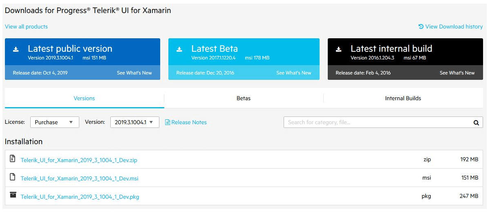
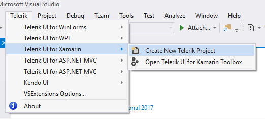

# First Steps

This article will guide you through the basics of __Telerik UI for Xamarin__ and how to start using the suite on __Windows OS__.

Once you have your first simple Xamarin control up and running, take a look at the __Next Steps__ section to explore other control functionality.

For additional resources you can also review the Related Articles section on the right.

## Download the Controls

When you have an active developer license, you can download the following files:

* Standalone installation
* Assemblies for manual installation
* NuGet packages
* Old versions

>tip Make sure you have already read the [System Requirements]() article before you proceed.

Follow the steps below in order to download the installation files:

1. Log into your [Telerik account](https://www.telerik.com/account/) and click on the __Downloads__ tab.

	#### __Figure 1: Downloads tab__

	

2. Select __Progress Telerik UI for Xamarin__ product title.

3. Download the Automatic Installation (msi) file.

	#### __Figure 2: Download automated (.msi) installer__

	

Once you have installed Telerik UI for Xamarin it's time to create your first application.

## Create a Project with Telerik UI for Xamarin

The easiest way to create a Telerik UI for Xamarin project is to use **Visual Studio Extensions** which are distributed with the Telerik UI for Xamarin installer. They can also be downloaded and installed as separate product from the [Visual Studio Marketplace](https://marketplace.visualstudio.com/). Once installed, the Visual Studio Extensions can be accessed by going to Telerik Menu > Telerik  UI for Xamarin.

>For detailed information on installing the Project Wizard, go to the [Installing VSExtensions]() article.

Depending on your scenario, you either have an existing app where you will add our Telerik components, or you have to create a new blank app. For the purpose of this article we will focus on creating an app from scrath with Visual Studio.

1. Open Microsoft Visual Studio.

2. Create new Telerik Xamarin project.

	#### __Figure 3: Go to Telerik > Telerik UI for Xamarin > Create New Telerik Project__

	

	Select which platform(s) your application targets and the wizard will automatically reference all required Telerik binaries and packages.

	#### __Figure 4: Select you the platform(s)__

	

## Next Steps

Now that you have installed and created your first project it is time to add a Telerik UI for Xamarin control:

- [Add a Control to Your Project]()
- [Explore Control Features]()
- [Change control appearance]()
- [Further information]()

## See Also

- [System Requirements]()
- [Telerik NuGet Server]()
- [Required Android Support Libraries]()
- [Getting started on Mac]()