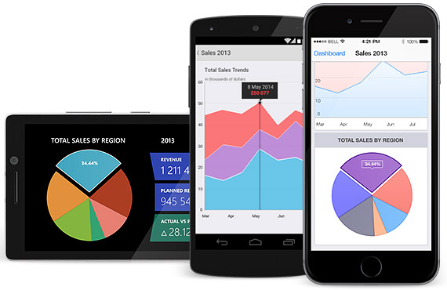

**Telerik UI for Xamarin** is a collection of Xamarin.Forms controls and Xamarin bindings built on top of the native Telerik UI for iOS and UI for Android suites. The Xamarin.Forms controls also utilize controls and features from the Telerik UI for Windows Phone, providing common API that allows the developer to use the native Telerik components on all three mobile platforms (iOS / Android / WP) using a single shared code base.

The API and feature set of the Xamarin.Forms controls is different from the Xamarin controls bindings for UI for iOS and UI for Android, hence the documentation is structured in the following way:

- The current documentation set provides information about the features and API of the Xamarin.Forms controls.
- The documentation set of [UI for iOS](http://docs.telerik.com/devtools/ios/) provides information about the features and API of the Xamarin.iOS bindings.*
- The documentation set of [UI for Android](http://docs.telerik.com/devtools/android/) provides information about the features and the API of the Xamarin.Android bindings.*

## Xamarin.Forms Controls Overview ##

- [**Telerik Chart for Xamarin**](): A feature rich charting control that supports different chart types and series. Its intuitive object model and public API allow you to easily setup complex charts and integrate them into your application.

You can use **Xamarin.Forms** for application development for the following mobile operating systems:

* **Android 4.0** or higher
* **iOS 6.1** or higher
* **Windows Phone 8**

> Note: There could be information for more controls in the UI for iOS and UI for Android than what is supported by the Xamarin bindings. For a list of the supported controls, you can refer to the [UI for Xamarin](http://www.telerik.com/xamarin-ui) product page.