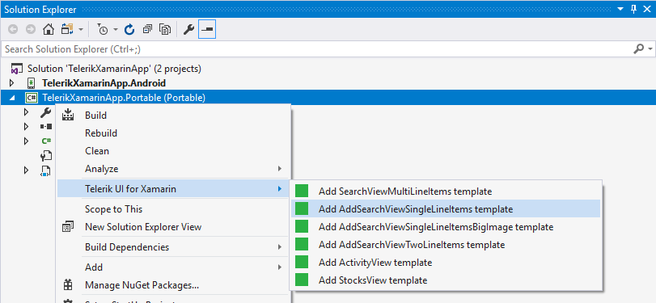
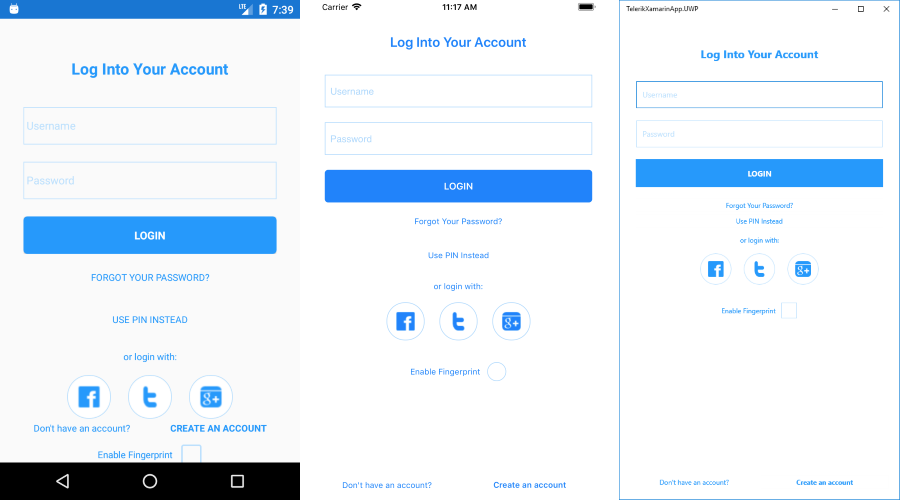

# Visual Studio Item Templates

There are several **predefined item templates for Visual Studio** included in the **UI for Xamarin** suite which come by default with the installation of the product. You can directly include them in your **Xamarin Forms** project and use them as footprints for similar scenarios in your application. This article provides more information on the different templates included and the controls which they utilize.

> The Item Templates are installed through a Visual Studio extension file(vsix) which can be found in the **VSExtensions** folder of your local installation. 

## Adding Item Templates to your project

As these item templates will be automatically added when you run the **UI for Xamarin** installation, you can find them when you try adding a new item to your Xamarin Forms project, as shown in **Figure 1**.

##### Figure 1: Adding a custom item to your Xamarin Forms project

 

You can also add them through the Telerik menu of Visual Studio as shown in **Figure 2**:

##### Figure 2: Adding a custom item to your Xamarin Forms project through Telerik menu:

 

Or through the context menu of your Visual Studio project:

##### Figure 3: Adding a custom item to your Xamarin Forms project through the context menu:
 

## Views

The available item templates are listed below:

* [Stocks View](#stocks-view)
* [Activity View](#activity-view)
* [Search View](#search-view)
* [Login Screen](#login-screen)
* [Feedback Screen](#feedback-screen)

### Stocks View

The Stocks View represents a list of several companies and information related to their stocks such as current price, trends, percentage difference, etc. The main controls which are utilized are the [RadListView]() and [RadCartesianChart]() controls. **Figure 2** shows the default appearance of the view.

##### Figure 4: Stocks View's default appearance
 
  
### Activity View

The Activity View provides an information regarding a specific user and information regarding his daily physical activity such as calories burned, average steps and active time. The view utilizes the [RadCartesianChart](), [RadRadialGauge]() and [RadHorizontalGauge]() controls. **Figure 3** shows the default appearance of the Activity View:

##### Figure 5: Activity View's default appearance
 

### Search View

There are several Search View custom items which show the same setup with a slightly different visualization. All of the item templates use the [RadAutoComplete]() and [RadListView]() controls with different modifications in order to achieve a diverse look. The **RadAutoComplete** control is used to filter the visible collection according to a certain user input.

#### Multiline Items

In the **SearchViewMultiLineItems** template, the items within the **RadListView** have multiple line description.

##### Figure 6: Search View Multiline Items 
 

#### Singleline Items

In the **SearchViewSingleLineItems** template, only a single line of information regarding the specific item is present.

##### Figure 7: Search View Singleline Items 
 

#### Singleline Items Big Image

The **SearchViewSingleLineItemsBigImage** template is similar to the **SearchViewSingleLineItems** template, however, the look of the item within the **RadListView** is slightly tweaked for a distinctive appearance that emphasizes on the image.

##### Figure 8: Search View Singleline Items Big Image 
 

#### Twoline Items

The **SearchViewTwoLinesItems** template once again shows a different approach of modifying RadListView's ItemTemplate.

#### Figure 9: Search View Twolines Items 
 

### Login Screen

The **Login Screen** template provides different options for entering user credentials, such as with fingerprint, with pin or social login. The template uses RadEntry, RadButton, RadBorder, and RadCheckbox from Progress Telerik UI for Xamarin.

The image below shows LoginComplete template:

#### Figure 10: Login Complete Screen
 

### Feedback Screen

The **Feedback Screen** template implements a feedback scenario using RadBorder, RadButton, and RadListView from Progress Telerik UI for Xamarin.

#### Figure 11: Feedback Screen
 

## See Also

* [System Requirements]()
* [Getting Started]()