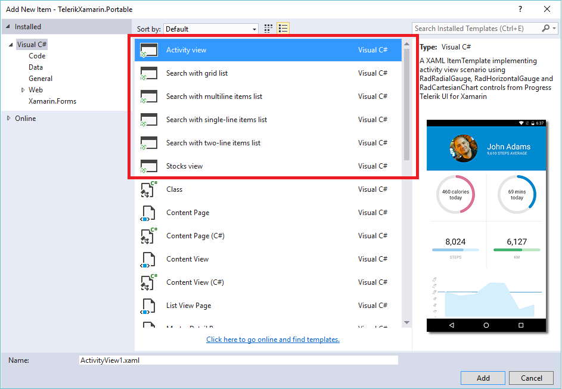
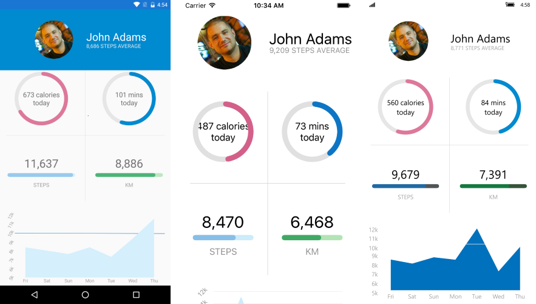
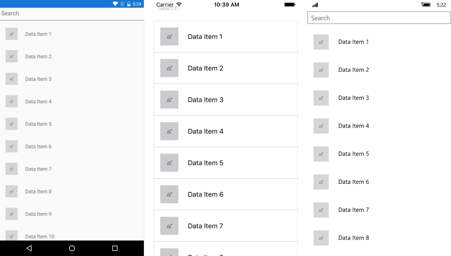
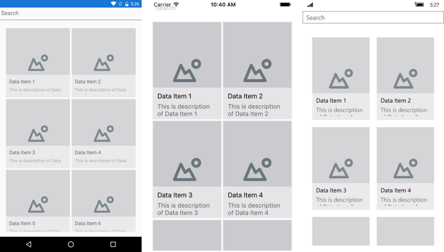

# Item Templates

There are several custom **item templates** included in the **UI for Xamarin** suite which come by default with the installation of the product. You can directly include them in your **Xamarin Forms** project and use them as footprints for similar scenarios in your application. This article provides more information on the different templates included and the controls which they utilize.

> The Item Templates are installed through a Visual Studio extension file(vsix) which can be found in the **VSExtensions** folder of your local installation. 

As these item templates will be automatically added when you run the **UI for Xamarin** installation, you can find them when you try adding a new item to your Xamarin Forms project, as shown in **Figure 1**.

#### Figure 1: Adding a custom item to your Xamarin Forms project

 

Here is a list of the available item templates:

* [Stocks View](#stocks-view)
* [Activity View](#activity-view)
* [Search View](#search-view)

## Stocks View

The Stocks View represents a list of several companies and information related to their stocks such as current price, trends, percentage difference, etc. The main controls which are utilized are the **RadListView** and **RadCartesianChart** controls. **Figure 2** shows the default appearance of the view.

#### Figure 2: Stocks View's default appearance
 
  
## Activity View

The Activity View provides an information regarding a specific user and information regarding his daily physical activity such as calories burned, average steps and active time. The view utilizes the **RadCartesianChart**, **RadRadialGauge** and **RadHorizontalGauge** controls. **Figure 3** shows the default appearance of the Activity View:

#### Figure 3: Activity View's default appearance
 

## Search View

There are several Search View custom items which show the same setup with a slightly different visualization. All of the item templates use the **RadAutoComplete** and **RadListView** controls with different modifications in order to achieve a diverse look. The **RadAutoComplete** control is used to filter the visible collection according to a certain user input.

### Multiline Items

In the **SearchViewMultiLineItems** template, the items within the **RadListView** have multiple line description.

#### Figure 4: Search View Multiline Items 
 

### Singleline Items

In the **SearchViewSingleLineItems** template, only a single line of information regarding the specific item is present.

#### Figure 5: Search View Singleline Items 
 

### Singleline Items Big Image

The **SearchViewSingleLineItemsBigImage** template is similar to the **SearchViewSingleLineItems** template, however, the look of the item within the **RadListView** is slightly tweaked for a distinctive appearance that emphasizes on the image.

#### Figure 6: Search View Singleline Items Big Image 
 

### Twoline Items

The **SearchViewTwoLinesItems** template once again shows a different approach of modifying RadListView's ItemTemplate.

#### Figure 7: Search View Twolines Items 
 

## See Also

* [System Requirements]()
* [Getting Started]()