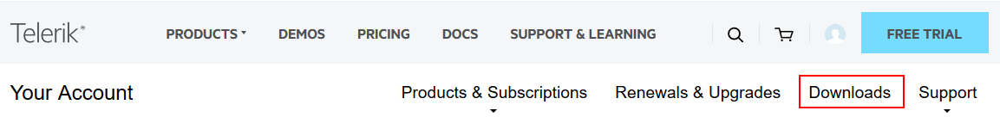
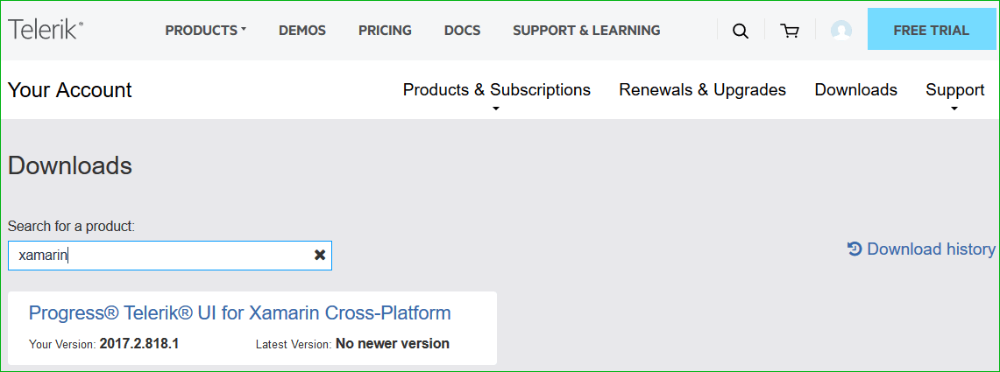
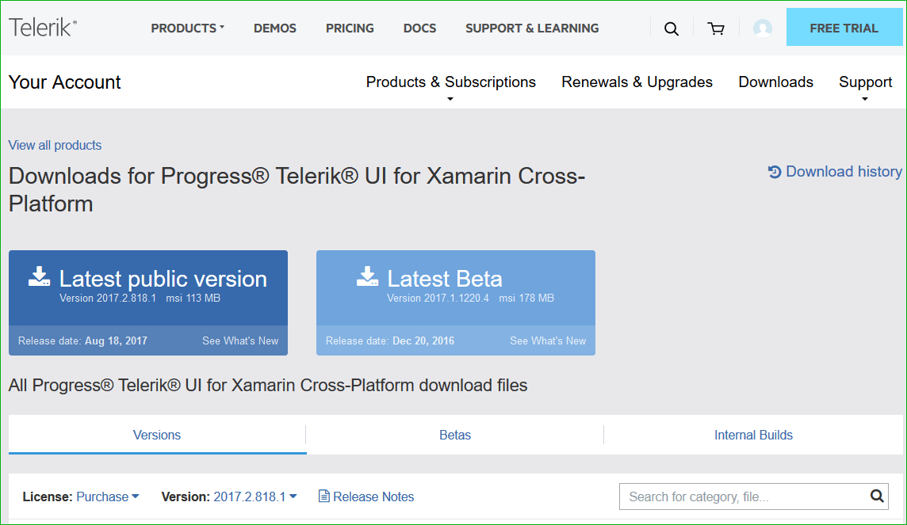

# Download Product Files

When you have an active trial or developer license, you can download the following files:

* Standalone installation
* Assemblies for manual installation
* NuGet packages
* Old versions

>tip You can enable a free trial license from the [Telerik UI for Xamarin product page](https://www.telerik.com/xamarin-ui). 

In order to download these you need to take the following steps:

**1. Log into your [Telerik account](https://www.telerik.com/account/).**

**2. Click on the __Downloads__ tab:**

**3. Select __Telerik UI for Xamarin__ product title:**

**4. The next page allows you to download the Automatic Installation msi file, DLLs and NuGet Packages.**

Below you could find a list of the available files:

>[license] could be Trial or Dev depending on the license you have.

>[version] is replaced with the version the file corresponds to.

### Installation

* Telerik_UI_for_Xamarin_[version]_[license].zip  - contains binaries, VSExtensions and examples used for manual installation.
* Telerik_UI_for_Xamarin_[version]_[license].msi - runnable msi file used for automatic installation (for use on PC).
* Telerik_UI_for_Xamarin_[version]_[license].pkg - runnable pkg file used for automatic installation (for use on Mac).

### Other Setup Files

* Telerik_UI_for_Xamarin_[version]_[license]_Hotfix.zip - the Hotfix archive is a bare-bones upgrade option for the Telerik Xamarin controls - it contains only those files that you need to replace in your project to upgrade to a newer version. 
* Telerik_UI_for_Xamarin_[version]_[license]_ProjectTemplate.mpack -  a Visual Studio for Mac add-in which provides a project template, pre-setup with all requirements to run Telerik UI for Xamarin components.

And we provide the following NuGet packages you can use according to the concrete requirements:

* Telerik_UI_for_Xamarin_[version]_[license]_NuGet_Separate_Packages.zip
* Telerik.UI.for.Xamarin.[version].nupkg
* Telerik.UI.for.Xamarin.Lite[version].nupkg

>You could take a look at the [Lite Assemblies]() topic for more details on the difference between lite and standard assemblies.

## See Also

- [Getting started on Windows]()
- [Getting started on Mac]()
