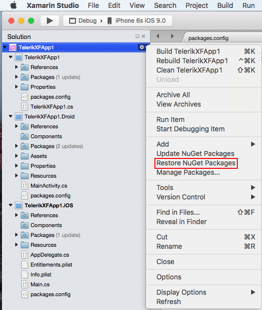
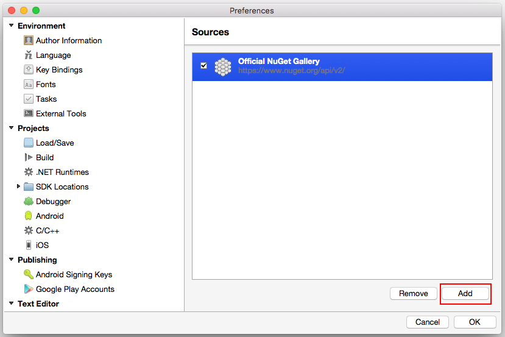

# Getting Started on Mac #

This article should help Mac developers to get started with **Telerik UI for Xamarin** suite and **Xamarin Studio** under iOS. We will demonstrate how users can take advantage of **Telerik NuGet server** in order to include our suite in their solution and/or update to the latest available version.

## Update *packages.config* files ##

After a blank **Xamarin.Forms App** has been created using the default solution template built in **Xamarin Studio** a default *packages.config* file will be generated for each platform. Users need to manually update those files so that they include the required packs since there is no stable mechanism to do this using UI or console, yet. After updating the respective files the **NuGet Package manager** will be able to restore the missing packs and update the existing ones. Another benefit is the fact that upgrading to the latest official release of the **Telerik UI for XamarinForms** suite will be as far away as a single mouse click is.

## iOS and Portable projects ##

For the iOS and the Portable projects users need to update only the version of the required Xamarin.Forms package since this is the only required pack. Its latest official version can be seen on the [official NuGet page](https://www.nuget.org/packages/Xamarin.Forms/). Open the *packages.config* file directly in Xamarin Studio and replace only the existing version with the one presented on the already referred page.

## Android project ##

The Android project however, requires additional packages with specified versions. All the requirements can be seen in the [Required Android Support Libraries]() article. The issue that will be encountered is installing a particular **Android.Support** package with a specific earlier (not latest available) version. This can be done by the *packages.config* file, also. Everything users need to do is to fill in the missing packages and update the existing one(s) in the following format :

		<package id="[PackageName]" version="[PackageVersion]" targetFramework="[TargetFramework]" />

>On the [Required Android Support Libraries]() Libraries page users can see the name and the exact version of the required packages.

Please bear in mind that the [*TargetFramework*] parameter should be the same among all packages since they all target the Android platform. This parameter can be taken from the existing packs in prior of modifying the *packages.config* file.

## Restore the NuGet packages ##

After updating all the *packages.config* files users are now ready to restore the packages. This can be done by clicking the settings icon of the solution and choosing “*Restore NuGet Packages*”.

## Add Telerik NuGet packages server ##

In order to take advantage of the Telerik NuGet packages and respectively the **Telerik UI for XamarinForms** pack users need to add the Telerik NuGet server in their packages sources list. This can be done by clicking on the settings icon of any “*Packages*” folder (any project will do the job) and choosing “*Add Packages…*”.

This will open another dialog. Users need to choose “*Configure Sources…*” option from the dropdown in the upper right corner.

On the next dialog users will see all the available sources. Choose “*Add*” to add the new server.

In the Add Package Source dialog users should fill in the information of the Telerik server (URL: **https://nuget.telerik.com/nuget**) as well as their private Telerik credentials. Authentication procedure is required in order to allow downloading the packs.

After the Telerik NuGet server is added users will be able to see the packages they are allowed to download in the Add Packages dialog. This will allow them to check the **Telerik UI for Xamarin** pack and add it into their projects.

## Add Telerik UI for Xamarin pack ##

Once the server is added users will be able to add to their projects any of the **Telerik NuGet** packages available for their license. One click on the settings icon of the “*Packages*” folder of any project will open the **Add Packages** dialog where the available Telerik packs will be listed.

