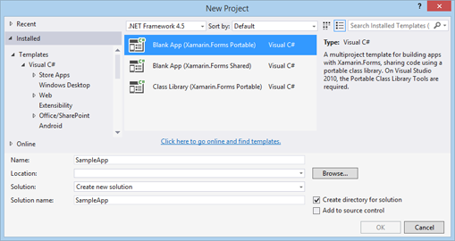
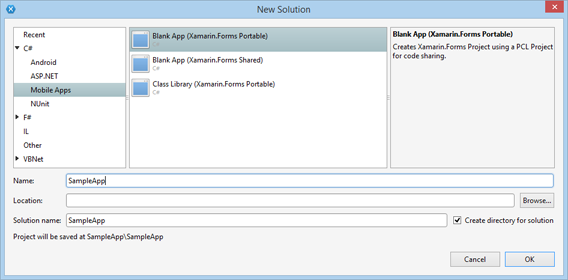
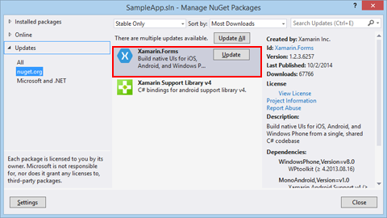
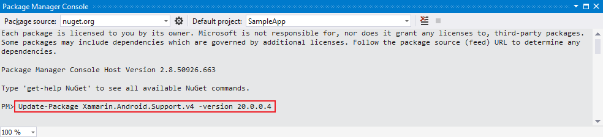

# Getting Started #

Here are described the steps that you have to follow to create a new cross platform solution with **Visual Studio** or **Xamarin Studio**. Please, read the [System Requirements]() article before you proceed.

First you have to download and install [Xamarin Studio](http://xamarin.com/download).

## Create new Xamarin.Forms Solution ##

Create new solution **Xamarin.Forms Portable** / **Shared**

* **Visual Studio**: located at *Templates* > *Visual C#* > *Mobile Apps* section:  

* **Xamarin Studio**: located at *C#* > *Mobile Apps* section:  
  

Typically, the solution will contain the following projects:

* **Portable/Shared**: Cross platform application library that contains the shared code and UI.
* **Android**: Available on all operation systems.
* **WinPhone**: Available only for projects created with Visual Studio.
* **iOS**:
	* Available for OS X.
	* If you wish to use Visual Studio as a development environment you will also need a mac machine. You can find more information how to setup your environment here: [Introduction to Xamarin.iOS for Visual Studio](http://developer.xamarin.com/guides/ios/getting_started/installation/windows/introduction_to_xamarin_ios_for_visual_studio/)
	 

## Getting the Latest Platform SDK Versions ##

You have to make sure that you have the right version of Xamarin.Forms and all related packages.

- Right-click the newly created solution and choose: Visual Studio: "Manage NuGet packages for Solution".
- From Updates >> nuget.org install the latest version of the **Xamarin.Forms** package (**v1.2.3.6257**).

>The minimum supported **Xamarin.Forms** version is **1.2.2.6234**.

- After you update the Xamarin.Forms to the the required version, you have to update the **Xamarin.Android.Support.v4** to version **20.0.0.4**.
You have to do this in the Package Manager Console, because you cannot update to a version prior to the latest one through the GUI of NuGet Package Manager. To open the console go to Tools >> NuGet Package Manager >> Package Manager Console. In the console window, select SampleApp.Android project and execute the following command:

`Update-Package Xamarin.Android.Support.v4 -version 20.0.0.4`

