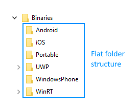

# Important Changes

## R3 2018

With **R3 2018** release we removed the WindowsPhone and WinRT assemblies as they're not relevant at this point. Here is the current structure of Binaries folder:

## R2 2017

### Binaries folder changes

With the **R2 2017** we introduced changes in the binaries we provide. These changes tend to simplify the getting started experience of our customers as well as to reduce the amount of references required in each platform. Here is how the Binaries folder looked like before the change:

##### Figure 1: Binaries folder structure prior R2 2017 (old)

The native binaries were separated from the cross-platform ones. We realized that this structure is not optimal and it forces customers to make additional efforts when it comes to manually referencing our binaries.

#### What customers had to do in order to reference our binaries in a single platform (e.g. Android)?
Here are the steps:

1. Reference the native binaries from the Binaries/Android folder.
1. Reference the portable binaries from the Binaries/XamarinForms/Common folder.
1. Reference the platform specific renderer binaries from the Binaries/XamarinForms/Android folder.
1. Register the respective renderers.
1. Call Telerik.Init() method.

To target the rest of the platforms the same steps needed to be repeated for each one. On top of this the binaries in each folder were with their respective name which lead to references that can be visualized like this:

##### Figure 2: Binary references prior R2 2017 (old)

After having the correct references customers had to manually register the XamarinForms components with their respective renderer in each platform. In Android, this step was executed by adding the following attributes in the **MainActivity.cs** file:

<pre><code class='language-cs'>
[assembly: Xamarin.Forms.ExportRenderer(typeof(Telerik.XamarinForms.Chart.RadCartesianChart), typeof(Telerik.XamarinForms.ChartRenderer.Android.CartesianChartRenderer))]
[assembly: Xamarin.Forms.ExportRenderer(typeof(Telerik.XamarinForms.Chart.RadPieChart), typeof(Telerik.XamarinForms.ChartRenderer.Android.PieChartRenderer))]
[assembly: Xamarin.Forms.ExportRenderer(typeof(Telerik.XamarinForms.Input.RadCalendar), typeof(Telerik.XamarinForms.InputRenderer.Android.CalendarRenderer))]
[assembly: Xamarin.Forms.ExportRenderer(typeof(Telerik.XamarinForms.DataControls.RadListView), typeof(Telerik.XamarinForms.DataControlsRenderer.Android.ListViewRenderer))]
[assembly: Xamarin.Forms.ExportRenderer(typeof(Telerik.XamarinForms.Primitives.RadSideDrawer), typeof(Telerik.XamarinForms.PrimitivesRenderer.Android.SideDrawerRenderer))]
[assembly: Xamarin.Forms.ExportRenderer(typeof(Telerik.XamarinForms.Input.RadAutoComplete), typeof(Telerik.XamarinForms.InputRenderer.Android.AutoCompleteRenderer))]
[assembly: Xamarin.Forms.ExportRenderer(typeof(Telerik.XamarinForms.Input.RadDataForm), typeof(Telerik.XamarinForms.InputRenderer.Android.DataFormRenderer))]
</code></pre>

In addition to this there was a method that had to be called after the initialization of the XamarinForms application to ensure that the resources used by our components are properly loaded:

<pre><code class='language-cs'>
public class MainActivity : Xamarin.Forms.Platform.Android.FormsAppCompatActivity
{
    protected override void OnCreate(Bundle bundle)
    {
        base.OnCreate(bundle);

        global::Xamarin.Forms.Forms.Init(this, bundle);
        Telerik.XamarinForms.Common.Android.TelerikForms.Init();
        LoadApplication(new Portable.App());
    }
}
</code></pre>

We realized these steps can be overwhelming for new comers and therefore decided to invest in simplifying these requirements.

#### What we did to improve this?

The first change is in the structure of the Binaries folder. Now it looks like this:

##### Figure 3: Binaries folder structure after R2 2017 (new)

The **XamarinForms** folder no longer exists and all binaries that were inside it are now shipped with the respective platform folders. 

For example, the _portable_ **Telerik.XamarinForms.Common.dll** that was previously shipped in the **Binaries/XamarinForms/Common** folder is now shipped in the **Binaries/Portable** folder (as well as all other portable binaries).

The _platform specific_ **Telerik.XamarinForms.Common.Android.dll** that was previously shipped in the **Binaries/XamarinForms/Android** folder is now shipped in the **Binaries/Android** folder.

The more significant change is renaming of the platform specific binaries. We decided to remove the “_Renderer._[platform]” and “_*._[platform]” parts of the name of all binaries. 

For example, the **Telerik.XamarinForms.ChartRenderer.Android.dll** binary previously shipped in the **Binaries/XamarinForms/Android** folder is now called **Telerik.XamarinForms.Chart.dll** and is now shipped in the **Binaries/Android** folder. Also the **Telerik.XamarinForms.Common.Android.dll** is now called **Telerik.XamarinForms.Common.dll**.
Basically, the name of the binary no longer holds the name of the platform it is built for. If users need to get that information they can still do this in the **Properties -> Details** tab.

These two changes allow customers to easily find all binaries required by a platform in one place. All Telerik binaries, native, platform specific and portable are now collected in a single directory. Now there is no need to switch folders when referencing binaries in a single platform.

For example, all binaries that are built for the Android platform are shipped in the **Binaries/Android** folder. This is true for all supported platforms.

Here is how the references look with the new structure:

##### Figure 4: Binariy references after R2 2017 (new)

On top of this, there is no need to manually apply annotations and to call initialization methods any more. We are now registering all renderers internally. 

Users need to figure out which binaries they need, reference them in the respective project and they are ready to go.

### Calendar changes

The **Telerik.XamarinForms.IAppointment** interface has been modified to include an additional **Detail** property.

## R1 2017

### DataForm changes

With the official release of **R1 2017** we have introduces some changes in the RadDataForm control that affect the entity property and metadata. Now the metadata can be accessed through the entity property and all methods that previously had metadata as parameter use the entity propertyn instead. The changes are listed below.

- **Assembly: Telerik.XamarinForms.Input**
 - **DataForm.EntityProperty** class is now interface: **DataForm.IEntityProperty**.
- **Assembly: Telerik.XamarinForms.InputRenderer.Android**
 - **DataForm.AndroidEntityProperty** has updated constructor:  
 ctor(XF.Input.DataForm.IEntityProperty, Java.Lang.Class, XF.InputRenderer.Android.DataForm.AndroidEntity)
 - Changed the signature of the following methods in **DataFormRenderer**:  
 **UpdateEditor**(NativeViz.EntityPropertyEditor, XF.Input.DataForm.EntityPropertyMetadata) -> (NativeViz.EntityPropertyEditor, XF.Input.DataForm.IEntityProperty)  
 **UpdateViewer**(NativeViz.EntityPropertyViewer, XF.Input.DataForm.EntityPropertyMetadata) -> (NativeViz.EntityPropertyViewer, XF.Input.DataForm.IEntityProperty)  
 - Removed **CLRConverter** property from **DataForm.AndroidEntityProperty** class.
 
 Where:
	
 - **XF**: Telerik.XamarinForms
 - **NativeViz**: Com.Telerik.Widget.Dataform.Visualization.Core
- **Assembly: Telerik.XamarinForms.InputRenderer.iOS**
 - **DataForm.IOSEntityProperty** has updated constructor:  
 ctor(DataFormEntityDataSource, DF.IEntityProperty, DF.IPropertyValidationCompletedListener DF.IPropertyDataSourceProvider)
 - Changed the signature of the following methods in **DataFormRenderer**:  
 **InitEditor**(TelerikUI.TKDataFormEditor, TelerikUI.TKEntityProperty, DF.EntityPropertyMetadata) -> (TelerikUI.TKDataFormEditor, DF.IEntityProperty)  
 **UpdateEditor**(TelerikUI.TKDataFormEditor, TelerikUI.TKEntityProperty, DF.EntityPropertyMetadata) -> (TelerikUI.TKDataFormEditor, DF.IEntityProperty)
 - Removed the following members from **DataFormRenderer**:  
 **CLRPropertyType**  
 **Converter**  

 Where:

 - **XF**: Telerik.XamarinForms
 - **DF**: Telerik.XamarinForms.Input.DataForm

- **Assembly: Telerik.XamarinForms.InputRenderer.UWP**
 - Changed the signature of the following method in **DataFormRenderer**:  
 **UpdateEditor**(Native.EntityPropertyControl, DF.EntityPropertyMetadata) -> (Native.EntityPropertyControl, DF.IEntityProperty)
 - **WindowsEntityProperty** has updated constructor:  
 ctor(DF.IEntityProperty, System.Object, DF.IPropertyDataSourceProvider)
 - **WindowsEntityProperty** has new property: **DF.IEntityProperty** XFEntityProperty

 Where:

 - **Native**: Telerik.UI.Xaml.Controls.Data
 - **DF**: Telerik.XamarinForms.Input.DataForm
 
### Type conversion changes

Changes also affect the mechanism for conversion from CLR DateTime objects to native Android and iOS types. Previously there was no adequate conversion for dates with different DateTimeKind. Now we have introduced several parameters to provide conversion context. The changes are listed below.

- **Assembly: Telerik.XamarinForms.Common**
 - Added new data form data annotation **DataAnnotations.NativeConvertionContextAttribute** to provide additional information for conversion.
 - Removed unnecessary **TargetType** property from **DataAnnotations.IPropertyConverter** 
- **Assembly: Telerik.XamarinForms.Common.Android**
 - **DateTimeTools.ToDateTime** method has changed signature:  
 **ToDateTime**(Java.Util.Calendar) -> (Java.Util.Calendar, System.DateTimeKind?)
 - **AndroidDateFormatter** class has changed constructor:  
 ctor(System.String, System.DateTimeKind?)
- **Assembly: Telerik.XamarinForms.Common.iOS**
 - **IOSDateFormatter** class has changed constructor:  
 ctor(System.String, System.String, Telerik.XamarinForms.Common.DataAnnotations.IPropertyConverter, System.Type, System.DateTimeKind?)
- **Assembly: Telerik.XamarinForms.Input**
 - **DataForm.EntityPropertyMetadata** has new property **NativeConvertionContext** of type object.

### Chart changes

Previously Chart axes required different LabelFormat on each platform that caused confusion among our customers. Now we changed the required format to be unified across all platforms.

## Q3 2015

With the official release of **Q3 2015** we have introduced several new assemblies that facilitate the initial steps required to setup a new project utilizing the Telerik's UI for Xamarin control suite. Now the code related to loading and initializing all required resources is combined in a single method call:

    TelerikForms.Init()

This method should be called right after the `Xamarin.Forms.Forms.Init(...)` call in the native projects starting pages.

- **Android**: MainActivity.cs  
in the `MainActivity.OnCreate(...)` method
- **iOS**: AppDelegate.cs  
in the `AppDelegate.FinishedLaunching(...)` method
- **Windows Phone**: MainPage.xaml.cs  
in the MainPage constructor

Also a reference to the new assemblies has to be added in each native project:

- **Android**:  
Telerik.XamarinForms.Common.Android.dll
- **iOS**:  
Telerik.XamarinForms.Common.iOS.dll
- **Windows Phone**:  
Telerik.XamarinForms.Common.WinPhone.dll 

> You will have to make these changes to your application if you update from a previous version of UI for Xamarin suite.

The other changes are mainly related to type conversion. We have introduced new ways to define conversion between CLR and native objects. We have also added support for automatic CLR to native types conversion and in most of the cases you will not need to know that such thing exists.

All type conversion related API is moved to the TypeRegister class. It provides methods to register your own type converters. You can also register your converters with an attribute in a similar way that you register renderer - control mappings. We have also provided extension methods:

- **Android**:
 - ToObject()
 - ToJavaObject()
- **iOS**:
 - ToObject()
 - ToNSObject()

### Removed Types

Below are listed classes that are removed or moved.

#### Common

- Telerik.XamarinForms.Common.AndroidEventArgsMappings
- Telerik.XamarinForms.Common.AndroidTypeMappings
- Telerik.XamarinForms.Common.EventArgsMappings
- Telerik.XamarinForms.Common.IOSEventArgsMappings
- Telerik.XamarinForms.Common.IOSTypeMappings
- Telerik.XamarinForms.Common.WinPhoneEventArgsMappings
- Telerik.XamarinForms.Common.WinPhoneTypeMappings

#### Android

- Telerik.XamarinForms.ChartRenderer.Android.JavaObjectTypeHelper
- Telerik.XamarinForms.PrimitivesRenderer.Android.AndroidTypeConverter
- Telerik.XamarinForms.DataControlsRenderer.Android.AndroidTypeConverter 
- Telerik.XamarinForms.DataControlsRenderer.Android.ITypeConverter (moved to Telerik.XamarinForms.Common)
- Telerik.XamarinForms.InputRenderer.Android.DateTimeTools (moved to Telerik.XamarinForms.Common.Android)

#### iOS

- Telerik.XamarinForms.ChartRenderer.iOS.EnumConverter
- Telerik.XamarinForms.PrimitivesRenderer.iOS.IOSTypeConverter
- Telerik.XamarinForms.DataControlsRenderer.iOS.IOSTypeConverter
- Telerik.XamarinForms.DataControlsRenderer.iOS.ITypeConverter (moved to Telerik.XamarinForms.Common)
- Telerik.XamarinForms.DataControlsRenderer.iOS.TypeConverterBase (moved to Telerik.XamarinForms.Common.iOS)
- Telerik.XamarinForms.DataControlsRenderer.iOS.ConvertibleNSObject (renamed to ConvertibleObject)
- Telerik.XamarinForms.InputRenderer.iOS.DateTimeTools (moved to Telerik.XamarinForms.Common.iOS)