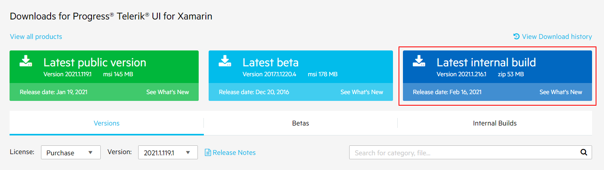
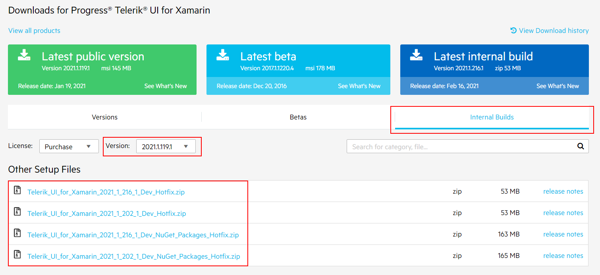
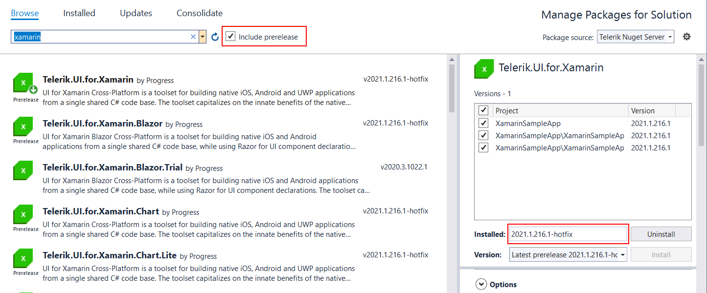
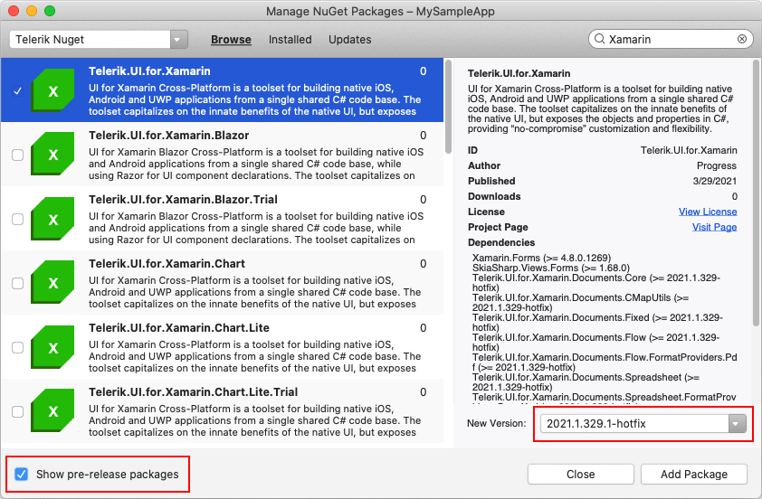

# Latest Internal Builds

The Latest Internal Build (LIB) is a bi-weekly distribution of the Telerik UI for Xamarin assemblies, built against the latest development environment. It contains all the newest bug fixes. And it is released on a bi-weekly basis.

The purpose of the the latest internal build is to allow the users to test the latest bug fixes. So, if you have experienced any problem with the current official distributions there is a possibility that the issue has already been addressed in the latest internal build.

>important The LIBs are intended for development only and are not recommended for production purposes as these distributions have not gone through the complete QA process.

## How to Download LIB

You can download the LIB assemblies from your [Telerik account](https://www.telerik.com/account/).

1. Go to the Telerik UI for Xamarin download page following the instructions in [Download Product Files]() topic.

2. Click on the Latest internal build button. This will download an archive with the UI for Xamarin assemblies:

To get a specific version of the LIB, open the **Internal Builds tab** on the Downloads page. And select a version from the list.

## Installing LIB from NuGet

Latest Internal Builds are available for installing as a [NuGet package]() as well.

- On Visual Studio you would need to check the **Include prerelease** option next to the search box:

- On Visual Studio for Mac you should check the **Show pre-release package** option at the bottom of the "Manage NuGet Packages" window:

## See Also
- [System Requirements]()
- [Download Product Files]()
- [Telerik Nuget Server]()
