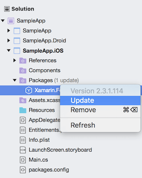
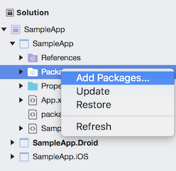

# Getting Started on Mac

This article should help developers to get started with **Telerik UI for Xamarin** suite and **Xamarin Studio** on **Mac OS**.

>Please, make sure you have already read the [System Requirements]() article before you proceed.
 
## 1. Start with Xamarin.Forms app

Depending on your scenario, you either have an existing app where you will add our components, or you have to create a new blank app.

 
> If you already have an app, please proceed to the [next step](#2-getting-the-latest-platform-sdk-versions).

### Create new app from scratch

Open Xamarin Studion and create new solution **Xamarin.Forms Forms App**:

Follow the steps in the wizard until your app is created. It should contain the following projects:

## 2. Getting the latest platform SDK versions

Make sure that your Xamarin.Forms packages are up to date.

You can either use the [Xamarin Studio UI](#update-packages-using-xamarin-studio-ui) to update all packages to the required versions, or you can do it [manually](#update-packages-using-packagesconfig-files) by editing the *packages.config* file in each project.

### Update packages using Xamarin Studio UI

>You have to make sure that you have the right version of Xamarin.Forms and all related packages.

To update specific package to the latest version, right-click on it and select "update":
 
 

If your application requires specific version of a package, you can right-click directly on the packages folder and choose "Add packages...". This will work even if newer version of the package is already added.

You have to search for the package and select the correct version:

>The **Android project** requires multiple packages with specific versions. The **Xamarin.Forms** package will install most of the required packages as its dependencies. You can then go to [Required Android Support Libraries]() article and check if you have all required files and versions.

### Update packages using *packages.config* files

Each project in your solution contains *packages.config* file that contains all referenced NuGet packages. Users can manually update those files to include new packages or modify existing ones. After updating the respective files the **NuGet Package manager** will be able to restore the missing packs and update the existing ones.

Everything users need to do is to fill in the missing packages and update the existing ones in the following format:

	<package id="[PackageName]" version="[PackageVersion]" targetFramework="[TargetFramework]" />
	
####  iOS and Portable

For the iOS and the Portable projects users need to update only the version of the required Xamarin.Forms package, this is the only required package. Its latest official version can be seen on the [official NuGet page](https://www.nuget.org/packages/Xamarin.Forms/). Open the *packages.config* file directly in Xamarin Studio and replace only the existing version with the latest one.

#### Android
	
After updating the Xamarin.Forms package, you can go to [Required Android Support Libraries]() article and check if you have all required packages and versions.
	
>Please bear in mind that the [*TargetFramework*] parameter in the *packages.config* file should be the same among all packages since they all target the Android platform. The value of this parameter can be seen from already installed packages.

If the versions of the required packages is not correct, the Android project will not build with multiple errors of this type:

	Error: `DataFormMultilineEditor.Droid.Resource.Style' does not contain a definition for `Widget_MediaRouter_ControllerText_Title'

#### Restore the NuGet packages

After updating all the *packages.config* files users are now ready to restore the packages. This can be done by clicking the settings icon of the solution and choosing “*Restore NuGet Packages*”.

## 3. Add reference to Telerik Components

You have two options.

### Telerik NuGet package server

You can use our [**Telerik NuGet package server**]() to include our suite in your solution and/or update to the latest available version.

### Manually add required assemblies

The hard way is to add all required assemblies manually. We have added a special article in each control section that contains information about all required assemblies. The article is called **"Required Assemblies"** and is located in the **Getting Started** section for each control.

- [Calendar Required Assemblies]()
- [Chart Required Assemblies]()
- [DataForm Required Assemblies]()
- [ListView Required Assemblies]()
- [SideDrawer Required Assemblies]()

## 4. Register Renderers

The final step is to register the control renderers. These articles will show you how:

- [Calendar Register Renderer]()
- [Chart Register Renderer]()
- [DataForm Register Renderer]()
- [ListView Register Renderer]()
- [SideDrawer Register Renderer]()

## See Also

- [Telerik NuGet packages server]()
- [Calendar Getting Started]()
- [Chart Getting Started]()
- [DataForm Getting Started]()
- [ListView Getting Started]()
- [SideDrawer Getting Started]()

