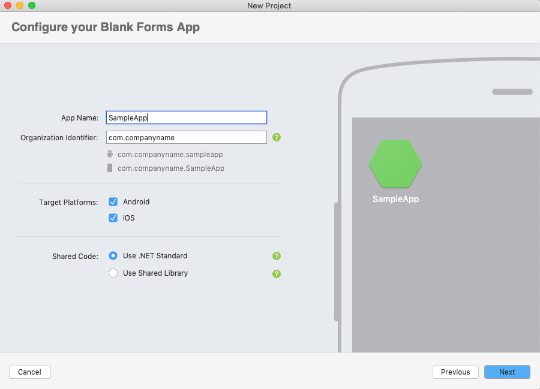
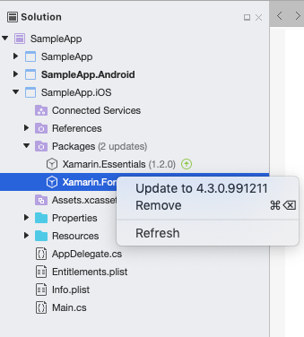
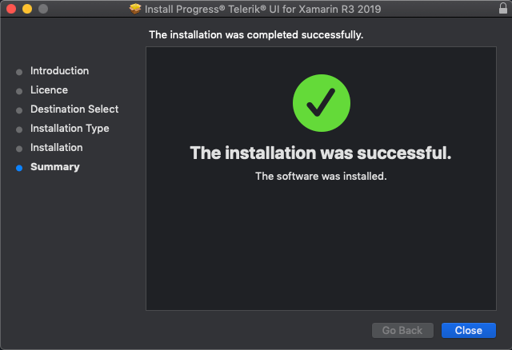

# Using Telerik UI for Xamarin on Mac

This article aims to help you setup your application to use **Telerik UI for Xamarin** suite on **Mac OS**.

>Please, make sure you have already read the [System Requirements](#macos) article before you proceed.
 
## 1. Start with Xamarin.Forms app

Depending on your scenario, you either have an existing app where you will add our components, or you have to create a new blank app.
 
> If you already have an app, please proceed to the [next step](#2-getting-the-latest-platform-sdk-versions).

### Add Telerik components to an already existing app

You can manually reference the Telerik UI for Xamarin assemblies in each of the projects (Xamarin.Forms, Android, iOS) or use the Telerik Nuget packages. For detailed instructions, go to [Step 3: Add references to Telerik Components](#3-add-references-to-telerik-components).

### Create a new app with Telerik UI for Xamarin

If you just start your app, you have two options:

- Use our [**Project Wizard**]() to create a project that has everything setup for you. You can start using our components right away without manually adding required assemblies and modifying solution files.

	>tip We strongly recommend using the **Project Wizard**. If you choose this option, you can skip the next steps in this article and jump directly to the **Getting Started** topic of any control.
	
- Create a new Xamarin.Forms app in Visual Studio for Mac and add the required references to Telerik assemblies.

	If your scenario requires creating a new app from scratch, please proceed following the steps below:
	
	1. Open Visual Studio for Mac, then create new project from the **Multiplatform**  section select **App** -> **Xamarin.Forms** -> **Blank Forms App**:
	
		

	1. In the next screen you could set App name. Organization Identifier, Target Platforms:

		

	1. Follow the steps in the wizard until your app is created. It should contain the following projects:

		

## 2. Getting the latest platform SDK versions

Make sure that your Xamarin.Forms packages are up to date.

You can either use the [Visual Studio UI](#update-packages-using-visual-studio-ui) to update all packages to the required versions, or you can do it manually by editing the *.csproj* file in each project.

### Update packages using Visual Studio UI

>You have to make sure that you have the right version of Xamarin and all related packages.

To update specific package to the latest version, right-click on it and select "Update to ...":
 
 

If your application requires specific version of a package, you can right-click directly on the packages folder and choose "Manage NuGet Packages...". This will work even if newer version of the package is already added.

You have to search for the package and select the correct version:

>important The minimum required version of **Xamarin.Forms** package is **4.1.0.581479**.

>The **Android project** requires multiple packages with specific versions. The **Xamarin.Forms** package will install most of the required packages as its dependencies. You can then go to [Required Android Support Libraries]() article and check if you have all required files and versions.

## 3. Add references to Telerik Components

You have two options: 

### Telerik NuGet package server

You can use our [**Telerik NuGet package server**](#visual-studio-for-mac) to include our suite in your solution and/or update to the latest available version.

### Manually add required assemblies

If you prefer to manually reference the required Telerik UI for Xamarin assemblies into your solution, you can get them in the following ways:

* Download the .pkg file, then install it on the Mac machine. After successfull instalation you will get the following screen:

	
	
	When the installation is completed the assemblies can be found in the Bianries folder.   
	
	
	
* Download a ZIP file containing all the assemblies, for more details on this go to [Download Product Files]() topic. You can then unzip the file to any location on your machine and reference the assemblies from that location.

If you're planning to use only a few components, you can add references to part of the assemblies. There is a special section in each control documentation that lists all the required assemblies. The section is called **"Adding the required Telerik references"** and is located in the **Getting Started** article for each control.

>important As some of the controls included in **Telerik UI for Xamarin** suite rely on the **SkiaSharp** rendering library, you should either install [SkiaSharp.Views.Forms](https://www.nuget.org/packages/SkiaSharp.Views.Forms/1.59.0) in all projects included in the Xamarin solution (portable, android, ios, etc.) or in case you do not intend to use any of the Skia-dependent components (Gauges, Rating, BusyIndicator), you could reference the [Lite assemblies]().

## See Also

- [System Requirements]()
- [Telerik NuGet packages server]()
- [Project Wizard for Visual Studio for Mac]()
