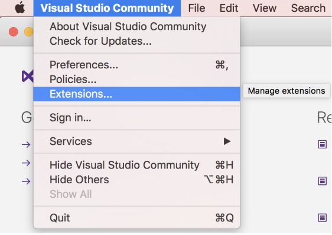
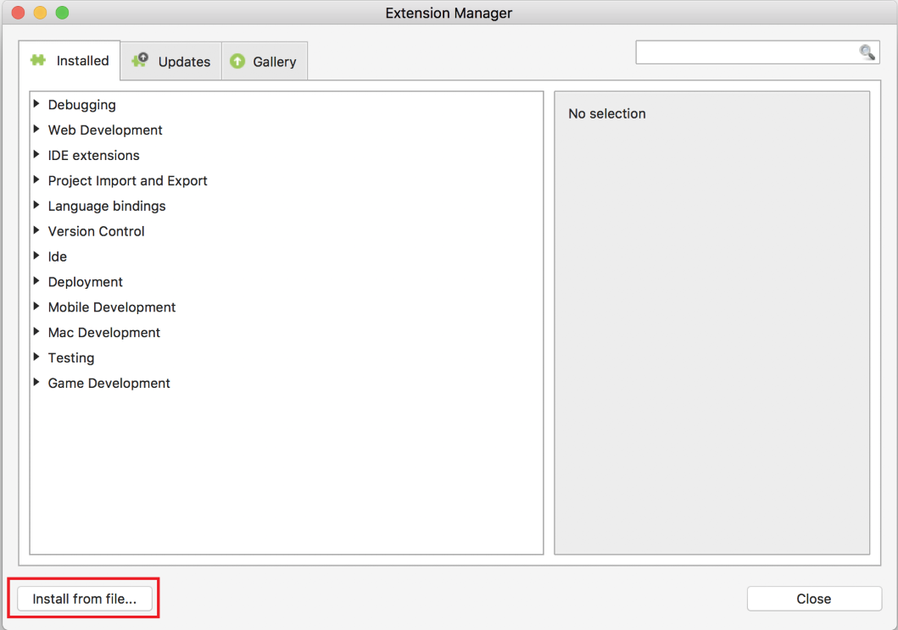
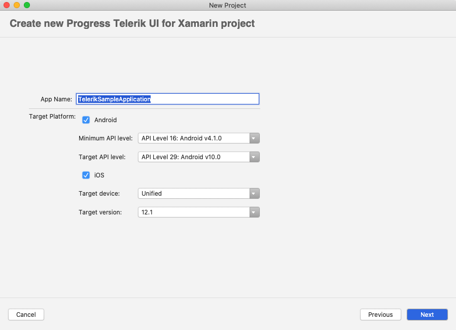
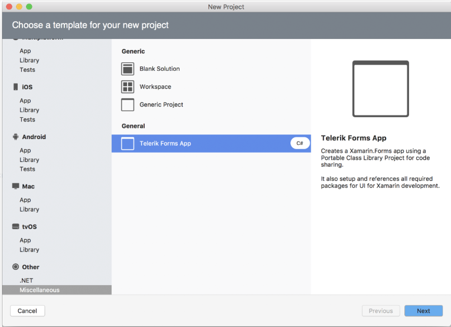

# Project Wizard for Visual Studio for Mac

This article introduces the **Telerik UI for Xamarin.Forms Project Wizard for Visual Studio for Mac**. The project wizard is a Visual Studio add-in that improves the getting started experience for Telerik customers. It provides a project template that is pre-setup with all requirements to run our components so the customers can start writing their apps right away.

## Installation

First, you have to download the **ProjectTemplateXamarin.mpack** file from the Telerik UI for Xamarin product download page inside your [Telerik account](https://www.telerik.com/account/). Go to [Download Product Files]() for exact steps on how to navigate to the download page.

Then, you have to install the project wizard add-in package. Open the Visual Studio **Extension Manager** and select the *Install form file...* option. __Figure 1__ shows how to access the Extension Manager.

#### __Figure 1: Accessing Visual Studio Extensions__

Once you have accessed the **Extension Manager**, the following dialog will appear and you should look for the **Install from file** option.

#### __Figure 2: Reaching the Extension Manager__

Navigate to the **ProjectTemplateXamarin.mpack** file. 

#### __Figure 3: The ProjectTemplate location__

If the add-in is successfully added to Visual Studio, you should see it in the **IDE** extensions section.

**Restart Visual Studio for Mac** to complete the installation.

## New Telerik Xamarin UI Application

Now you can create a new project using the Telerik Project Template.

#### __Figure 4: Create New Project Dialog__

The **Telerik Xamarin UI Application** template can be found in *Other > .NET* section.

#### __Figure 5: Telerik Xamarin UI Application template__

Follow the steps to setup your app.

When you are done the project will contain all required packages and binaries and you can start writing your app right away.

## See Also
- [System Requirements]()
- [Getting Started on Mac]()
- [Required Android Support Libraries]()
