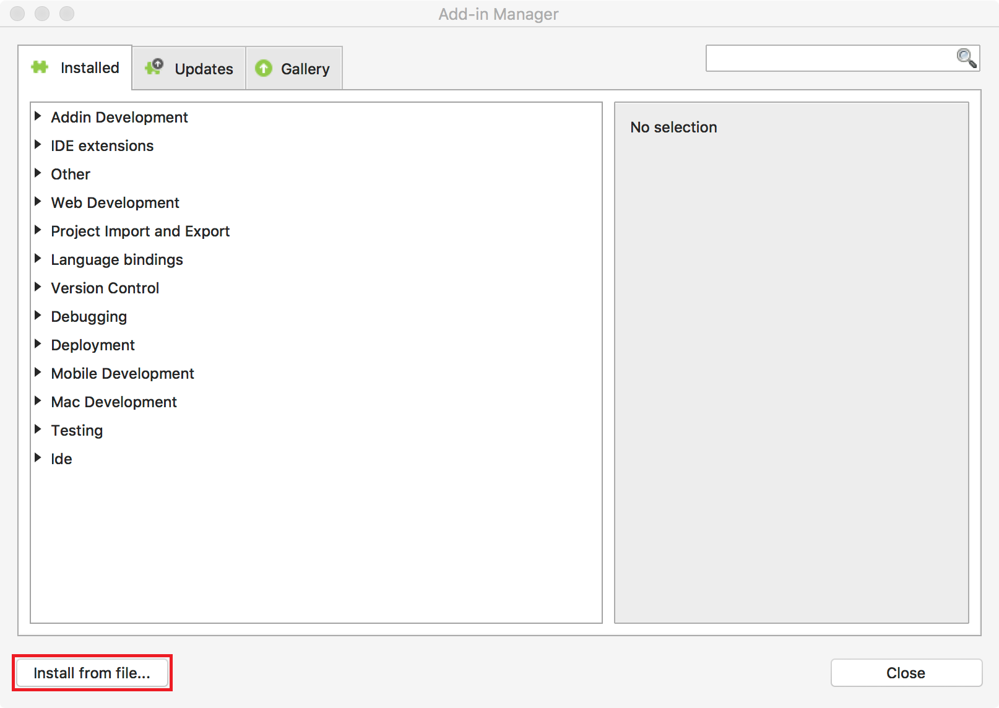
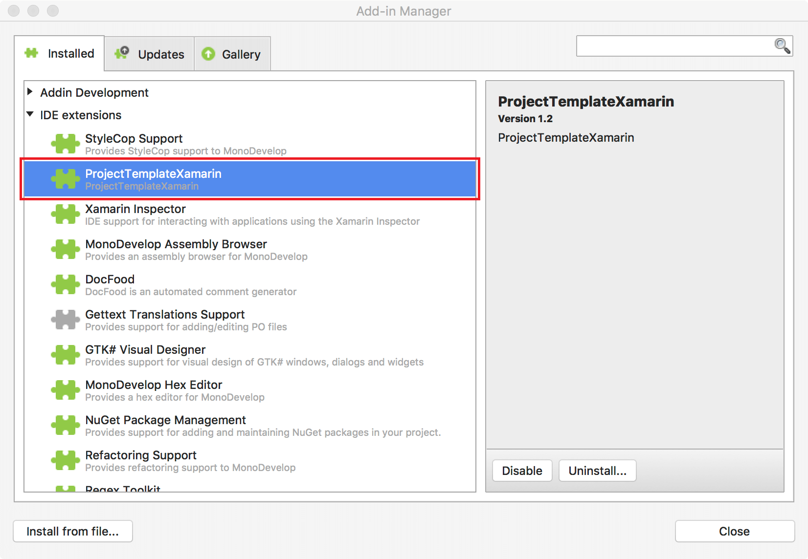
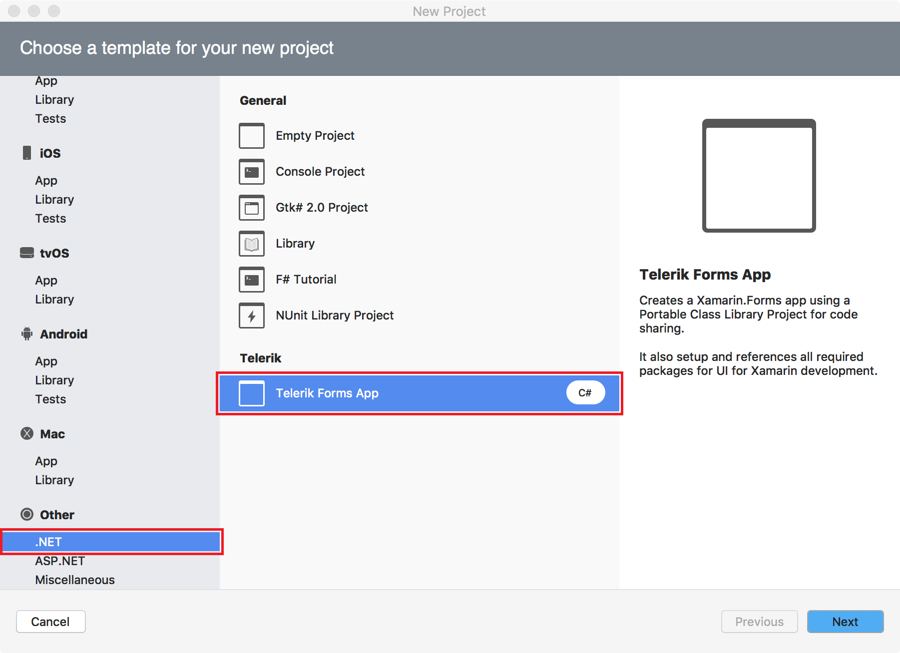
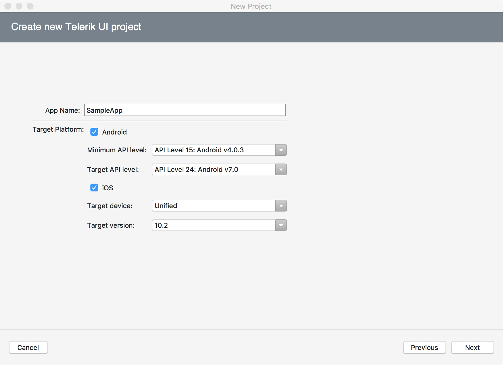

# Project Wizard for Xamarin Studio

This article introduces the **Telerik UI for Xamarin.Forms Project Wizard for Xamarin Studio**. The project wizard is a Xamarin Studio add-in that improves the getting started experience for Telerik customers. It provides a project template that is pre-setup with all requirements to run our components so the customers can start writing their app right away.

## Installation

First, you have to install the project wizard add-in package. Open the Xamarin Studio **Add-in manager** and select the *Install form file...* option.

Navigate to the **ProjectTemplateXamarin.mpack** file. It is located in the *ProjectTemplates* folder inside the installation folder of the suite. If the add-in is successfully added to Xamarin Studio you should see it in the IDE extensions section.

## New Telerik Forms App

Now you can create a new project using the Telerik Project Template.

The **Telerik Forms App** template can be found in *Other > Miscellaneous* section.

Follow the steps to setup your app.

 

When you are done the project will contain all required packages and binaries and you can start writing your app right away.

## See Also
- [System Requirements]()
- [Getting Started on Mac]()
- [Required Android Support Libraries]()