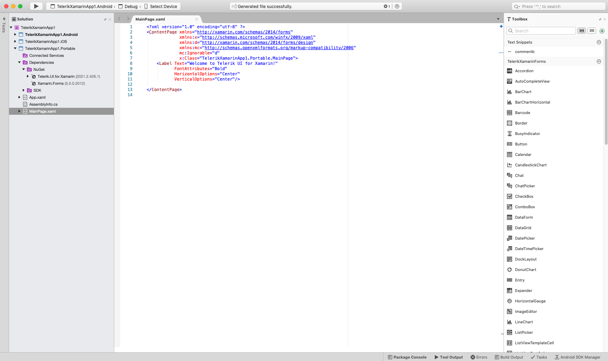
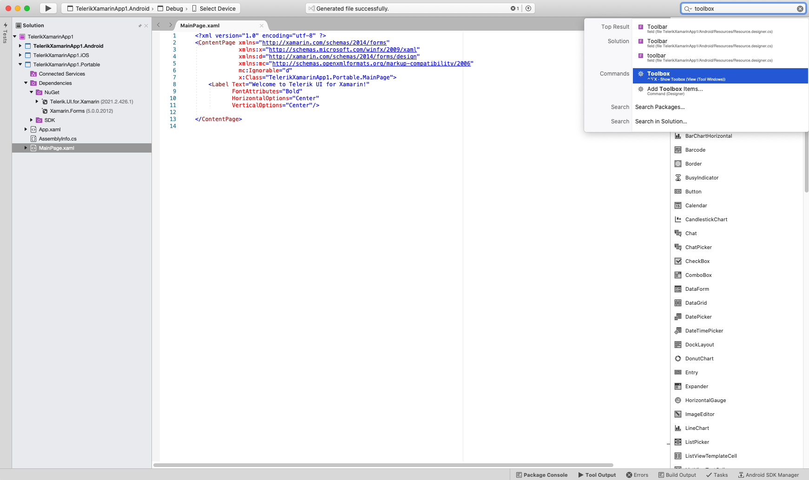

# Telerik Xamarin.Forms Toolbox Extension for Mac

This article introduces **TelerikXamarinForms Toolbox** for Visual Studio for Mac which will ease the process of adding Telerik controls to your Xamarin.Forms application on Mac. 

In order to use the TelerikXamarinForms Toolbox, first you have to install the Project Wizard for Visual Studio for Mac. In short you will need to download the ProjectTemplate.mpack file from the Telerik UI for Xamarin download page inside your [Telerik account](https://www.telerik.com/account/) and install it through the Visual Studio Extension Manager.

>For more details on adding the Telerik UI for Xamarin ProjectTemplate.mpack file check the article about [Project Wizard for Visual Studio for Mac](). 

>important Telerik Visual Studio Toolbox extension for Mac will be phased out in 2024, following the [discontinuation of Visual Studio for Mac](https://devblogs.microsoft.com/visualstudio/visual-studio-for-mac-retirement-announcement/).

## Showing the Telerik Toolbox

In order to show the Toolbox and start using the controls, you should navigate to the MainPage.xaml file in your project and click on it. If the ProjectTemplate.mpack file is installed successfully, Toolbox window is visible in the project when you click on the MainPage.xaml file (or any other XAML file inside your project). You can also find this option when typing “Toolbox” in the Search filed (top right corner in Visual Studio for Mac).

**Figure 1** and **Figure 2** shows where you can find the options in Visual Studio for Mac:

#### Figure 1: Showing the TelerikXamarinForms Toolbox when clicking on MainPage.xaml 

#### Figure 2: Showing the TelerikXamarinForms Toolbox from Search field

Once you have clicked the option you should be prompted to the window which contains the different controls from the suite. **Figure 1** and **Figure 2** shows the appearance of the toolbox if everything is correctly set.

>important If no usable controls are present in the toolbox - make sure all the required references are added and try rebuilding your project. 

## Adding Controls to Your Project

Embedding the controls from the suite is made as easy as possible and all you need to do is simply drag one of the controls within your XAML file. This will add the control definition and will also map the needed namespace declarations. **Figure 3** shows how the action is performed.

#### Figure 3: Adding Telerik controls to your application

## See Also

- [Project Wizard for Visual Studio for Mac]()
- [Telerik NuGet packages server](#visual-studio-for-mac)
