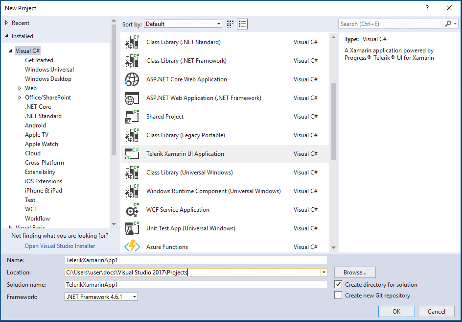

# Project Wizard

This article introduces the **Telerik UI for Xamarin.Forms Project Wizard**. The Project Wizard is a Visual Studio extension that improves the getting started experience of Telerik customers.

It allows customers to select which platform(s) their application target(s) and the wizard will automatically reference all required binaries and packages.

>With the official Q2 2016 release the Project Wizard is included in the automatic installation of the Telerik UI for Xamarin.Forms suite of controls.

# New Project

In order to create a new solution using the Project Wizard customers should open the **New Project** dialog window of Visual Studio.
Next should navigate to Templates -> Visual C# section and the Telerik UI for Xamarin.Forms Project Wizard will be listed at the end.

Find the **TelrikXFApp** template and click OK. This will invoke the Project Wizard. Make your choice and click **Create**. Wait untill Visual Studio prepares all the projects for you. After the solution is created it should be rebuilt in order to update the Xamarin.Forms NuGet packages.

