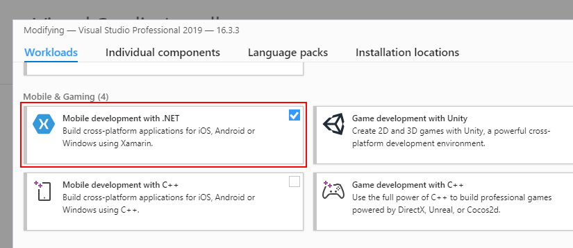

# System Requirements for Telerik UI for Xamarin

In order to develop applications with **Telerik UI for Xamarin** you need to have the following development tools installed:

## Windows

- [Windows 10](https://www.microsoft.com/en-us/windows/get-windows-10) is required to develop for Xamarin.Forms.
- Visual Studio 2019 or Visual Studio 2017 with Xamarin installed. Go to [Visual Studio Downloads](https://visualstudio.microsoft.com/downloads/) page to see the available download options.

	To install Xamarin for Visual Studio 2019/ Visual Studio 2017, you would need to enable **Mobile development with .NET** workload. 
		
	* If you run a fresh installation of Visual Studio, you will be prompted to select workloads during the installation process.
	* if you already have Visual Studio installed, you could modify the active workloads by re-running the Visual Studio installer and selecting "Modify" option.
	
	#### Figure 1: VS 2019 with Mobile development with .NET workload enabled
	
		
	> Before proceeding, please make sure the following Individual components are included:
	>	* **Xamarin**
	>	* **Text Template Transformation**

	>tip If you use Telerik UI for Xamarin version older than **R2 2019**, the **.NET Portable Library Targeting Pack** individual component is also required to successfully install and build with our Xamarin controls.
	
	>tip For more detailed instructions go to [Installing Xamarin in Visual Studio on Windows](https://docs.microsoft.com/en-us/xamarin/cross-platform/get-started/installation/windows) topic in Xamarin documentation.	
	
- For building iOS apps - [configured iOS build host](https://developer.xamarin.com/guides/ios/getting_started/installation/windows/connecting-to-mac/).

## macOS

You will be able to develop **Android** and **iOS** apps. The **iOS** apps will require iOS 8 and higher. Windows apps are not supported on macOS.

-  [macOS High Sierra 10.13 or higher](http://www.apple.com/osx/).
-  [Visual Studio for Mac](https://www.visualstudio.com/downloads/) with Xamarin installed.

	Visual Studio for Mac installer inspects your system and verifies which components are installed and which need to be updated. In order to make sure Xamarin is installed, you would need to run the VS for Mac installer and check whether **Android** and **iOS** options are enabled.
	
	#### Figure 3: VS for Mac with Android and iOS platforms enabled
	

	>tip For more information go to [Setup and Install Visual Studio for Mac](https://docs.microsoft.com/en-us/visualstudio/mac/installation) topic.

-  [XCode 8.3 or higher](https://developer.apple.com/xcode/).

## Xamarin.Forms reference

The minimum required version of **Xamarin.Forms** package is **4.6.0.726**.

>The **Android project** requires multiple packages with specific versions. The **Xamarin.Forms** package will install most of the required packages as its dependencies. You can then go to [Required Android Support Libraries]() article and check if you have all required files and versions.

## Supported mobile versions

You can use Telerik UI for Xamarin for application development for the following mobile operating systems:

|Platform 		| Supported version 			|
|:---			| :---							|
|Android		| 5.0 (API Level 21) or higher	|
|iOS			| 7.0 or higher					|
|Windows		| Windows 10  					|

## Next Steps

- [Using Telerik UI for Xamarin on Windows]()
- [Using Telerik UI for Xamarin on Mac]()