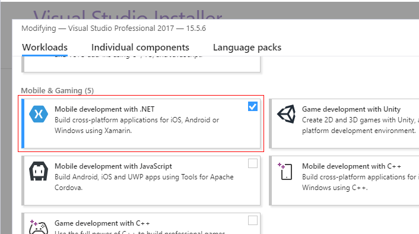
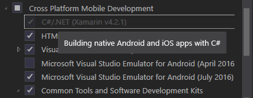
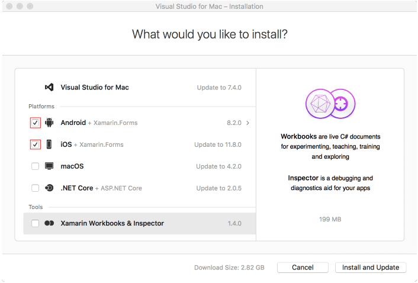

# System Requirements

In order to develop applications with **Telerik UI for Xamarin** you need to have the following development tools installed:

## Windows

- Windows 8.1 or higher. You would need [Windows 10](https://www.microsoft.com/en-us/windows/get-windows-10) in order to develop for UWP.
- [Visual Studio 2015](https://www.visualstudio.com/downloads/) or [Visual Studio 2017](https://www.visualstudio.com/downloads/) with Xamarin installed.

	* To install Xamarin for Visual Studio 2017 you would need to enable **Mobile development with .NET** workload. 
		
		* If you run a fresh installation of VS 2017, you will be prompted to select workloads during the installation process.
		* if you already have VS 2017 installed, you could modify the active workloads by re-running the Visual Studio installer and selecting "Modify" option.
	
	#### Figure 1: VS 2017 with Mobile development with .NET workload enabled
	
		
	> Before proceeding, please make sure the following Individual components are included:
	>	* Xamarin
	>	* Text Template Transformation
	>	* .NET Portable Library targeting pack

	>tip For more detailed instructions go to [Installing Xamarin in Visual Studio on Windows](https://docs.microsoft.com/en-us/xamarin/cross-platform/get-started/installation/windows) topic in Xamarin documentation.
 
	* То add Xamarin to Visual Studio 2015 you would need to enable **Cross-Platform Mobile Development > C#/.NET (Xamarin)** feature in VS 2015 installer.
	
		* If you run a new installation of VS 2015, select "Custom" type within the installer in order to be able to select additional features.
		* If you already have VS 2015 installed, go to Control Panel -> Programs and Features, choose the Visual Studio 2015 item, and click "Change". When the installer opens, select "Modify";
	
	#### Figure 2: VS 2015 with C#/.NET (Xamarin) feature enabled	
	
	
	> For detailed information on how to setup your VS 2015 development environment check [this MSDN article](https://msdn.microsoft.com/en-us/library/mt613162.aspx).
	
- For building iOS apps - [configured iOS build host](https://developer.xamarin.com/guides/ios/getting_started/installation/windows/connecting-to-mac/).

## macOS

You will be able to develop **Android** and **iOS** apps. The **iOS** apps will require iOS 8 and higher. Windows apps are not supported on macOS.

-  [macOS Sierra 10.12 or higher](http://www.apple.com/osx/).
-  [Visual Studio for Mac](https://www.visualstudio.com/downloads/) with Xamarin installed.

	VS for Mac installer inspects your system and verifies which components are installed and which need to be updated. In order to make sure Xamarin is installed, you would need to run the VS for Mac installer and check whether **Android** and **iOS** options are enabled.
	
	#### Figure 3: VS for Mac with Android and iOS platforms enabled
	

	>tip For more information go to [Setup and Install Visual Studio for Mac](https://docs.microsoft.com/en-us/visualstudio/mac/installation) topic.

-  [XCode 8.3 or higher](https://developer.apple.com/xcode/).

## Next Steps

- [Getting started on Windows]()
- [Getting started on Mac]()