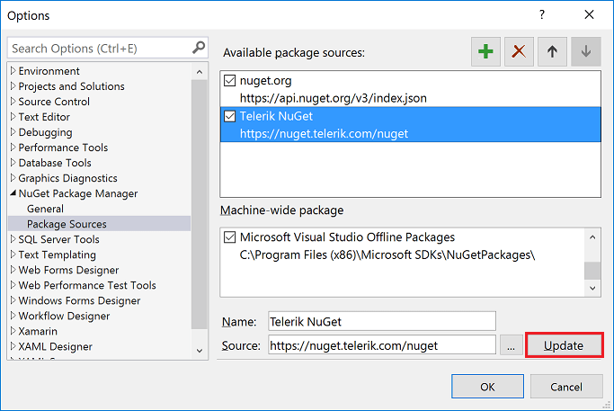

# Telerik NuGet Server

The following steps demonstrate how users can take advantage of **Telerik NuGet server** in order to include our suite in their solution and/or update to the latest available version.

>important The credentials needed to access Telerik Nuget server are the same you use to log into your [Telerik account](https://www.telerik.com/account).

>You will find Nuget packages containing the standard and the lite assemblies - the latter have *Lite* in their names. Please take a look at the [Lite Assemblies]() topic for more details on the difference between them.

## Visual Studio for Windows

<iframe width="800" height="400" src="https://www.youtube.com/embed/c3m_BLMXNDk" frameborder="0" allow="accelerometer; autoplay; encrypted-media; gyroscope; picture-in-picture" allowfullscreen></iframe>

The first step is to add the Telerik server to the NuGet package sources. This can be done in the Package Manager Settings from the Tools menu.


In the the Package Sources section users can add new sources.


In the Source field users should fill in the address of the Telerik server (URL: **https://nuget.telerik.com/nuget**) and click the Update button.



The Telerik server is now ready to use. Users can go to their solution and open the solution package manager.


### Add Telerik UI for Xamarin pack

Users have to find the **Telerik.UI.for.Xamarin** package and install it to their projects following these steps:

1. Select the Telerik server as a package source and enter their credentials when prompted.
1. Search for the Telerik.UI.for.Xamarin package.
1. Select the package when found.
1. Select which projects will have the package installed.
1. Choose the desired version and click Install.


Now the user's solution has all required Telerik assemblies.

## Visual Studio for Mac

Users first have to add the Telerik NuGet server in their packages sources list. This can be done by clicking on the settings icon of any “*Packages*” folder (any project will do the job) and choosing “*Add Packages…*”.


This will open another dialog. Users need to choose “*Configure Sources…*” option from the dropdown in the upper right corner.


On the next dialog users will see all the available sources. Choose “*Add*” to add the new server.


In the Add Package Source dialog users should fill in the information of the Telerik server (URL: **https://nuget.telerik.com/nuget**) as well as their private Telerik credentials. Authentication procedure is required in order to allow downloading the packs.


After the Telerik NuGet server is added users will be able to see the packages they are allowed to download in the Add Packages dialog. This will allow them to check the **Telerik UI for Xamarin** pack and add it into their projects.

### Add Telerik UI for Xamarin pack

Once the server is added users will be able to add to their projects any of the **Telerik NuGet** packages available for their license. One click on the settings icon of the “*Packages*” folder of any project will open the **Add Packages** dialog where the available Telerik packs will be listed.


## Troubleshooting

### '401 Logon failed' error

If you're receiving this error when connecting to Telerik Nuget Server, you could try to update your NuGet credentials through the Windows Credential Manager. Please follow the steps below:

1. Close all open Visual Studio instances (this is so that all NuGet package manager tasks are stopped).
2. Open the "Credential Manager" app on your PC.
3. Scroll through all the entries until you find any that are for nuget.telerik.com.
4. Once you find that entry, expand it and select "edit".
5. Make sure the username and password are the same ones you use for your Telerik account and clisk
    1. Use the email address in the place of username
    2. Make sure any special characters are escaped (see *Handling Special Characters in Password* below)
    3. Click "Save" 
6. Make sure the URL does not have a trailing slash, it must be only `https://nuget.telerik.com/nuget`

Now you can reopen Visual Studio and access the Telerik NuGet server. 

#### Handling Special Characters in Password

If your password contains a special character, those characters need to be escaped or it may fail authentication resulting in *Error 401 login failure* from the NuGet server. A common character that needs to be escaped is the ampersand `&`, but it can be as unique as the section character `§`. There are two ways to handle this.

1. Change the password so that it only includes characters that do not need to be escaped
2. HTML encode the password so the special characters are escaped (e.g. `my§uper&P@§§word` becomes `my&sect;uper&amp;P@&sect;&sect;word`).

We **strongly** discourage entering your password into an online encoder utility, use Powershell instead. Here's one example:

```
Add-Type -AssemblyName System.Web
[System.Web.HttpUtility]::HtmlEncode('my§uper&P@§§word')
```

Result:


### Networking Problems

Another common problem is that your machine (PC or DevOps agent) is behind a proxy. To check if you're experiencing a networking issue, open the following URL in your web browser:

https://nuget.telerik.com/nuget/Search()?$filter=IsAbsoluteLatestVersion&searchTerm=%27Xamarin%27&includePrerelease=true&$skip=0&$top=100&semVerLevel=2.0.0. 

After you enter your Telerik.com username and password, you should see an XML search result containing a list of all the Telerik.UI.for.Xamarin packages available with your license.


## See Also
- [System Requirements]()
- [Getting Started on Windows]()
- [Getting Started on Mac]()
