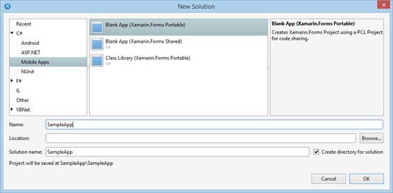

# Getting Started on Windows

This article should help developers to get started with **Telerik UI for Xamarin** suite on **Windows OS**.

>Please, make sure you have already read the [System Requirements]() article before you proceed.

## 1. Start with Xamarin.Forms app

Depending on your scenario, you either have an existing app where you will add our components, or you have to create a new blank app.
 
> If you already have an app, please proceed to the [next step](#2-getting-the-latest-platform-sdk-versions).

### Create new app from scratch

If you start your app from scratch, you have these options:

- Use our [**Project Wizard**]() to create a project that has everything setup for you. You can start using our components right away without manually adding required assemblies and modifying solution files.
- Create a blank Xamarin.Forms app and manually setup all requirements.

> We strongly recommend using the **Project Wizard**. If you choose this option, you can skip the next steps in this article and jump directly to the **Getting Started** section of any control.

If your scenario requires using the other approach, please proceed following the steps in this article.

#### How to create blank Xamarin.Forms app

Create new solution **Xamarin.Forms Portable** / **Shared**

* **Visual Studio**: located at *Templates* > *Visual C#* > *Mobile Apps* section:  

* **Xamarin Studio**: located at *C#* > *Mobile Apps* section:  
  

Typically, the solution will contain the following projects:

* **Portable/Shared**: Cross platform application library that contains the shared code and UI.
* **Android**: Available on all operation systems.
* **WinPhone**, **Windows 8.1**or **UWP**: Available only for projects created with Visual Studio.
* **iOS**:
 * Available for OS X.
 * If you wish to use Visual Studio as a development environment you will also need a mac machine. You can find more information how to setup your environment here: [Introduction to Xamarin.iOS for Visual Studio](http://developer.xamarin.com/guides/ios/getting_started/installation/windows/introduction_to_xamarin_ios_for_visual_studio/)

## 2. Getting the latest platform SDK versions

Make sure that your Xamarin.Forms packages are up to date.

>The **Android project** requires multiple packages with specific versions. The **Xamarin.Forms** package will install most of the required packages as its dependencies. You can then go to [Required Android Support Libraries]() article and check if you have all required files and versions.

This is how you can update the NuGet packages:

1. Right-click the newly created solution and choose: Visual Studio > "Manage NuGet packages for Solution".
2. From Updates >> nuget.org install the latest version of the **Xamarin.Forms** package.

## 3. Add reference to Telerik Components

You can use our [**Telerik NuGet package server**]() to include our suite in your solution and/or update to the latest available version.

The hard way is to add all required assemblies manually. We have added a special article in each control section that contains information about all required assemblies. The article is called **"Required Assemblies"** and is located in the **Getting Started** section for each control.

- [Calendar Required Assemblies]()
- [Chart Required Assemblies]()
- [DataForm Required Assemblies]()
- [ListView Required Assemblies]()
- [SideDrawer Required Assemblies]()

## 4. Register Renderers

The final step is to register the control renderers. These articles will show you how:

- [Calendar Register Renderer]()
- [Chart Register Renderer]()
- [DataForm Register Renderer]()
- [ListView Register Renderer]()
- [SideDrawer Register Renderer]()

## See Also

- [Project Wizard]()
- [Telerik NuGet packages server]()
- [Calendar Getting Started]()
- [Chart Getting Started]()
- [DataForm Getting Started]()
- [ListView Getting Started]()
- [SideDrawer Getting Started]()