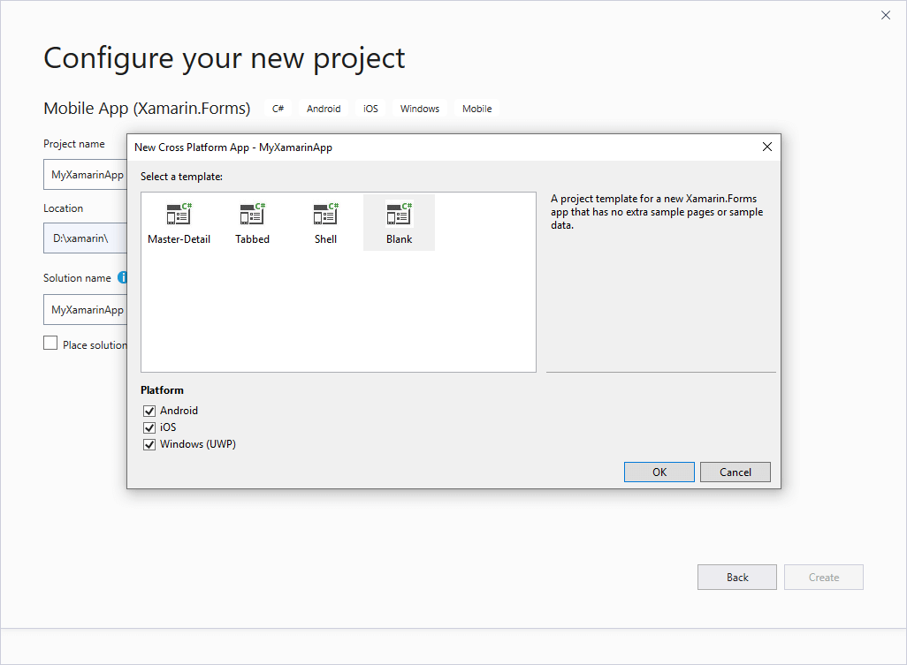

# Using Telerik UI for Xamarin on Windows

This article aims to help you setup your application to use **Telerik UI for Xamarin** suite on **Windows OS**.

>Please, make sure you have already read the [System Requirements]() article before you proceed.

## 1. Start with Xamarin.Forms app

Depending on your scenario, you either have an existing app where you will add our components, or you have to create a new blank app.
 
### Add Telerik components to an already existing app

You can manually reference the Telerik UI for Xamarin assemblies in each of the projects (Xamarin.Forms, Android, iOS, UWP) or use the Telerik Nuget packages. For detailed instructions, go to [Step 2: Add references to Telerik Components](#2-add-references-to-telerik-components).
 
### Create a new app with Telerik UI for Xamarin

If you just start your app, you have two options:

- Use our [**Project Wizard**]() to create a project that has everything setup for you. You can start using our components right away without manually adding required assemblies and modifying solution files.

	>tip We strongly recommend using the **Project Wizard**. If you choose this option, you can skip the next steps in this article and jump directly to the **Getting Started** topic of any control.

- Create a new Xamarin.Forms app in Visual Studio and add the required references to Telerik assemblies.

	If your scenario requires creating a new app from scratch, please proceed following the steps below:

	1. Create a new solution using the **Mobile App (Xamarin.Forms)** template:

		

	1. In the next screen you could set Project name and location as well as choose the Xamarin.Forms template and platforms your app will target:

		

		Typically, the solution can contain the following projects:

		* **.NET Standard**: Cross platform application library that contains the shared code and UI.
		* **Android**: Available on all operation systems.
		* **UWP**: Available only for projects created with Visual Studio.
		* **iOS**:
		 * Available for MacOS.
		 * If you wish to use Visual Studio as a development environment you will also need a mac machine. You can find more information how to setup your environment here: [Introduction to Xamarin.iOS for Visual Studio](http://developer.xamarin.com/guides/ios/getting_started/installation/windows/introduction_to_xamarin_ios_for_visual_studio/)

>important The minimum required version of **Xamarin.Forms** package is **4.1.0.581479**.
  
>The **Android project** requires multiple packages with specific versions. The **Xamarin.Forms** package will install most of the required packages as its dependencies. You can then go to [Required Android Support Libraries]() article and check if you have all required files and versions.

## 2. Add references to Telerik Components

You have two options: 

### Telerik NuGet package server

You can use our [**Telerik NuGet package server**]() to include our suite in your solution and/or update to the latest available version.

### Manually add required assemblies

If you prefer to manually reference the required Telerik UI for Xamarin assemblies into your solution, you can get them in the following ways:

* Through the MSI installation - in this case after [installing Telerik UI for Xamarin]() on your machine, you can find the assemblies in the following default folder: C:\Program Files\Progress\ or C:\Program Files (x86)\Progress\ for a 64bit machine;
* Download a ZIP file containing all the assemblies, for more details on this go to [Download Product Files]() topic. You can then unzip the file to any location on your machine and reference the assemblies from that location.

If you're planning to use only a few components, you can add references to part of the assemblies. There is a special section in each control documentation that lists all the required assemblies. The section is called **"Adding the required Telerik references"** and is located in the **Getting Started** article for each control.

>important As some of the controls included in **Telerik UI for Xamarin** suite rely on the **SkiaSharp** rendering library, you should either install [SkiaSharp.Views.Forms](https://www.nuget.org/packages/SkiaSharp.Views.Forms/1.59.0) in all projects included in the Xamarin solution (portable, android, ios, etc.) or in case you do not intend to use any of the Skia-dependent components (Gauges, Rating, BusyIndicator), you could reference the [Lite assemblies]().

## See Also

- [System Requirements]()
- [Project Wizard]()
- [Telerik NuGet packages server]()
