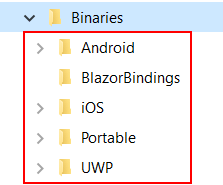

# Installing Telerik UI for Xamarin from MSI file #

To install Telerik UI for Xamarin on your machine from the Windows Installer MSI file, follow the instructions below:

>Please, make sure you have already read the [System Requirements]() article before you proceed.

1. Go to to the Telerik UI for Xamarin download page following the instructions in [Download Product Files]() topic.

2. Download the automatic installation (MSI) file.

3. Once the download completes, **run the MSI file** and follow the instructions. On a 32bit machine the wizard will install the UI for Xamarin component in the following folder unless you specify otherwise: *C:\Program Files\Telerik\* or *C:\Program Files (x86)\Telerik\* for a 64bit machine.

> If you prefer using the ZIP file with the dlls instead of the automatic installation you can download it from the [Telerik UI for Xamarin product download page]().

#### Exploring the installation folder

If you open the installation folder you will probably note the following sub directories:

* Binaries
* Examples - here you can find the [SDK Browser application](#sdk-browser-application) as well as sample applications demonstrating our [controls for Xamarin.Android and Xamarin.iOS]().
* LicenseAgreements - provides the product EULA.
* QSF - includes the full source of [Telerik UI for Xamarin Samples Application](#telerik-ui-for-xamarin-samples-application).
* VSExtensions - includes our Visual Studio Extension package. For more details go to [Visual Studio Extensions]() topic.

**Binaries** folder contains all the Telerik UI for Xamarin assemblies grouped in folders according to the target project they should be added to. Check the exact structure in the image below:

### Next Steps
- [Using project wizard for Visual Studio]()
- [Getting started on Windows]()
- [Getting started on Mac]()
- [UI for Xamarin Support and Learning Resources](http://www.telerik.com/support/xamarin-ui)