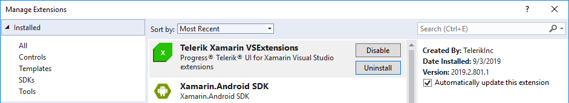
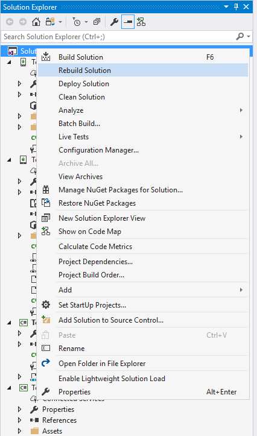

# Project Wizard

This article introduces the **Telerik UI for Xamarin.Forms Project Wizard**. The Project Wizard is a Visual Studio extension that improves the getting started experience for Telerik customers.

It allows customers to select which platform(s) their application targets and the wizard will automatically reference all required Telerik binaries and packages.

>With the official **Q2 2016** release the Project Wizard is included in the automatic installation of the Telerik UI for Xamarin.Forms suite of controls. With the minor release **R1 2017.1.10301** the Project Wizard is integrated with **Visual Studio 2017**.

## Installing the Project Wizard

In order to have access to the **Project Wizard to Visual Studio**, you need to install the Visual Studio extension that is shipped with the default installation of the **Telerik UI for Xamarin** suite. It can be found in the **VSExtensions** folder as shown below:

Running the vsix file will install the template and it will be present in the "Extensions and Update" section in Visual Studio:
 

>important If you install the Telerik UI for Xamarin suite through the MSI automatic installation, you will be prompted to install the extensions automatically so there will be no need of manually running the .vsix file

## New Project

In order to create a new solution using the Project Wizard customers should open the **New Project** dialog window of Visual Studio.

Next users should navigate to Templates -> Visual C# section and the Telerik UI for Xamarin.Forms Project Wizard will be listed there.

Find the template and click OK. This will invoke the Project Wizard. Make your choice and click **Finish**. Wait until Visual Studio prepares all the projects for you. After the solution is created it should be rebuilt in order to update the Xamarin.Forms NuGet packages.

After rebuilding the solution all packages and binaries will be updated and users will be ready to choose a startup project and deploy it to the targeted platform.

## See Also
- [Visual Studio Item Templates]()
- [Telerik NuGet Server]()
- [Required Android Support Libraries]()

