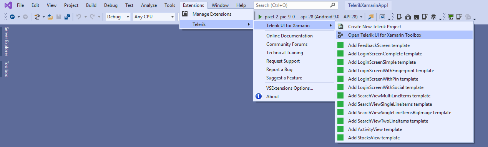
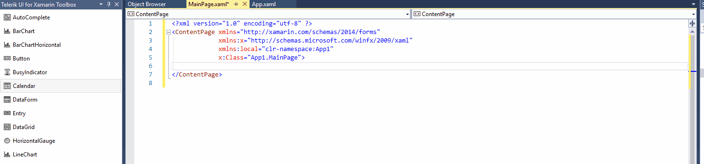

# Telerik UI for Xamarin Toolbox

When you install the **Telerik UI for Xamarin** suite through the msi installation file, the Xamarin.UI.VSPackage.vsix(Visual Studio extension file) will be automatically installed on your Visual Studio instances. This will add the Telerik UI for Xamarin toolbox which can be used to ease the process of adding Telerik controls to your Xamarin.Forms application. 

## Showing the Telerik Toolbox

In order to show the Toolbox and start using the controls, you should navigate to "Telerik" -> "Telerik UI for Xamarin" -> "Open Telerik UI for Xamarin Toolbox" tab within Visual Studio. You can also find this option when typing "Telerik UI for Xamarin Toolbox" in the Quick Launch search field (top right corner in Visual Studio).
**Figure 1** shows where you can find the option in Visual Studio:

#### Figure 1: Showing the Telerik UI for Xamarin Toolbox 

Once you have clicked the option you should be prompted to the window which contains the different controls from the suite.**Figure 2** shows the appearance of the toolbox if everything is correctly set.

>important If no usable controls are present in the toolbox - make sure all the required references are added and try rebuilding your project. 

## Adding Controls to Your Project

Embedding the controls from the suite is made as easy as possible and all you need to do is simply drag one of the controls within your XAML file. This will add the control definition and will also map the needed namespace declarations. **Figure 2** shows how the action is performed.

#### Figure 2: Adding Telerik controls to your application

## See Also

- [Project Wizard]()
- [Telerik NuGet packages server]()
- [Calendar Getting Started]()
- [Chart Getting Started]()
- [DataForm Getting Started]()
- [ListView Getting Started]()
- [SideDrawer Getting Started]()
