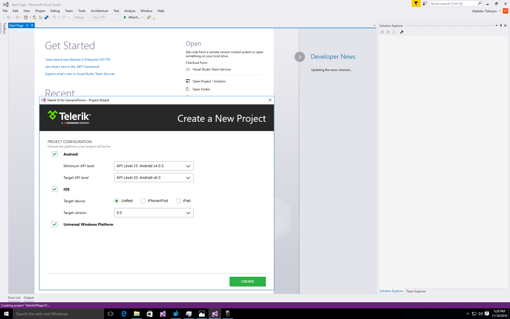
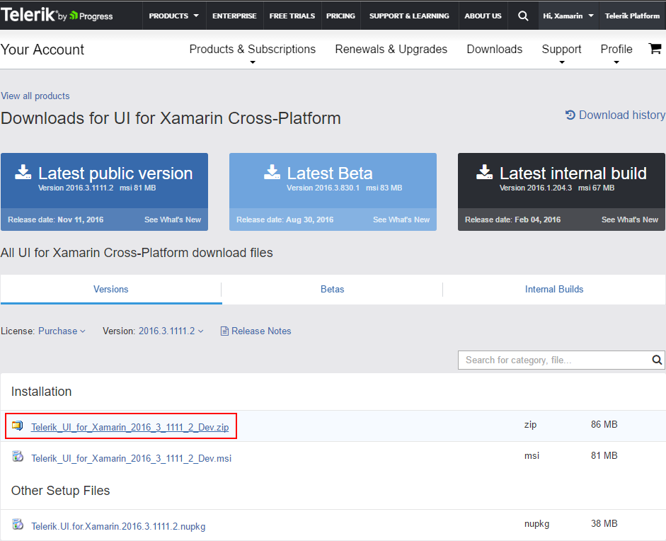

## How to manually install Telerik UI for Xamarin


Visual Studio 15 RC is already here and we are quite excited about the improvements it gives and the benefits it will generate for everyone. I am glad to say that we already tested UI for Xamarin against this latest version of Visual Studio and we are working without any issues.


Some additional work is required, however, to finalize the installers that will provide smooth out-of-the-box integration experience between UI for Xamarin and Visual Studio RC 15, in the face of our Project Template and Project Wizard.





If you are eager to try UI for Xamarin on Visual Studio 15 and get the integration goodies set up, there’s still a relatively easy and quick and easy way to install them manually. This approach will also find its place in the cases where, for one reason or another, our organization does not allow usage of downloaded MSI installers. Here is the general flow when manual installation is used.

First, you need to log into your Telerik account and download the latest ZIP package. Unzip its content to any folder (for the purpose of this article *C:\\TelerikManualInstallation* will be used) and manually install the Project Wizard by triggering the **ProjectTemplateVS14.VSIX.vsix** file.





These steps will allow you to create projects using the Project Wizard. However, the projects will not build out of the box due to incorrect references.


## What breaks the wizard?


When our components are installed using the MSI we know where the binaries are copied. Also we create a special RegistryKey during the installation. Later on, when customers use the Project Wizard to create new solution, we rely on that particular key to create all projects with correct references to our binaries. When this registry key does not exist all references inside the newly created projects will be incorrect.

## How to fix the projects? 

### Manual reference update


One possible way to fix the issue is to manually update the references by deleting the existing ones and creating new ones pointing to the folder of the manual installation. This approach will resolve the binaries from the new folder and the references will be correct. 

Another way to correctly reference the binaries is to open each of the created **\*.csproj** files in a text editor and update the tag BinariesFolder with the new path. By default, that tag uses the custom registry key to find the path to the Binaries folder. However, when a new solution is created, the same issue will exist and the same steps should be made again.


```xml
<PropertyGroup>
    <Configuration Condition=" '$(Configuration)' == '' ">Debug</Configuration>
    <Platform Condition=" '$(Platform)' == '' ">x86</Platform>
    <ProjectGuid>{2843F59C-670B-47F6-AB88-E81ADBD06C9E}</ProjectGuid>
    <OutputType>AppContainerExe</OutputType>
    <AppDesignerFolder>Properties</AppDesignerFolder>
    <RootNamespace>TelerikXFApp12.UWP</RootNamespace>
    <AssemblyName>TelerikXFApp12.UWP</AssemblyName>
    <DefaultLanguage>en-US</DefaultLanguage>
    <TargetPlatformIdentifier>UAP</TargetPlatformIdentifier>
    <TargetPlatformVersion>10.0.10586.0</TargetPlatformVersion>
    <TargetPlatformMinVersion>10.0.10240.0</TargetPlatformMinVersion>
    <MinimumVisualStudioVersion>14</MinimumVisualStudioVersion>
    <FileAlignment>512</FileAlignment>
    <ProjectTypeGuids>{A5A43C5B-DE2A-4C0C-9213-0A381AF9435A};{FAE04EC0-301F-11D3-BF4B-00C04F79EFBC}</ProjectTypeGuids>
    <PackageCertificateKeyFile>Windows_TemporaryKey.pfx</PackageCertificateKeyFile>
    <BinariesFolder>C:\TelerikManualInstallation\Binaries</BinariesFolder>
</PropertyGroup>
```

### Registry update


The second approach for fixing the references is to manually create the **RegistryKey** that we rely on. That registry should exist in: **HKEY\_LOCAL\_MACHINE/SOFTWARE/WOW6432Node/Telerik/UIForXamarin/[release version]/**. The registry itself should be a string value (*REG_SZ*) type. With **Name** “*InstallDir*” and Data “[*path of the install dir*]” e.g. “*C:\\TelerikManualInstallation\\*”. Once this registry is added, the *Project Wizard* will use it and will create projects with correct references. The benefit of this approach is that as long as the binaries are present in the mentioned folder, the created projects will have correct references and the additional steps should be made once.


There you go, you can now create Project Wizard-supported projects with UI for Xamarin in Visual Studio 15. Happy coding!


## See Also
- [System Requirements]()
- [Getting Started on Mac]()
- [Required Android Support Libraries]()
