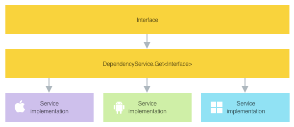

## Environment
<table>
	<tbody>
		<tr>
			<td>Product Version</td>
			<td>2020.1.318.1</td>
		</tr>
		<tr>
			<td>Product</td>
			<td>UI for Xamarin Cross-Platform</td>
		</tr>
	</tbody>
</table>


## Description

Currently, there is no "export UI element as image" feature built into Xamarin.Forms. This tutorial will show you how to use native platform APIs to render and save the Xamarin.Forms application UI as an image.

## Solution

Use the native platform APIs in Xamarin.Android, Xamarin.iOS and UWP to get the screen's pixels into a buffer and encode them as a particular image type (png, jpg, etc).

### Xamarin.Forms Dependency Service

Before moving forward, it's important to understand how a Xamarin.Forms **Dependency Service** works because we'll be defining the interface in Xamarin.Forms, but implementing the logic in each native platform project.



> If you're not familiar with creating a Dependency Service, please visit this great tutorial: [Xamarin.Forms DependencyService Introduction](https://docs.microsoft.com/en-us/xamarin/xamarin-forms/app-fundamentals/dependency-service/introduction). It will quickly show you the different parts of a Dependency Service and how it works with a simple device orientation example.

### XamarinForms Project Setup

Define the dependency service interface in the Xamarin.Forms project:

```csharp
using System.Threading.Tasks;
using RenderImage.Portable.Models;

namespace RenderImage.Portable.Services
{
    public interface IRenderService
    {
        /// <summary>
        /// Will render the entire display as an image byte[].
        /// </summary>
        /// <param name="encodingFormat">Can be set to 'jpeg', but defaults to 'png'</param>
        /// <returns>Image byte array</returns>
        Task<byte[]> RenderAsync(RenderEncodingOptions encodingFormat = RenderEncodingOptions.Png);

        /// <summary>
        /// Renders cropped area using absolute pixel position
        /// Ex. 50,50,300, 200
        /// </summary>
        /// <param name="x">Left</param>
        /// <param name="y">Top</param>
        /// <param name="width">Width</param>
        /// <param name="height">Height</param>
        /// <param name="encodingFormat">Can be set to 'jpeg', but defaults to 'png'</param>
        /// <returns>Image byte array</returns>
        Task<byte[]> RenderAsync(int x, int y, int width, int height, RenderEncodingOptions encodingFormat = RenderEncodingOptions.Png);

        /// <summary>
        /// Renders cropped area using proportional percentage values.
        /// For example, if the X position is at pixel 100 on a 400 pixel wide display, X will be 25%. do the same for all 4 values.
        /// This proportional value allows the cropping to be scaled up to the device's specific resolution.
        /// </summary>
        /// <param name="xProportion">Left</param>
        /// <param name="yProportion">Top</param>
        /// <param name="widthProportion">Width</param>
        /// <param name="heightProportion">Height</param>
        /// <param name="encodingFormat">Can be set to 'jpeg', but defaults to 'png'</param>
        /// <returns>Image byte array</returns>
        Task<byte[]> RenderRelativeAsync(int xProportion, int yProportion, int widthProportion, int heightProportion, RenderEncodingOptions encodingFormat = RenderEncodingOptions.Png);
    }
}
```
> This KB will be using the simplest method, which grabs the entire screen. The example above provides more advanced overloads so you can select a smaller portion of the screen.

On MainPage, we'll use a RadBarcode as an example for the UI. 

```xml
<?xml version="1.0" encoding="utf-8" ?>
<ContentPage xmlns="http://xamarin.com/schemas/2014/forms"
             xmlns:x="http://schemas.microsoft.com/winfx/2009/xaml"
             xmlns:primitives="clr-namespace:Telerik.XamarinForms.Primitives;assembly=Telerik.XamarinForms.Primitives"
             x:Class="RenderImage.Portable.Views.MainPage"
             Title="Render Demo">

    <Grid Padding="10">
        <barcode:RadBarcode WidthRequest="260"
                            HeightRequest="260"
                            HorizontalOptions="Center"
                            VerticalOptions="Center"
                            Value="Mrs Lara Howard SOF LIS S7 129 12C 06 June 2018 6:30 pm 12 36">
            <barcode:RadBarcode.Symbology>
                <barcode:QRCode SizingMode="Stretch" />
            </barcode:RadBarcode.Symbology>
        </barcode:RadBarcode>
        
        <Button Text="Render Image" Clicked="RenderButton_OnClicked" />
    </Grid>
</ContentPage>
```

The Button's click handler invokes `RenderAsync` gets back a `byte[]`` of the encoded image from the native platform.

```csharp
using System;
using System.IO;
using RenderImage.Portable.Models;
using RenderImage.Portable.Services;
using Xamarin.Forms;

namespace RenderImage.Portable.Views
{
    public partial class MainPage : ContentPage
    {
        public MainPage()
        {
            InitializeComponent();
        }

        private async void RenderButton_OnClicked(object sender, EventArgs e)
        {
            // 1. Render the screen, you get back a byte[] with the encoded image
            var imageBytes = await DependencyService.Get<IRenderService>().RenderAsync(RenderEncodingOptions.Jpeg);
            
            // 2. Do whatever you need with the byte[], in this case we're saving it to a file
            var filePath = Path.Combine(Environment.GetFolderPath(Environment.SpecialFolder.LocalApplicationData), "screenshot.jpg");

            if (File.Exists(filePath))
                File.Delete(filePath);

            File.WriteAllBytes(filePath, imageBytes);
        }
    }
}
```

### Xamarin.Android

The service implementation for Android is

```csharp
using System.IO;
using System.Threading.Tasks;
using Android.Graphics;
using Plugin.CurrentActivity;
using RenderImage.Portable.Models;
using RenderImage.Portable.Services;

namespace RenderImage.Android.Services
{
    public class RenderService : IRenderService
    {
        public Task<byte[]> RenderAsync(RenderEncodingOptions encodingFormat = RenderEncodingOptions.Png)
        {
            return Task.Run(() =>
            {
                var rootView = CrossCurrentActivity.Current.Activity.Window.DecorView.RootView;

                // Generate the full screen bitmap
                using (var bitmap = Bitmap.CreateBitmap(rootView.Width, rootView.Height, Bitmap.Config.Argb8888))
                {
                    var canvas = new Canvas(bitmap);
                    rootView.Draw(canvas);

                    using (var stream = new MemoryStream())
                    {
                        bitmap.Compress(
                            encodingFormat == RenderEncodingOptions.Jpeg ? Bitmap.CompressFormat.Jpeg : Bitmap.CompressFormat.Png,
                            90,
                            stream);

                        return stream.ToArray();
                    }
                }
            });
        }

        public Task<byte[]> RenderAsync(int x, int y, int width, int height, RenderEncodingOptions encodingFormat = RenderEncodingOptions.Png)
        {
            return Task.Run(() =>
            {
                var rootView = CrossCurrentActivity.Current.Activity.Window.DecorView.RootView;

                // Generate the full screen bitmap
                using (var bitmap = Bitmap.CreateBitmap(rootView.Width, rootView.Height, Bitmap.Config.Argb8888))
                {
                    var canvas = new Canvas(bitmap);
                    rootView.Draw(canvas);

                    // Generate the cropped bitmap using the crop rect.
                    using(var croppedBitmap = Bitmap.CreateBitmap(bitmap, x, y, width, height))
                    {
                        var canvas2 = new Canvas(croppedBitmap);
                        rootView.Draw(canvas2);

                        using (var stream = new MemoryStream())
                        {
                            croppedBitmap.Compress(
                                encodingFormat == RenderEncodingOptions.Jpeg ? Bitmap.CompressFormat.Jpeg : Bitmap.CompressFormat.Png,
                                90,
                                stream);

                            return stream.ToArray();
                        }
                    }
                }
            }); 
        }

        public Task<byte[]> RenderRelativeAsync(int xProportion, int yProportion, int widthProportion, int heightProportion, RenderEncodingOptions encodingFormat = RenderEncodingOptions.Png)
        {
            return Task.Run(() =>
            {
                var rootView = CrossCurrentActivity.Current.Activity.Window.DecorView.RootView;

                // Generate the full screen bitmap
                using (var bitmap = Bitmap.CreateBitmap(rootView.Width, rootView.Height, Bitmap.Config.Argb8888))
                {
                    var canvas = new Canvas(bitmap);
                    rootView.Draw(canvas);
                    
                    var xTrue = canvas.Width * xProportion / 100;
                    var yTrue = canvas.Height * yProportion / 100;
                    var widthTrue = canvas.Width * widthProportion / 100;
                    var heightTrue = canvas.Height * heightProportion / 100;

                    // Generate the cropped bitmap using the crop rect.
                    using (var croppedBitmap = Bitmap.CreateBitmap(bitmap, xTrue, yTrue, widthTrue, heightTrue))
                    {
                        var canvas2 = new Canvas(croppedBitmap);
                        rootView.Draw(canvas2);

                        using (var stream = new MemoryStream())
                        {
                            croppedBitmap.Compress(
                                encodingFormat == RenderEncodingOptions.Jpeg ? Bitmap.CompressFormat.Jpeg : Bitmap.CompressFormat.Png, 
                                90, 
                                stream);

                            return stream.ToArray();
                        }
                    }
                }
            });
        }
    }
}
```

In **MainActivity.cs**, register the DependencyService in the `OnCreate` method **after** `Forms.Init()`:

```charp
protected override void OnCreate(Bundle bundle)
{
    ...
    
    global::Xamarin.Forms.Forms.Init(this, bundle);

    // ************ REGISTER SERVICE *************** //
    DependencyService.Register<RenderService>();

    ...
}
```

### Xamarin.iOS

The service implementation for iOS is

```csharp
using System;
using System.Drawing;
using System.Runtime.InteropServices;
using System.Threading.Tasks;
using RenderImage.Portable.Models;
using RenderImage.Portable.Services;
using UIKit;

namespace RenderImage.iOS.Services
{
    public class RenderService : IRenderService
    {
        public Task<byte[]> RenderAsync(RenderEncodingOptions encodingFormat = RenderEncodingOptions.Png)
        {
            return Task.Run(() =>
            {
                var capture = UIScreen.MainScreen.Capture();

                if (encodingFormat == RenderEncodingOptions.Jpeg)
                {
                    using (var nsData = capture.AsJPEG())
                    {
                        var bytes = new byte[nsData.Length];

                        Marshal.Copy(nsData.Bytes, bytes, 0, Convert.ToInt32(nsData.Length));

                        return bytes;
                    }
                }
                else
                {
                    using (var nsData = capture.AsPNG())
                    {
                        var bytes = new byte[nsData.Length];

                        Marshal.Copy(nsData.Bytes, bytes, 0, Convert.ToInt32(nsData.Length));

                        return bytes;
                    }
                }
            });
        }

        public Task<byte[]> RenderAsync(int x, int y, int width, int height, RenderEncodingOptions encodingFormat = RenderEncodingOptions.Png)
        {
            return Task.Run(() =>
            {
                var capture = UIScreen.MainScreen.Capture();

                // Option 1
                //UIGraphics.BeginImageContext(new SizeF(width, height));
                //UIGraphics.GetCurrentContext().ClipToRect(new RectangleF(0, 0, width, height));
                //capture.Draw(new RectangleF(-x, -y, width, height));
                //var modifiedImage = UIGraphics.GetImageFromCurrentImageContext();
                //UIGraphics.EndImageContext();

                // Option 2
                // NOTE: Might need to use -x and -y
                using (var cgImage = capture.CGImage.WithImageInRect(new RectangleF(x, y, width, height)))
                {
                    var croppedImage = UIImage.FromImage(cgImage);

                    if (encodingFormat == RenderEncodingOptions.Jpeg)
                    {
                        using (var nsData = croppedImage.AsJPEG())
                        {
                            var bytes = new byte[nsData.Length];

                            Marshal.Copy(nsData.Bytes, bytes, 0, Convert.ToInt32(nsData.Length));

                            return bytes;
                        }
                    }
                    else
                    {
                        using (var nsData = croppedImage.AsPNG())
                        {
                            var bytes = new byte[nsData.Length];

                            Marshal.Copy(nsData.Bytes, bytes, 0, Convert.ToInt32(nsData.Length));

                            return bytes;
                        }
                    }
                }
            });
        }

        public Task<byte[]> RenderRelativeAsync(int xProportion, int yProportion, int widthProportion, int heightProportion, RenderEncodingOptions encodingFormat = RenderEncodingOptions.Png)
        {
            return Task.Run(() =>
            {
                var capture = UIScreen.MainScreen.Capture();

                var xTrue = capture.CGImage.Width * xProportion / 100;
                var yTrue = capture.CGImage.Height * yProportion / 100;
                var widthTrue = capture.CGImage.Width * widthProportion / 100;
                var heightTrue = capture.CGImage.Height * heightProportion / 100;

                using (var cgImage = capture.CGImage.WithImageInRect(new RectangleF(xTrue, yTrue, widthTrue, heightTrue)))
                {
                    var croppedImage = UIImage.FromImage(cgImage);

                    if (encodingFormat == RenderEncodingOptions.Jpeg)
                    {
                        using (var nsData = croppedImage.AsJPEG())
                        {
                            var bytes = new byte[nsData.Length];

                            Marshal.Copy(nsData.Bytes, bytes, 0, Convert.ToInt32(nsData.Length));

                            return bytes;
                        }
                    }
                    else
                    {
                        using (var nsData = croppedImage.AsPNG())
                        {
                            var bytes = new byte[nsData.Length];

                            Marshal.Copy(nsData.Bytes, bytes, 0, Convert.ToInt32(nsData.Length));

                            return bytes;
                        }
                    }
                }
            });
        }
    }
}
```

In **AppDelegate.cs**, register the DependencyService in the `FinishedLaunching` method **after** `Forms.Init()`:

```charp
public override bool FinishedLaunching(UIApplication app, NSDictionary options)
{
    global::Xamarin.Forms.Forms.Init();

    // ************ REGISTER SERVICE *************** //

    DependencyService.Register<RenderService>();

    ...
}
```

### UWP

The service implementation for UWP is

```csharp
using System;
using System.Runtime.InteropServices.WindowsRuntime;
using System.Threading.Tasks;
using Windows.Graphics.Display;
using Windows.Graphics.Imaging;
using Windows.Storage;
using Windows.UI.Xaml;
using Windows.UI.Xaml.Media.Imaging;
using RenderImage.Portable.Models;
using RenderImage.Portable.Services;

namespace RenderImage.UWP.Services
{
    public class RenderService : IRenderService
    {
        public async Task<byte[]> RenderAsync(RenderEncodingOptions encodingFormat = RenderEncodingOptions.Png)
        {
            var rtb = new RenderTargetBitmap();
            await rtb.RenderAsync(Window.Current.Content);

            var pixelBuffer = await rtb.GetPixelsAsync();
            var pixels = pixelBuffer.ToArray();
            var displayInformation = DisplayInformation.GetForCurrentView();

            var file = await ApplicationData.Current.LocalFolder.CreateFileAsync("temp" + ".png", CreationCollisionOption.ReplaceExisting);

            using (var stream = await file.OpenAsync(FileAccessMode.ReadWrite))
            {
                var encoder = await BitmapEncoder.CreateAsync(
                    encodingFormat == RenderEncodingOptions.Jpeg ? BitmapEncoder.JpegEncoderId : BitmapEncoder.PngEncoderId, 
                    stream);

                encoder.SetPixelData(BitmapPixelFormat.Bgra8,
                    BitmapAlphaMode.Premultiplied,
                    (uint)rtb.PixelWidth,
                    (uint)rtb.PixelHeight,
                    displayInformation.RawDpiX,
                    displayInformation.RawDpiY,
                    pixels);

                await encoder.FlushAsync();
            }

            var buffer = await FileIO.ReadBufferAsync(file);

            return buffer.ToArray();
        }

        public async Task<byte[]> RenderAsync(int x, int y, int width, int height, RenderEncodingOptions encodingFormat = RenderEncodingOptions.Png)
        {
            var rtb = new RenderTargetBitmap();
            await rtb.RenderAsync(Window.Current.Content);

            var pixelBuffer = await rtb.GetPixelsAsync();
            var pixels = pixelBuffer.ToArray();
            var displayInformation = DisplayInformation.GetForCurrentView();

            var file = await ApplicationData.Current.LocalFolder.CreateFileAsync("temp" + ".png", CreationCollisionOption.ReplaceExisting);

            using (var stream = await file.OpenAsync(FileAccessMode.ReadWrite))
            {
                var encoder = await BitmapEncoder.CreateAsync(
                    encodingFormat == RenderEncodingOptions.Jpeg ? BitmapEncoder.JpegEncoderId : BitmapEncoder.PngEncoderId,
                    stream);

                encoder.SetPixelData(BitmapPixelFormat.Bgra8,
                    BitmapAlphaMode.Premultiplied,
                    (uint)rtb.PixelWidth,
                    (uint)rtb.PixelHeight,
                    displayInformation.RawDpiX,
                    displayInformation.RawDpiY,
                    pixels);

                // This does the cropping
                encoder.BitmapTransform.Bounds = new BitmapBounds
                {
                    X = (uint)x,
                    Y = (uint)y,
                    Height = (uint)height,
                    Width = (uint)width
                };

                await encoder.FlushAsync();
            }

            var buffer = await FileIO.ReadBufferAsync(file);

            return buffer.ToArray();
        }

        public async Task<byte[]> RenderRelativeAsync(int xProportion, int yProportion, int widthProportion, int heightProportion, RenderEncodingOptions encodingFormat = RenderEncodingOptions.Png)
        {
            var rtb = new RenderTargetBitmap();
            await rtb.RenderAsync(Window.Current.Content);

            var pixelBuffer = await rtb.GetPixelsAsync();
            var pixels = pixelBuffer.ToArray();
            var displayInformation = DisplayInformation.GetForCurrentView();

            var file = await ApplicationData.Current.LocalFolder.CreateFileAsync("temp" + ".png", CreationCollisionOption.ReplaceExisting);

            using (var stream = await file.OpenAsync(FileAccessMode.ReadWrite))
            {
                var encoder = await BitmapEncoder.CreateAsync(
                    encodingFormat == RenderEncodingOptions.Jpeg ? BitmapEncoder.JpegEncoderId : BitmapEncoder.PngEncoderId,
                    stream);

                encoder.SetPixelData(BitmapPixelFormat.Bgra8,
                    BitmapAlphaMode.Premultiplied,
                    (uint)rtb.PixelWidth,
                    (uint)rtb.PixelHeight,
                    displayInformation.RawDpiX,
                    displayInformation.RawDpiY,
                    pixels);
                
                var xTrue = rtb.PixelWidth * xProportion / 100;
                var yTrue = rtb.PixelHeight * yProportion / 100;
                var widthTrue = rtb.PixelWidth * widthProportion / 100;
                var heightTrue = rtb.PixelHeight * heightProportion / 100;

                // This does the cropping
                encoder.BitmapTransform.Bounds = new BitmapBounds
                {
                    X = (uint)xTrue,
                    Y = (uint)yTrue,
                    Height = (uint)widthTrue,
                    Width = (uint)heightTrue
                };

                await encoder.FlushAsync();
            }

            var buffer = await FileIO.ReadBufferAsync(file);

            return buffer.ToArray();
        }
    }
}

```

In **App.xaml.cs**, register the DependencyService in the `OnLaunched` method **after** `Forms.Init()`:

```csharp
protected override void OnLaunched(LaunchActivatedEventArgs e)
{
    ...
    
    Xamarin.Forms.Forms.Init(e);

    // ************ REGISTER SERVICE *************** //
    DependencyService.Register<RenderService>();
        
    ...
}
```


## More Resources

To learn more about these approaches, visit the following documentation:

* [Xamarin.Android](https://docs.microsoft.com/en-us/xamarin/android/)
* [Xamarin.iOS](https://docs.microsoft.com/en-us/xamarin/ios/)
* [UWP](https://docs.microsoft.com/en-us/windows/uwp/)
* [Xamarin.Forms](https://docs.microsoft.com/en-us/xamarin/xamarin-forms/)
* [Xamarin.Forms DependencyService Overview](https://docs.microsoft.com/en-us/xamarin/xamarin-forms/app-fundamentals/dependency-service/)
