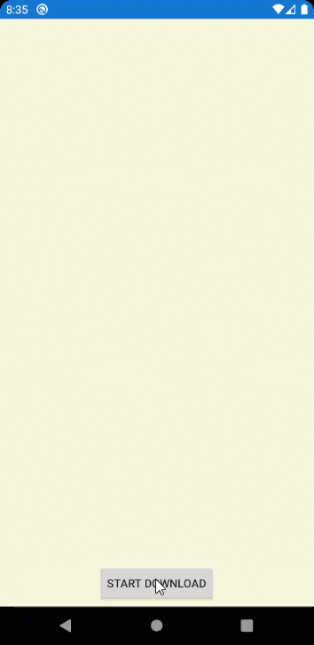

## Environment
<table>
	<tbody>
		<tr>
			<td>Product Version</td>
			<td>2020.2.513.1</td>
		</tr>
		<tr>
			<td>Product</td>
			<td>BusyIndicator for Xamarin Cross-Platform</td>
		</tr>
		<tr>
			<td>Xamarin Technology</td>
			<td>Xamarin.Forms</td>
		</tr>
	</tbody>
</table>

## Description

How-to show the progress of a long running operation in a custom BusyIndicator animation.

In this article, we will use HttpClient to show the download progress of a large file, but you can use this same exact approach for any long-running operation that reports progress of the operation (i.e. saving files, doing background work, etc). 


## Solution

The RadBusyIndicator allows you to use any custom animation you want instead of the built-in ones. This is accomplished with these three settings:

* Set `AnimationType` to **Custom**
* Put the custom content inside the `BusyContent`
* Add a custom animation to `Animations`

Please review the [Custom Animations](https://docs.telerik.com/devtools/xamarin/controls/busyindicator/busyindicator-animations#custom-animation) documentation article before continuing on with this tutorial. It will provide you with the basics of using a custom animation that we will build on in this tutorial

#### The Progress Animation

Now, it's time to think about what type of control you want to use to visualize the progress. In today's example, I will use a custom progress bar, but you can use anything... a `RadPieChart`, a `RadLinearGauge`, a `RadRadialGauge` or just an `Image` control that changes images.

Here's a snippet with a custom `CoolProgressBar` control in the **BusyContent**. It has a `Progress` property that supports values from from 0 to 100 to represent "percent complete".

```XML
<primitives:RadBusyIndicator x:Name="BusyIndicator"
                             AnimationContentHeightRequest="200"
                             AnimationContentWidthRequest="200"
                             AnimationType="Custom"
                             InputTransparent="True">
    <primitives:RadBusyIndicator.BusyContent>
        <!-- Your custom content goes here (make sure AnimationType='Custom') -->
        <local:CoolProgressBar x:Name="ProgressBar"
                               BarForegroundColor="White"
                               BarBackgroundColor="LightSeaGreen"
                               Progress="0"
                               HorizontalOptions="Center"
                               VerticalOptions="Center" />
    </primitives:RadBusyIndicator.BusyContent>
</primitives:RadBusyIndicator>
```

When IsBusy is toggled,the custom content is now visible and you can make any changes to the content while it is busy. For example, increment the progress bar's value.

```csharp
private async Task DoWorkAsync()
{
    // 1. show the busy indicator
    BusyIndicator.IsVisible = BusyIndicator.IsBusy = true;

    // 2. Do work and increment the progress animation

    // Simulating download work
    for (int i = 0; i < 100; i++)
    {
        ProgressBar.Progress = i;
        await Task.Delay(30);
    }
    
    // 3. When done, hide the BusyIndicator
    BusyIndicator.IsVisible = BusyIndicator.IsBusy = false;
}
```


## Complete Demo Code

Below is the complete code to try this conceptual example. 

### Runtime
Let's start with a GIF of what it looks like when downloading a large image file



> Remember that you can use anything you want in the BusyContent, it doesn't have to be a progress bar!

### Custom ProgressBar

*CoolProgressBar.xaml*

```XML
<?xml version="1.0" encoding="UTF-8"?>
<ContentView xmlns="http://xamarin.com/schemas/2014/forms" 
             xmlns:x="http://schemas.microsoft.com/winfx/2009/xaml"
             xmlns:d="http://xamarin.com/schemas/2014/forms/design"
             xmlns:mc="http://schemas.openxmlformats.org/markup-compatibility/2006"
             xmlns:primitives="clr-namespace:Telerik.XamarinForms.Primitives;assembly=Telerik.XamarinForms.Primitives"
             mc:Ignorable="d"
             x:Class="MyApp.Portable.CoolProgressBar"
             BackgroundColor="Transparent">

    <StackLayout HorizontalOptions="Center"
                 VerticalOptions="Center">
        <primitives:RadBorder x:Name="UnderBorder"
                              WidthRequest="300"
                              HeightRequest="30"
                              BackgroundColor="LightSeaGreen"
                              CornerRadius="5">
            <Grid>
                <Grid.ColumnDefinitions>
                    <ColumnDefinition />
                    <ColumnDefinition />
                    <ColumnDefinition />
                </Grid.ColumnDefinitions>

                <Label x:Name="Flag0" 
                       Text="🏳"
                       TextColor="White"
                       VerticalOptions="Center"
                       HorizontalOptions="Start"
                       Margin="5" 
                       Grid.Column="0"/>

                <Label x:Name="Flag50" 
                       Text="🚩"
                       TextColor="White"
                       VerticalOptions="Center"
                       HorizontalOptions="Center"
                       Margin="5"
                       Grid.Column="1" />

                <Label x:Name="Flag100" 
                       Text="🏁"
                       TextColor="White"
                       VerticalOptions="Center"
                       HorizontalOptions="End"
                       Margin="5" 
                       Grid.Column="2"/>

                <primitives:RadBorder x:Name="ProgressValueBorder"
                                      BackgroundColor="White"
                                      HorizontalOptions="End"
                                      WidthRequest="300"
                                      HeightRequest="30"
                                      BorderThickness="0"
                                      BorderColor="White"
                                      CornerRadius="0"
                                      Grid.Column="0"
                                      Grid.ColumnSpan="3"/>
            </Grid>
        </primitives:RadBorder>

        <Label x:Name="ProgressLabel"
               TextColor="LightSeaGreen"
               HorizontalOptions="Center"
               Margin="10" />
    </StackLayout>
</ContentView>
```
*CoolProgressBar.xaml.cs*
```csharp
using Xamarin.Forms;
using Xamarin.Forms.Xaml;

namespace MyApp.Portable
{
    [XamlCompilation(XamlCompilationOptions.Compile)]
    public partial class CoolProgressBar : ContentView
    {
        public CoolProgressBar()
        {
            InitializeComponent();
        }

        public static readonly BindableProperty ProgressProperty = BindableProperty.Create(
            "Progress", 
            typeof(double), 
            typeof(CoolProgressBar), 
            (double)0, 
            propertyChanged: OnProgressChanged);

        public static readonly BindableProperty BarBackgroundColorProperty = BindableProperty.Create(
            "BarBackgroundColor",
            typeof(Color),
            typeof(CoolProgressBar),
            Color.LightSeaGreen,
            propertyChanged: OnBarBackgroundColorChanged);

        public static readonly BindableProperty BarForegroundColorProperty = BindableProperty.Create(
            "BarForegroundColor",
            typeof(Color),
            typeof(CoolProgressBar),
            Color.White,
            propertyChanged: OnBarForegroundColorChanged);

        public double Progress
        {
            get => (double)GetValue(ProgressProperty);
            set => SetValue(ProgressProperty, value);
        }

        public Color BarBackgroundColor
        {
            get => (Color)GetValue(BarBackgroundColorProperty);
            set => SetValue(BarBackgroundColorProperty, value);
        }

        public Color BarForegroundColor
        {
            get => (Color)GetValue(BarForegroundColorProperty);
            set => SetValue(BarForegroundColorProperty, value);
        }

        private static void OnProgressChanged(BindableObject bindable, object oldValue, object newValue)
        {
            if (!(bindable is CoolProgressBar self)) return;

            var progress = (double)newValue;
            var calculatedWidth = 300 * (progress * .01);
            var differenceWidth = 300 - calculatedWidth;

            self.ProgressValueBorder.WidthRequest = differenceWidth;
            self.ProgressLabel.Text = $"{progress:N2}%";
        }

        private static void OnBarBackgroundColorChanged(BindableObject bindable, object oldValue, object newValue)
        {
            if (!(bindable is CoolProgressBar self)) return;

            self.UnderBorder.BackgroundColor = (Color) newValue;
            self.ProgressLabel.TextColor = (Color) newValue;
        }

        private static void OnBarForegroundColorChanged(BindableObject bindable, object oldValue, object newValue)
        {
            if (!(bindable is CoolProgressBar self)) return;

            self.Flag0.TextColor = (Color) newValue;
            self.Flag50.TextColor = (Color)newValue;
            self.Flag100.TextColor = (Color)newValue;
            self.ProgressValueBorder.BackgroundColor = (Color)newValue;
        }
    }
}
```
### Implementation on MainPage

*MainPage.xaml*

```xml
<?xml version="1.0" encoding="utf-8" ?>
<ContentPage xmlns="http://xamarin.com/schemas/2014/forms"
             xmlns:x="http://schemas.microsoft.com/winfx/2009/xaml"
             xmlns:d="http://xamarin.com/schemas/2014/forms/design"
             xmlns:mc="http://schemas.openxmlformats.org/markup-compatibility/2006"
             mc:Ignorable="d"
             xmlns:primitives="clr-namespace:Telerik.XamarinForms.Primitives;assembly=Telerik.XamarinForms.Primitives"
             xmlns:local="clr-namespace:AdroidTenTest.Portable;assembly=AdroidTenTest.Portable"
             x:Class="MyApp.Portable.MainPage"
             BackgroundColor="Beige">

    <Grid>
        <Label x:Name="ResultsLabel"
               HorizontalOptions="Center"
               VerticalOptions="Start"
               LineBreakMode="WordWrap"
               Margin="20" />

        <Button x:Name="DownloadButton"
                Text="Start download"
                VerticalOptions="End"
                HorizontalOptions="Center"
                Margin="5"
                Clicked="Btn_Clicked" />

        <primitives:RadBusyIndicator x:Name="BusyIndicator"
                                     AnimationContentHeightRequest="200"
                                     AnimationContentWidthRequest="200"
                                     AnimationType="Custom"
                                     InputTransparent="True">
            <primitives:RadBusyIndicator.BusyContent>
                <!-- Your custom content goes here (make sure AnimationType='Custom') -->
                <local:CoolProgressBar x:Name="ProgressBar"
                                       BarForegroundColor="White"
                                       BarBackgroundColor="LightSeaGreen"
                                       Progress="0"
                                       HorizontalOptions="Center"
                                       VerticalOptions="Center" />
            </primitives:RadBusyIndicator.BusyContent>
        </primitives:RadBusyIndicator>
    </Grid>
</ContentPage>
```

*MainPage.xaml.cs*

```csharp
using System;
using System.Diagnostics;
using System.IO;
using System.Net;
using System.Net.Http;
using System.Threading;
using System.Threading.Tasks;
using CommonHelpers.Common.Args;
using CommonHelpers.Extensions;
using Xamarin.Forms;

namespace MyApp.Portable
{
    public partial class MainPage : ContentPage
    {
        private CancellationTokenSource cts;

        public MainPage()
        {
            InitializeComponent();
        }

        private async void Btn_Clicked(object sender, EventArgs e)
        {
            if (cts == null)
            {
                cts = new CancellationTokenSource();

                await DownloadDataAsync(cts.Token);
            }
            else
            {
                cts.Cancel();
            }
        }

        private async Task DownloadDataAsync(CancellationToken token)
        {
            BusyIndicator.IsVisible = BusyIndicator.IsBusy = true;
            ResultsLabel.Text = "Preparing to download...";

            var reporter = new Progress<DownloadProgressArgs>();
            reporter.ProgressChanged += HttpClientReporter_ProgressChanged;

            try
            {
                var handler = new HttpClientHandler();
                if (handler.SupportsAutomaticDecompression)
                    handler.AutomaticDecompression = DecompressionMethods.Deflate | DecompressionMethods.GZip;

                var bigImageUrl = $"http://www.tomswallpapers.com/images/201505/tomswallpapers.com_28074.jpg?dontCacheMeBro={DateTime.Now.Ticks}";

                ResultsLabel.Text = "Downloading...";
                DownloadButton.Text = "Cancel";

                using (var client = new HttpClient(handler))
                {
                    client.DefaultRequestHeaders.ExpectContinue = false;

                    using (var response = await client.GetAsync(bigImageUrl, HttpCompletionOption.ResponseHeadersRead, token))
                    using (var stream = await response.Content.ReadAsStreamAsync())
                    {
                        int receivedBytes = 0;
                        var totalBytes = Convert.ToInt32(response.Content.Headers.ContentLength);

                        var memStream = new MemoryStream();

                        while (true)
                        {
                            var buffer = new byte[4096];
                            int bytesRead = await stream.ReadAsync(buffer, 0, buffer.Length, token);

                            await memStream.WriteAsync(buffer, 0, bytesRead, token);

                            if (bytesRead == 0)
                            {
                                break;
                            }

                            receivedBytes += bytesRead;

                            ((IProgress<DownloadProgressArgs>) reporter).Report(new DownloadProgressArgs(receivedBytes, totalBytes));
                        }

                        memStream.Position = 0;

                        await memStream.SaveToLocalFolderAsync("bgImage.jpg");
                    }
                }

                ResultsLabel.Text = "Download Complete!";
            }
            catch (TaskCanceledException)
            {
                ResultsLabel.Text = "Download cancelled";
            }
            catch (Exception ex)
            {
                ResultsLabel.Text = "Error occurred, see output.";
                Debug.WriteLine($"Exception\r\n{ex}");
            }
            finally
            {
                reporter.ProgressChanged -= HttpClientReporter_ProgressChanged;
                BusyIndicator.IsVisible = BusyIndicator.IsBusy = false;
                cts = null;

                DownloadButton.Text = "Start Download";
            }
        }

        private void HttpClientReporter_ProgressChanged(object sender, DownloadProgressArgs e)
        {
            Device.BeginInvokeOnMainThread(()=>
            {
                ProgressBar.Progress = e.PercentComplete;
            });
        }
    }
}
```

> Keep in mind you may need to update the value on the UI thread using `BeginInvokeOnMainThread` while progress is changing. This is because the ProgressChanged event handler is invoked from a different thread.

### See Also

- [Project Wizard]()
- [Getting Started on Windows]()
- [Getting Started on Mac]()
