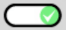
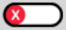

## Environment
<table>
	<tr>
		<td>Product Version</td>
		<td>2018.2.620.2</td>
	</tr>
	<tr>
		<td>Product</td>
		<td>Button for Xamarin</td>
	</tr>
</table>


## Description

How can I create a ToggleButton with a Style?

## Solution

You can create a custom Toggle-like styled button by combining the **RadButton** with a value converter and alternating images.


The example above uses the following components:

#### View

```xml
<ContentPage.Resources>
    <ResourceDictionary>
        <converters:ConfigurableBoolConverter x:Key="BackgroundImageConverter"
                                              x:TypeArguments="x:String"
                                              TrueResult="ToggleOn.png"
                                              FalseResult="ToggleOff.png"/>
    </ResourceDictionary>
</ContentPage.Resources>

<ContentPage.BindingContext>
    <viewModels:MainViewModel />
</ContentPage.BindingContext>

<Grid BackgroundColor="#FFD8D7D6">
    <input:RadButton Command="{Binding ToggleButtonStateCommand}" 
                     BackgroundImage="{Binding IsOn, Converter={StaticResource BackgroundImageConverter}}" 
                     HeightRequest="30"
                     WidthRequest="66"
                     BorderThickness="0"
                     VerticalOptions="Center"
                     HorizontalOptions="Center"
                     BorderColor="Transparent"/>
</Grid>
```

#### View Model

```C#
public class MainViewModel : Telerik.XamarinForms.Common.NotifyPropertyChangedBase
{
    private bool isOn;

    public MainViewModel()
    {
        ToggleButtonStateCommand = new Command(() => { IsOn = !IsOn; });
    }

    public bool IsOn
    {
        get => isOn;
        set
        {
            if (isOn == value)
                return;

            isOn = value;
            OnPropertyChanged();
        }
    }

    public Command ToggleButtonStateCommand { get; set; }
}
```

#### Images

This example uses two images; one for the "on" state and one for the "off" state.





#### Value converter


```C#
class ConfigurableBoolConverter<T> : IValueConverter
{
    public ConfigurableBoolConverter() { }

    public ConfigurableBoolConverter(T trueResult, T falseResult)
    {
        TrueResult = trueResult;
        FalseResult = falseResult;
    }

    public T TrueResult { get; set; }
    public T FalseResult { get; set; }

    public object Convert(object value, Type targetType, object parameter, CultureInfo culture)
    {
        if(TrueResult == null || FalseResult == null)
            return !(bool) value;

        return value is bool b && b ? TrueResult : FalseResult;
    }

    public object ConvertBack(object value, Type targetType, object parameter, CultureInfo culture)
    {
        if(TrueResult == null || FalseResult == null)
            return !(bool) value;

        return value is T variable && EqualityComparer<T>.Default.Equals(variable, TrueResult);
    }
}
```
