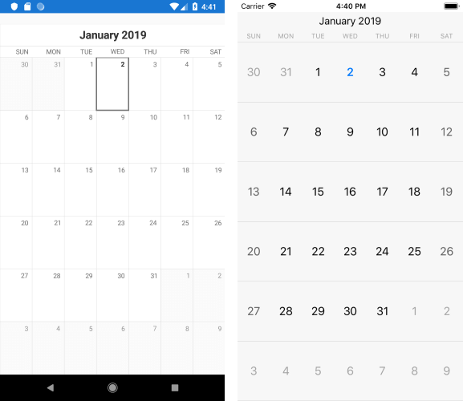

## Environment
<table>
	<tr>
		<td>Product Version</td>
		<td>R1 2020 (2020.1.114)</td>
	</tr>
	<tr>
		<td>Product</td>
		<td>Calendar for Xamarin Cross-Platform</td>
	</tr>
</table>


## Description

In order to make any further customizations on RadCalendar control that is not provided from the Xamarin.Forms API, you will need a custom renderer. This article will show how you could change the Calendar Month name to be uppercase through custom renderers on Android and iOS.

## Solution

First, add a simple RadCalendar definition to your page and set its ViewMode property:

```XAML
<telerikInput:RadCalendar x:Name="calendar" ViewMode="Month" />
```

For more details on provided view modes go to [Calendar: ViewModes Overview](https://docs.telerik.com/devtools/xamarin/controls/calendar/view-modes/calendar-navigation-and-view-mode#setting-the-viewmode) topic.

That's all on the shared project.

Now, let's start with the Android project:

Create a class which inherits from Telerik.XamarinForms.InputRenderer.Android.CalendarRenderer and override the OnElementChanged method:

```C#
class CustomCalendarRenderer : CalendarRenderer
{
    protected override void OnElementChanged(ElementChangedEventArgs<Telerik.XamarinForms.Input.RadCalendar> e)
    {
        base.OnElementChanged(e);

        if (this.Control != null)
            this.Control.CustomizationRule = new CustomizationRule();
    }
}
```

Create another class that takes that inherits from *Java.Lang.Object* and *IProcedure* interface and inside the Apply method implement your custom logic for changing the Calendar DayName Text to be uppercase.

```C#
public class CustomizationRule : Java.Lang.Object, IProcedure
{
    public void Apply(Java.Lang.Object p0)
    {
        if (!(p0 is Com.Telerik.Widget.Calendar.CalendarCell))
        {
            return;
        }

        Com.Telerik.Widget.Calendar.CalendarCell calendarCell = p0.JavaCast<Com.Telerik.Widget.Calendar.CalendarCell>();

        if (calendarCell.CellType == Com.Telerik.Widget.Calendar.CalendarCellType.DayName)
        {
            String cellText = calendarCell.Text;
            if (cellText != null)
            {
                calendarCell.Text = cellText.ToUpper();
            }
        }
    }
}
```

Finally, let's go to the iOS project. Create a class which inherits from Telerik.XamarinForms.InputRenderer.iOS.CalendarRenderer and override the CreateCalendarDelegateOverride method:

```C#
public class CustomCalendarRenderer : CalendarRenderer
{
    protected override CalendarDelegate CreateCalendarDelegateOverride()
    {
        return new CustomCalendarDelegate();
    }
}
```

The method should return object of class delivered from Telerik.XamarinForms.InputRenderer.iOS.CalendarDelegate and override UpdateVisualsForCell and TKCalendarCell ViewForCellOfKind methods:

```C#
public class CustomCalendarDelegate : CalendarDelegate
{
    public override void UpdateVisualsForCell(TKCalendar calendar, TKCalendarCell cell)
    {
        var dayNameCell = cell as TKCalendarDayNameCell;
        if (dayNameCell != null)
        {
            dayNameCell.Label.Text = dayNameCell.Label.Text.ToUpper();
        }
    }

    public override TKCalendarCell ViewForCellOfKind(TKCalendar calendar, TKCalendarCellType cellType)
    {
        var cell = base.ViewForCellOfKind(calendar, cellType);
        if (cellType == TKCalendarCellType.Title)
        {
            
        }
        return cell;
    }
}
```

Here is the result after running the example:


