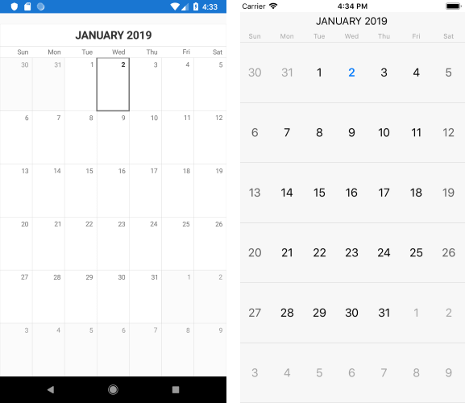

## Environment
<table>
	<tr>
		<td>Product Version</td>
		<td>2018.3.1122.3</td>
	</tr>
	<tr>
		<td>Product</td>
		<td>Calendar for Xamarin Cross-Platform</td>
	</tr>
</table>


## Description

In order to make any further customizations on RadCalendar control, the custom renderer should be used. This article will show how you could change the Calendar Month name to be uppercase through custom renderers on Android and iOS.

## Solution

First, add a simple RadCalendar definition to your page:

```XAML
<telerikInput:RadCalendar x:Name="calendar"/>
```

and set its [ViewMode](https://docs.telerik.com/devtools/xamarin/controls/calendar/view-modes/calendar-navigation-and-view-mode#setting-the-viewmode) in code behind to Mont:

```C#
calendar.NativeControlLoaded += CalendarLoaded;
```

```C#
private void CalendarLoaded(object sender, EventArgs args)
{
    (sender as RadCalendar).TrySetViewMode(CalendarViewMode.Month);
}
```

That's all on the shared project.

Now, let's start with the Android project:

Create a class which inherits from Telerik.XamarinForms.InputRenderer.Android.CalendarRenderer and override the OnElementChanged method:

```C#
class CustomCalendarRenderer : CalendarRenderer
{
    protected override void OnElementChanged(ElementChangedEventArgs<Telerik.XamarinForms.Input.RadCalendar> e)
    {
        base.OnElementChanged(e);

        if (this.Control != null)
            this.Control.CustomizationRule = new CustomizationRule();
    }
}
```

Create another class that takes that inherits from Java.Lang.Object and IProcedure interface and inside the Apply method implement your custom logic for changing the Calendar Title Text to be uppercase.

```C#
public class CustomizationRule : Java.Lang.Object, IProcedure
{
    public void Apply(Java.Lang.Object p0)
    {
        if (!(p0 is CalendarCell))
        {
            return;
        }

        CalendarCell calendarCell = p0.JavaCast<CalendarCell>();

        if (calendarCell.CellType == CalendarCellType.Title)
        {
            String cellText = calendarCell.Text;
            if (cellText != null)
            {
                calendarCell.Text = cellText.ToUpper();
            }
        }
    }
}
```

Finally, let's go to the iOS project. Create a class which inherits from Telerik.XamarinForms.InputRenderer.iOS.CalendarRenderer and override the CreateCalendarDelegateOverride method:

```C#
public class CustomCalendarRenderer : CalendarRenderer
{
    protected override CalendarDelegate CreateCalendarDelegateOverride()
    {
        return new CustomCalendarDelegate();
    }
}
```

The method should return object of class delivered from Telerik.XamarinForms.InputRenderer.iOS.CalendarDelegate and override UpdateVisualsForCell and TKCalendarCell ViewForCellOfKind methods:

```C#
public class CustomCalendarDelegate : CalendarDelegate
{
    public override void UpdateVisualsForCell(TKCalendar calendar, TKCalendarCell cell)
    {
        var monthCell = cell as TKCalendarTitleCell;
        if (monthCell != null)
        {
            monthCell.Label.Text = monthCell.Label.Text.ToUpper();
        }
    }

    public override TKCalendarCell ViewForCellOfKind(TKCalendar calendar, TKCalendarCellType cellType)
    {
        var cell = base.ViewForCellOfKind(calendar, cellType);
        if (cellType == TKCalendarCellType.Title)
        {
                
            return new TKCalendarTitleCell();
        }
        return cell;
    }
}
```

Here is the result after running the example:


