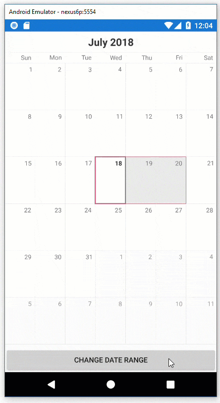

## Environment
<table>
	<tr>
		<td>Product Version</td>
		<td>2018.2.620.2</td>
	</tr>
	<tr>
		<td>Product</td>
		<td>Calendar for Xamarin</td>
	</tr>
</table>

## Description

How can I enable Range Selection mode for RadCalendar in Xamarin.Forms?

## Solution

You can access the native calendar controls using a [Xamarin Platform Effect](https://docs.microsoft.com/en-us/xamarin/xamarin-forms/app-fundamentals/effects/introduction) to enable Range Selection and pass the date range values via custom EventArgs.



>Note If you're not familiar with Xamarin Platform Effects, visit [Introduction to Effects](https://docs.microsoft.com/en-us/xamarin/xamarin-forms/app-fundamentals/effects/introduction) and [Effect Creation](https://docs.microsoft.com/en-us/xamarin/xamarin-forms/app-fundamentals/effects/creating) to familiarize yourself with the fundamentals. Effects are an alternative to Custom Renderers for many scenarios.

The native controls rendered on the target platforms are:

* [RadCalendar (UWP)](https://docs.telerik.com/devtools/universal-windows-platform/controls/radcalendar/overview)
* [TKCalendar (iOS)](https://docs.telerik.com/devtools/xamarin/nativecontrols/ios/calendar/overview)
* [RadCalendarView (Android)](https://docs.telerik.com/devtools/xamarin/nativecontrols/android/calendar/calendar-overview)


The this article will walk you through the components using a two-part approach: 

* **Part 1** - Setting up the **RoutedEffect** and consuming it using the Xamarin.Forms **RadCalendar** in the class library project. 
* **Part 2** - Setting up the **PlatformEffect** in each of the target platform projects; UWP, Android and iOS.

Part 1 is mandatory, however Part 2 can be selectively applied depending on which platforms your application is targeting.

### Part 1 - Class Library Project

The class library holds the event args and shared Effect class.  It's best practice to keep these classes in a distinct project folder, for this example we named the folder Examples.


#### Custom EventArgs

To get started, add a folder named "Effects" to the class library project and add the following class. 

```C#
using System;

namespace YourApplication.Portable.Effects
{
    public class DateRangeChangedEventArgs : System.EventArgs
    {
        public DateRangeChangedEventArgs(DateTime startDate, DateTime endDate)
        {
            StartDate = startDate;
            EndDate = endDate;
        }

        public DateTime StartDate { get; set; }

        public DateTime EndDate { get; set; }
    }
}
```
>note The custom **DateRangeChangedEventArgs** class has a `StartDate` and an `EndDate` property, this will be passed to the native control when an event, defined in the RoutedEffect, is invoked.

#### Routing Effect

Add the following **RangeSelectionEffect** class to the same Effects folder. This has a `DateRangeValueChanged` event, which is invoked when either the `StartDate` or `EndDate` property values change. An instance of `DateRangeChangedEventArgs` is created and passed as parameter to the subscribed event handler.

```C#
using System;
using Xamarin.Forms;

namespace YourApplication.Portable.Effects
{
    public class RangeSelectionEffect : RoutingEffect
    {
        private DateTime endDate;
        private DateTime startDate;

        public RangeSelectionEffect() 
            : base("YourCompany.RangeSelectionEffect")
        {
        }

        public DateTime StartDate
        {
            get => startDate;
            set
            {
                if (startDate == value)
                    return;

                startDate = value;
                ExecuteValueChanged();
            }
        }

        public DateTime EndDate
        {
            get => endDate;
            set
            {
                if (endDate == value)
                    return;

                endDate = value;
                ExecuteValueChanged();
            }
        }

        public delegate void DateRangeChanged(object sender, DateRangeChangedEventArgs e);

        public event DateRangeChanged DateRangeValueChanged;

        private void ExecuteValueChanged()
        {
            DateRangeValueChanged?.Invoke(this, new DateRangeChangedEventArgs(this.StartDate, this.EndDate));
        }
    }
}
```

>note If you prefer, the value used for "YourCompany" in `base("YourCompany.RangeSelectionEffect")` can be changed, just make sure to change it in each of the PlatformEffect classes, too. This attribute is the **ResolutionGroupName** and sets a company wide namespace for effects, preventing collisions with other effects with the same name. Note that this attribute can only be applied once per project.

#### View

Now, add the Effect to the RadCalendar's instance and give it an x:Name so . This example has a Button and a RadCalendar on MainPage.xaml.

```xml
<?xml version="1.0" encoding="utf-8" ?>
<ContentPage xmlns="http://xamarin.com/schemas/2014/forms"
             xmlns:x="http://schemas.microsoft.com/winfx/2009/xaml"
             xmlns:telerikInput="clr-namespace:Telerik.XamarinForms.Input;assembly=Telerik.XamarinForms.Input"
             xmlns:effects="clr-namespace:YourApplication.Portable.Effects;assembly=RangeSelectionTest.Portable"
             x:Class="YourApplication.Portable.MainPage">
    <Grid>
        <Grid.RowDefinitions>
            <RowDefinition />
            <RowDefinition Height="Auto" />
        </Grid.RowDefinitions>

        <telerikInput:RadCalendar x:Name="radCalendar">
            <telerikInput:RadCalendar.Effects>
                <effects:RangeSelectionEffect x:Name="SelectionEffect" />
            </telerikInput:RadCalendar.Effects>
        </telerikInput:RadCalendar>

        <Button Text="Change Date Range"
                Clicked="Button_OnClicked"
                Grid.Row="1" />
    </Grid>
</ContentPage>
```

The view's code-behind contains a Button click handler to update the Effect's StartDate and EndDate. 

```C#
using System;
using Xamarin.Forms;

namespace YourApplication.Portable
{
    public partial class MainPage : ContentPage
    {
        private int incrementer = 1;

        public MainPage()
        {
            InitializeComponent();
            
            SelectionEffect.StartDate = radCalendar.DisplayDate;
            SelectionEffect.EndDate = radCalendar.DisplayDate;
        }

        private void Button_OnClicked(object sender, EventArgs e)
        {
            incrementer++;
            
            SelectionEffect.StartDate = radCalendar.DisplayDate;
            SelectionEffect.EndDate = radCalendar.DisplayDate.AddDays(incrementer);
        }
    }
}
```

>note The example uses RadCalendar's `DisplayDate` value to calculate `StartDate` and `EndDate`, this is just for demonstration purposes and can be a DateTime value of your choice.

### Part 2 - Platform Effects

In the target platform, you'll need to add a class that extends **PlatformEffect**. This mandates two overridden methods:

* OnAttached
* OnDetached

In each Effect, the following is accomplished:

1. In **OnAttached**, get a reference to the native calendar control and enable range selection
2. In **OnAttached**, get a reference to the class library's RoutedEffect instance to subscribe to the DateRangeChanged event with an event handler
3. In the event handler, set the native calendar control's range selection  property using the values from the `DateRangeChangedEventArgs`
4. In **OnDetached**, unsubscribe from the event

The same pattern is used for all the platforms, the main difference are the properties available for the native Calendar control and their expected value types.

>important When reviewing the effect classes, take notice that every `RangeSelectionEffect` reference uses a full namespace. This is important to prevent ambiguous reference conflicts.

#### UWP Platform Effect

If you have a UWP project, add a new folder named "Effects" to the project root and then add the following class to the folder.

```C#
using System.Linq;
using Telerik.UI.Xaml.Controls.Input;
using Xamarin.Forms;
using Xamarin.Forms.Platform.UWP;

[assembly: ResolutionGroupName("YourCompany")]
[assembly: ExportEffect(typeof(YourApplication.UWP.Effects.RangeSelectionEffect), "RangeSelectionEffect")]
namespace RangeSelectionTest.UWP.Effects
{
    public class RangeSelectionEffect : PlatformEffect
    {
        protected override void OnAttached()
        {
            if (Element.Effects.FirstOrDefault (e => e is Portable.Effects.RangeSelectionEffect) is Portable.Effects.RangeSelectionEffect effect)
            {
                effect.DateRangeValueChanged += Effect_DateRangeValueChanged;

                if (Control is RadCalendar calendar)
                {
                    calendar.SelectionMode = CalendarSelectionMode.Multiple;
                }
            }   
        }
        

        private void Effect_DateRangeValueChanged(object sender, Portable.Effects.DateRangeChangedEventArgs args)
        {
            if (Control is RadCalendar calendar)
            {
                var dateRange = new CalendarDateRange
                {
                    StartDate = args.StartDate,
                    EndDate = args.EndDate
                };
                
                calendar.SelectedDateRange = dateRange;
            }
        }

        protected override void OnDetached()
        {
            if (Element.Effects.FirstOrDefault (e => e is Portable.Effects.RangeSelectionEffect) is Portable.Effects.RangeSelectionEffect effect)
            {
                effect.DateRangeValueChanged -= Effect_DateRangeValueChanged;
            }    
        }
    }
}

```

#### Android Platform Effect

If you have an Android project, If you have a UWP project, add a new folder named "Effects" to the project root and then add the following class to the folder.

```C#
using System;
using System.Linq;
using Com.Telerik.Widget.Calendar;
using Java.Util;
using Xamarin.Forms;
using Xamarin.Forms.Platform.Android;

[assembly: ResolutionGroupName("LancelotSoftware")]
[assembly: ExportEffect(typeof(RangeSelectionTest.Android.Effects.RangeSelectionEffect), "RangeSelectionEffect")]
namespace RangeSelectionTest.Android.Effects
{
    public class RangeSelectionEffect : PlatformEffect
    {
        protected override void OnAttached()
        {
            if (Element.Effects.FirstOrDefault (e => e is Portable.Effects.RangeSelectionEffect) is Portable.Effects.RangeSelectionEffect effect)
            {
                effect.DateRangeValueChanged += Effect_DateRangeValueChanged;

                if (Control is RadCalendarView calendar)
                {
                    calendar.SelectionMode = CalendarSelectionMode.Range;
                }
            }  
        }

        private void Effect_DateRangeValueChanged(object sender, Portable.Effects.DateRangeChangedEventArgs args)
        {
            if (Control is RadCalendarView calendarView)
            {
                calendarView.SelectedRange = new DateRange(ConvertToCalendar(args.StartDate).TimeInMillis, ConvertToCalendar(args.EndDate).TimeInMillis);
            }
        }

        protected override void OnDetached()
        {
            if (Element.Effects.FirstOrDefault (e => e is Portable.Effects.RangeSelectionEffect) is Portable.Effects.RangeSelectionEffect effect)
            {
                effect.DateRangeValueChanged -= Effect_DateRangeValueChanged;
            }    
        }

        public static Calendar ConvertToCalendar(DateTime date) 
        {
            Calendar calendar = Calendar.Instance;
            calendar.Set(date.Year, date.Month - 1, date.Day, date.Hour, date.Minute, date.Second);
            return calendar;
        } 
    }
}
```

>note The .NET `DateTime` values passed via the event args are converted to TimeInMilliseconds via a Java `Calendar` and applied to a `DateRange` instance.

#### iOS Platform Effect
If you have an iOS project, If you have a UWP project, add a new folder named "Effects" to the project root and then add the following class to the folder.

```C#
using System;
using System.Linq;
using Foundation;
using TelerikUI;
using Xamarin.Forms;
using Xamarin.Forms.Platform.iOS;

[assembly: ResolutionGroupName("YourCompany")]
[assembly: ExportEffect(typeof(YourApplication.iOS.Effects.RangeSelectionEffect), "RangeSelectionEffect")]
namespace YourApplication.iOS.Effects
{
    public class RangeSelectionEffect : PlatformEffect
    {
        protected override void OnAttached()
        {
            if (Element.Effects.FirstOrDefault (e => e is Portable.Effects.RangeSelectionEffect) is Portable.Effects.RangeSelectionEffect effect)
            {
                effect.DateRangeValueChanged += Effect_DateRangeValueChanged;

                if (Control is TKCalendar calendar)
                {
                    calendar.SelectionMode = TKCalendarSelectionMode.Range;
                }
            }  
        }

        private void Effect_DateRangeValueChanged(object sender, Portable.Effects.DateRangeChangedEventArgs args)
        {
            if (Control is TKCalendar calendar)
            {
                calendar.SelectedDatesRange = new TKDateRange
                {
                    StartDate = ToNSDate(args.StartDate),
                    EndDate = ToNSDate(args.EndDate)
                };
            }
        }

        protected override void OnDetached()
        {
            if (Element.Effects.FirstOrDefault (e => e is Portable.Effects.RangeSelectionEffect) is Portable.Effects.RangeSelectionEffect effect)
            {
                effect.DateRangeValueChanged -= Effect_DateRangeValueChanged;
            }  
        }
        
        // ReSharper disable once InconsistentNaming
        private static NSDate ToNSDate(DateTime date)
        {
            if (date.Kind == DateTimeKind.Unspecified)
                date = DateTime.SpecifyKind(date, DateTimeKind.Local);

            return (NSDate) date;
        }
    }
}
```

>note The .NET `DateTime` values passed via the event args need to be converted to an iOS `NSDate` which get used for a `TKDateRange`

### Conclusion

The approach is now complete and you're now ready to build and deploy. You can find a runnable version of this demo [here on GitHub](https://github.com/LanceMcCarthy/CustomXamarinDemos/tree/master/RangeSelectionTest).

## See Also
- [UI for Xamarin (Xamarin.Forms) - RadCalendar Overview]()
- [UI for UWP - RadCalendar](https://docs.telerik.com/devtools/universal-windows-platform/controls/radcalendar/overview)
- [UI for Xamarin.Android - RadCalendarView: Overview]()
- [UI for Xamarin.iOS - TKCalendar: Overview](https://docs.telerik.com/devtools/xamarin/nativecontrols/ios/calendar/overview)
- [Xamarin Effects - Introduction](https://docs.microsoft.com/en-us/xamarin/xamarin-forms/app-fundamentals/effects/introduction)
- [Xamarin Effects - Creating an Effect](https://docs.microsoft.com/en-us/xamarin/xamarin-forms/app-fundamentals/effects/creating)
- [Xamarin Effects - Passing Parameters as CLR properties](https://docs.microsoft.com/en-us/xamarin/xamarin-forms/app-fundamentals/effects/passing-parameters/clr-properties)
- [Xamarin Effects - Passing Parameters as attached Properties](https://docs.microsoft.com/en-us/xamarin/xamarin-forms/app-fundamentals/effects/passing-parameters/attached-properties)
