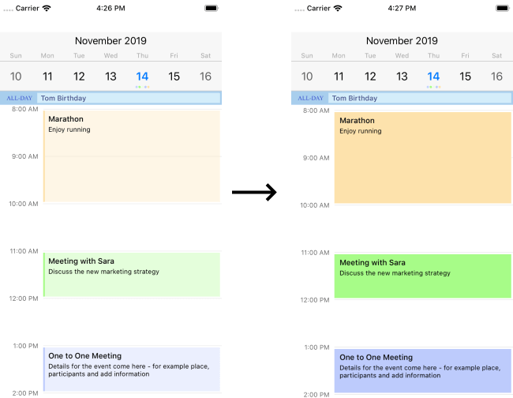

## Environment
<table>
    <tbody>
	    <tr>
	    	<td>Product Version</td>
	    	<td>2019.1.318.1</td>
	    </tr>
	    <tr>
	    	<td>Product</td>
	    	<td>Calendar for Xamarin</td>
	    </tr>
    </tbody>
</table>


## Description

With the default style the background of the appointments on iOS is semi-transparent in DayView mode. This makes it not possible to define white background to appointments. 
You could check how appointments look by default on Android and iOS here: [Calendar &amp; Scheduling Appointments]().

## Solution

To remove the semi-transparency, you would need a custom renderer on iOS and in it change the DataSource of the DayView. In the custom DataSource override UpdateCell method and inside it you will find Transparency property of the cell style:

```C#
using Telerik.XamarinForms.Input;
using Telerik.XamarinForms.InputRenderer.iOS;
using TelerikUI;
using XamarinApp1.iOS;
using UIKit;
using Xamarin.Forms;
using Xamarin.Forms.Platform.iOS;

[assembly: ExportRenderer(typeof(RadCalendar), typeof(CustomCalendarRenderer))]
namespace XamarinApp1.iOS
{
    class CustomCalendarRenderer : CalendarRenderer
    {
        protected override void OnElementChanged(ElementChangedEventArgs<RadCalendar> e)
        {
 
            base.OnElementChanged(e);
            var dayView = (this.Control.Presenter as TKCalendarDayViewPresenter).DayView;
            dayView.DataSource = new MyCustomDataSource();
 
        }
    }
           
    internal class MyCustomDataSource : TKCalendarDayViewDataSource
    {
        public override void UpdateCell(TKCalendarDayView dayView, UICollectionViewCell cell)
        {
            var eventCell = cell as TKCalendarDayViewEventCell;
            if (eventCell != null)
            {
 
                eventCell.Style.TextColor = UIColor.Black;
                eventCell.Style.Transparency = 1f;
            }
        }
    }
}
```

Here is the result:


