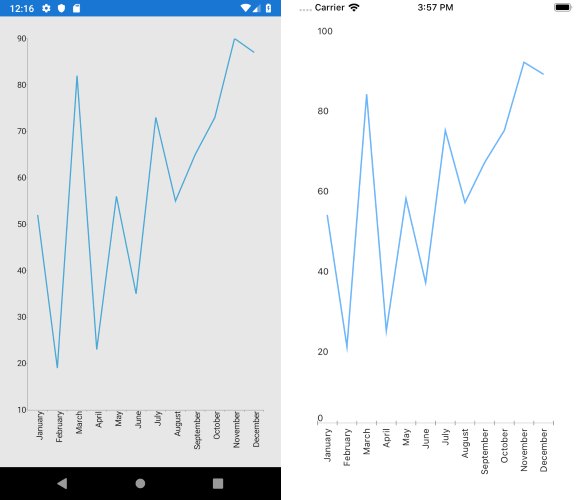

## Environment
<table>
	<tbody>
		<tr>
			<td>Product Version</td>
			<td>2019.3.1004.1</td>
		</tr>
		<tr>
			<td>Product</td>
			<td>RadChart for Xamarin</td>
		</tr>
	</tbody>
</table>

## Description

RadChart for Xamarin.Forms supports only two modes of labels alignment - MultiLine and Rotate. However, currently the rotation angle is hard-coded in Xamarin.Forms (about 45 degrees) and in order to change it you would need to create [custom renderers]() on different platforms and change the angle of the native axis.

## Solution

* For Android you would need to find the axis and set its **LabelRotationAngle** property:

>tip The sample below uses CategoricalAxis, but the same could be applied on any Chart native axis. Check our topic for axis configurations in Chart for Xamarin.Android documentation here: [RadChartView: Axes]().

```C#
using Android.Content;
using Telerik.XamarinForms.ChartRenderer.Android;
using ChartRotationAngle.Droid;
using Xamarin.Forms.Platform.Android;

[assembly: Xamarin.Forms.ExportRenderer(typeof(Telerik.XamarinForms.Chart.RadCartesianChart), typeof(CustomChartRenderer))]
namespace ChartRotationAngle.Droid
{
    class CustomChartRenderer : CartesianChartRenderer
    {       
        public CustomChartRenderer(Context context) : base(context)
        {

        }
        protected override void OnElementChanged(ElementChangedEventArgs<Telerik.XamarinForms.Chart.RadCartesianChart> e)
        {
            base.OnElementChanged(e);

            if (this.Control != null)
            {               
                var nativeAxis = this.Control.HorizontalAxis as Com.Telerik.Widget.Chart.Visualization.CartesianChart.Axes.CategoricalAxis;

                if (nativeAxis != null)
                {
                    nativeAxis.LabelFitMode = Com.Telerik.Widget.Chart.Engine.Axes.Common.AxisLabelFitMode.Rotate;
                    nativeAxis.LabelRotationAngle = -90;
                }
            }
        }
    }
}   
```

* For iOS you would need to apply **RotationAngle** of the Style.LabelStyle of the axis:

>tip The sample below uses CategoricalAxis, but the same could be applied on any Chart native axis. Check our topic for axis configurations in Chart for Xamarin.Android documentation here: [Chart Axes: Overview]().


```C#
using System;
using Telerik.XamarinForms.Chart;
using Telerik.XamarinForms.ChartRenderer.iOS;
using TelerikUI;
using ChartRotationAngle.iOS;
using Xamarin.Forms.Platform.iOS;

[assembly: Xamarin.Forms.ExportRenderer(typeof(RadCartesianChart), typeof(CustomChartRenderer))]
namespace ChartRotationAngle.iOS
{
    class CustomChartRenderer : CartesianChartRenderer
    {
        protected override void OnElementChanged(ElementChangedEventArgs<RadCartesianChart> e)
        {
            base.OnElementChanged(e);
            var nativeAxis = this.Control.XAxis as TKChartCategoryAxis;
            if (nativeAxis != null)
            {
                nativeAxis.Style.LabelStyle.FitMode = TKChartAxisLabelFitMode.Rotate;
                nativeAxis.Style.LabelStyle.RotationAngle = new nfloat(-Math.PI / 2);
            }
        }
    }
}
```

Here is the result after implementing the custom renderers on Android and iOS:


