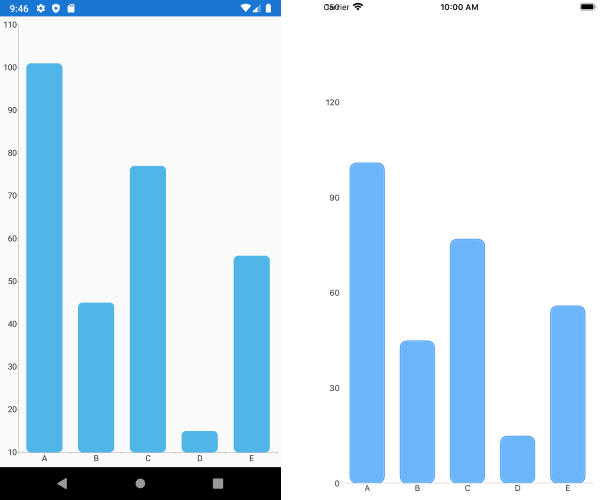

## Environment
<table>
	<tbody>
		<tr>
			<td>Product Version</td>
			<td>R3 2020</td>
		</tr>
		<tr>
			<td>Product</td>
			<td>RadChart for Xamarin</td>
		</tr>
	</tbody>
</table>


## Description

RadChart for Xamarin.Forms does not expose a property for setting rounded corners of the bar series, still this can be achieved through custom renderers on Android and iOS.

## Solution

* The native Android chart provides direct properties for setting round edges to the BarSeries, namely <code>AreBarsRounded</code> and <code>RoundBarsRadius</code>.

```C#
using System.Linq;
using Android.Content;
using Com.Telerik.Widget.Chart.Visualization.CartesianChart.Series.Categorical;
using ChartBarSeries.Droid;
using Telerik.XamarinForms.ChartRenderer.Android;
using Xamarin.Forms.Platform.Android;

[assembly: Xamarin.Forms.ExportRenderer(typeof(Telerik.XamarinForms.Chart.RadCartesianChart), typeof(CustomCartesianChartRenderer))]
namespace ChartBarSeries.Droid
{
    public class CustomCartesianChartRenderer : CartesianChartRenderer
    {
        public CustomCartesianChartRenderer(Context context) : base(context)
        {

        }
        protected override void OnElementChanged(ElementChangedEventArgs<Telerik.XamarinForms.Chart.RadCartesianChart> e)
        {
            base.OnElementChanged(e);

            if (this.Control != null)
            {

                var barSeriesArray = this.Control.Series.ToArray();
                var firstSeries = barSeriesArray.FirstOrDefault() as BarSeries;

                firstSeries.AreBarsRounded = true;
                firstSeries.RoundBarsRadius = 15;               

            }
        }
    }
}
```

* On iOS round corners could be implemented by setting <code>CornerRadius</code> of the Fill and Stroke of the corresponding to the bar series <code>PaletteItems</code>. 

```C#
using System.Linq;
using ChartBarSeries.iOS;
using Telerik.XamarinForms.Chart;
using Telerik.XamarinForms.ChartRenderer.iOS;
using TelerikUI;
using UIKit;
using Xamarin.Forms.Platform.iOS;

[assembly: Xamarin.Forms.ExportRenderer(typeof(RadCartesianChart), typeof(CustomCartesianChartRenderer))]
namespace ChartBarSeries.iOS
{
    class CustomCartesianChartRenderer : CartesianChartRenderer
    {
        protected override void OnElementChanged(ElementChangedEventArgs<RadCartesianChart> e)
        {
            base.OnElementChanged(e);

            //bar series rounded corners
            var firstSeries = this.Control.Series.FirstOrDefault() as TKChartSeries;
            if (firstSeries != null)
            {
                var defaultPaletteItem = firstSeries.Style.Palette.Items.FirstOrDefault();

                foreach (var item in defaultPaletteItem.Drawables)
                {
                    if (item is TKFill)
                    {
                        ((TKFill)item).CornerRadius = 10;
                        ((TKFill)item).Corners = UIRectCorner.AllCorners;
                    }
                    else
                    {
                        ((TKStroke)item).CornerRadius = 10;
                        ((TKStroke)item).Corners = UIRectCorner.AllCorners;
                    }
                }
                firstSeries.Style.Palette = new TKChartPalette();
                firstSeries.Style.Palette.AddPaletteItem(defaultPaletteItem);
            }
        }
    }
}
```

Here is the result after implementing the custom renderers on Android and iOS:

