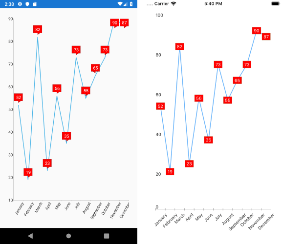

## Environment
<table>
	<tbody>
		<tr>
			<td>Product Version</td>
			<td>2019.3.1004.1</td>
		</tr>
		<tr>
			<td>Product</td>
			<td>RadChart for Xamarin</td>
		</tr>
	</tbody>
</table>


## Description

In order to customize the Series Labels of RadChart, you would need to implement a __custom renderer for each platform__.  The example below shows sample implementation of custom renderers on Android and iOS where the text color of the BarSeries Labels is modified. 

For more details on the customizations options, go through the following topics in Telerik UI for Xamarin documentation: [Android RadChartView Labels]() and [iOS Chart PointLabels]().

## Solution

* For Android you would need to set Label-related properties property of the series:

```C#
using Android.Content;
using Telerik.XamarinForms.ChartRenderer.Android;
using ChartCustomLabels.Droid;
using Xamarin.Forms.Platform.Android;
using Com.Telerik.Widget.Chart.Visualization.CartesianChart;
using Com.Telerik.Widget.Chart.Visualization.CartesianChart.Series.Categorical;
using Android.Graphics;

[assembly: Xamarin.Forms.ExportRenderer(typeof(Telerik.XamarinForms.Chart.RadCartesianChart), typeof(CustomChartRenderer))]
namespace ChartCustomLabels.Droid
{
    class CustomChartRenderer : CartesianChartRenderer
    {       
        public CustomChartRenderer(Context context) : base(context)
        {

        }
        protected override void OnElementChanged(ElementChangedEventArgs<Telerik.XamarinForms.Chart.RadCartesianChart> e)
        {
            base.OnElementChanged(e);

            if (Control is RadCartesianChartView nativeChart)
            {               
                for (int i = 0; i < nativeChart.Series.Size(); i++)
                {
                    // Get a reference to the series you need, in this case it's a categorical series
                    if (nativeChart.Series.Get(i) is CategoricalSeries series)
                    {
                        // Set the Label properties you want
                        series.LabelFillColor = Color.Red;
                        series.LabelTextColor = Color.White;
                        series.LabelStrokeColor = Color.Brown;
                    }
                }
            }
        }
    }
}  
```

* For iOS you would need to create a new ChartDelegate and override LabelForDataPoint method as shown below:

```C#
using System;
using Telerik.XamarinForms.Chart;
using Telerik.XamarinForms.ChartRenderer.iOS;
using TelerikUI;
using ChartCustomLabels.iOS;
using UIKit;

[assembly: Xamarin.Forms.ExportRenderer(typeof(RadCartesianChart), typeof(CustomChartRenderer))]
namespace ChartCustomLabels.iOS
{
    public class CustomChartRenderer : CartesianChartRenderer
    {
        protected override TKChartDelegate CreateChartDelegate(RadCartesianChart chart)
        {
            return new MyChartDelegate(chart);
        }
      
        public class MyChartDelegate : CartesianChartDelegate
        {
            public MyChartDelegate(RadCartesianChart chart) : base(chart)
            {
            }
			
            public override TKChartPointLabel LabelForDataPoint(TKChart chart, TKChartData dataPoint, string propertyName, TKChartSeries series, nuint dataIndex)
            {
                TKChartDataPoint chartDataPoint = (TKChartDataPoint)dataPoint;
                return new MyChartPointLabel(chartDataPoint, series, chartDataPoint.DataYValue.ToString());
            }
        }

        public class MyChartPointLabel : TKChartPointLabel
        {
            public MyChartPointLabel(TKChartDataPoint point, TKChartSeries series, string text) : base(point, series, text)
            {
                this.Style.TextColor = UIColor.White;
                this.Style.Fill = new TKSolidFill(UIColor.Red);
                this.Style.Stroke = new TKStroke(UIColor.Brown);
                this.Style.Insets = new UIEdgeInsets(-2, -4, -2, -4);
            }
        }
    }
}
```

Here is the result after implementing the custom renderers on Android and iOS:

