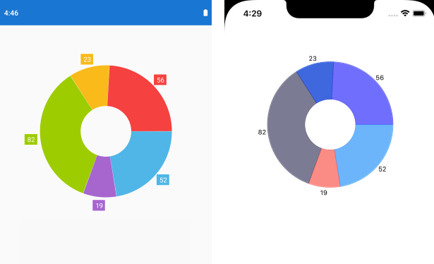

## Environment
<table>
	<tbody>
		<tr>
			<td>Product Version</td>
			<td>R1 2021</td>
		</tr>
		<tr>
			<td>Product</td>
			<td>Chart for Xamarin</td>
		</tr>
	</tbody>
</table>


## Description

PieChart for Xamarin supports series labels, which by default are rendered inside the pie slices on Android and iOS ( each slice corresponds to a data item from the Series ItemsSource) - this is valid for both PieSeries and DonutSeries. Through [custom renderers]() on different platforms you can change the position of the labels, so that they are rendered outside the pie chart.

## Solution

Let's have the following PieChart definition:

```XAML
<telerikChart:RadPieChart x:Name="pieChart">
    <telerikChart:RadPieChart.BindingContext>
        <local:ViewModel />
    </telerikChart:RadPieChart.BindingContext>
    <telerikChart:RadPieChart.Series>
        <telerikChart:DonutSeries ShowLabels="True"
                            InnerRadiusFactor="0.4"
							RadiusFactor="0.8"    
                            ValueBinding="Value"                                   
                            ItemsSource="{Binding Data}" />
    </telerikChart:RadPieChart.Series>
</telerikChart:RadPieChart>
```

Add a sample ViewModel class and a data item class:

```C#
public class ViewModel
{
    public ObservableCollection<CategoricalData> Data { get; set; }

    public ViewModel()
    {
        this.Data = GetCategoricalData();
    }

    private static ObservableCollection<CategoricalData> GetCategoricalData()
    {
        var data = new ObservableCollection<CategoricalData>
    {
        new CategoricalData { Category = "Greenings", Value = 52 },
        new CategoricalData { Category = "Perfecto", Value = 19 },
        new CategoricalData { Category = "NearBy", Value = 82 },
        new CategoricalData { Category = "Family", Value = 23 },
        new CategoricalData { Category = "Fresh", Value = 56 },
    };
        return data;
    }
}

public class CategoricalData
{
    public object Category { get; set; }

    public double Value { get; set; }
}
```

### Custom Renderer on Android

For Android you would need to set **LabelOffset** property of the series:

```C#
using MyApp.Droid;
using Android.Content;
using System.Linq;
using Telerik.XamarinForms.Chart;
using Telerik.XamarinForms.ChartRenderer.Android;
using Xamarin.Forms.Platform.Android;

[assembly: Xamarin.Forms.ExportRenderer(typeof(Telerik.XamarinForms.Chart.RadPieChart), typeof(CustomPieChartRenderer))]
namespace MyApp.Droid
{
    public class CustomPieChartRenderer : PieChartRenderer
    {
        public CustomPieChartRenderer(Context context) : base(context)
        {
         
        }

        protected override void OnElementChanged(ElementChangedEventArgs<RadPieChart> e)
        {
            base.OnElementChanged(e);

            var series = this.Control.Series.ToArray()?.FirstOrDefault() as Com.Telerik.Widget.Chart.Visualization.PieChart.DoughnutSeries;
            series.LabelOffset = -40;           
        }
    }
}
```

### Custom renderer on iOS

For iOS you would need to set **LabelDisplayMode** property of the series. In addition, you can apply **LabelOffset** of the PointLabelStyle to position the label at the required location.

```C#
using MyApp.iOS;
using Telerik.XamarinForms.Chart;
using Telerik.XamarinForms.ChartRenderer.iOS;
using TelerikUI;
using UIKit;
using Xamarin.Forms.Platform.iOS;

[assembly: Xamarin.Forms.ExportRenderer(typeof(RadPieChart), typeof(CustomChartRenderer))]
namespace MyApp.iOS
{
    public class CustomChartRenderer : PieChartRenderer
    {
        protected override void OnElementChanged(ElementChangedEventArgs<RadPieChart> e)
        {
            base.OnElementChanged(e);

            var pieSeries = ((TKChartDataSource)this.Control.WeakDataSource).GetSeries(this.Control, 0) as TKChartPieSeries;

            if (pieSeries != null)
            {
                pieSeries.LabelDisplayMode = TKChartPieSeriesLabelDisplayMode.Outside;
                pieSeries.Style.PointLabelStyle.LabelOffset = new UIOffset(10, 0);
            }
        }
    }
}
```

> **MyApp** should be replaced with the namespace you're using in your application - the namespace the RadChart is defined into.

Here is the result both on Android and iOS:

