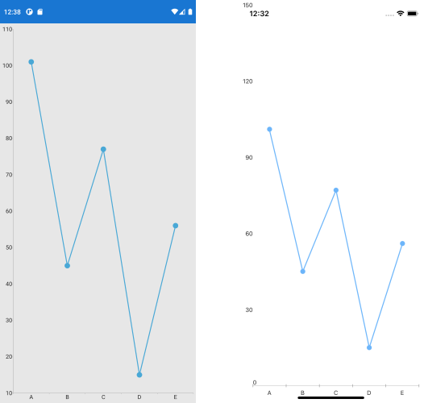

## Environment
<table>
	<tbody>
		<tr>
			<td>Product Version</td>
			<td>R1 2022</td>
		</tr>
		<tr>
			<td>Product</td>
			<td>Chart for Xamarin</td>
		</tr>
	</tbody>
</table>


## Description

Is there a way to turn on Data Point Markers for RadCartesianChart LineSeries? This can be really helpful in case there is only one result the chart doesn't show the value of the result.

## Solution

You would need to create custom renderers both on Android and iOS in order to display data point markers on LineSeries of the CartesianChart.  

Let's have the following Chart definition:

```XAML
<telerikChart:RadCartesianChart x:Name="chart">
    <telerikChart:RadCartesianChart.BindingContext>
        <local:CategoricalDataViewModel/>
    </telerikChart:RadCartesianChart.BindingContext>
    <telerikChart:RadCartesianChart.Series>
        <telerikChart:LineSeries ItemsSource="{Binding Data}">
            <telerikChart:LineSeries.ValueBinding>
                <telerikChart:PropertyNameDataPointBinding PropertyName="Value"/>
            </telerikChart:LineSeries.ValueBinding>
            <telerikChart:LineSeries.CategoryBinding>
                <telerikChart:PropertyNameDataPointBinding PropertyName="Category"/>
            </telerikChart:LineSeries.CategoryBinding>
        </telerikChart:LineSeries>
    </telerikChart:RadCartesianChart.Series>
    <telerikChart:RadCartesianChart.HorizontalAxis>
        <telerikChart:CategoricalAxis/>
    </telerikChart:RadCartesianChart.HorizontalAxis>
    <telerikChart:RadCartesianChart.VerticalAxis>
        <telerikChart:NumericalAxis/>
    </telerikChart:RadCartesianChart.VerticalAxis>
</telerikChart:RadCartesianChart>
```

Where **CategoricalDataViewModel** is defined like this:

```C#
public class CategoricalDataViewModel
{
	public ObservableCollection<CategoricalData> Data { get; set; }

	public CategoricalDataViewModel()
	{
		this.Data = GetCategoricalData();
	}

	private static ObservableCollection<CategoricalData> GetCategoricalData()
	{
		var data = new ObservableCollection<CategoricalData>
		{
			new CategoricalData { Category = "A", Value = 101 },
			new CategoricalData { Category = "B", Value = 45 },
			new CategoricalData { Category = "C", Value = 77 },
			new CategoricalData { Category = "D", Value = 15 },
			new CategoricalData { Category = "E", Value = 56 },
		};
		return data;
	}
}

public class CategoricalData
{
	public object Category { get; set; }
	public double Value { get; set; }
}
```

Then lets move on to the custom renderers:

### Custom Renderer for Android

On Android you would need to create a custom `PointRenderer` class and assign it to the **DataPointRenderer** property of the LineSeries:

```C#
using Android.Content;
using Android.Graphics;
using MyApp.Droid;
using Com.Telerik.Widget.Chart.Engine.DataPoints;
using Com.Telerik.Widget.Chart.Visualization.CartesianChart.Series.Categorical;
using Com.Telerik.Widget.Chart.Visualization.CartesianChart.Series.Pointrenderers;
using Com.Telerik.Widget.Palettes;
using Telerik.XamarinForms.ChartRenderer.Android;
using Xamarin.Forms.Platform.Android;

[assembly: Xamarin.Forms.ExportRenderer(typeof(Telerik.XamarinForms.Chart.RadCartesianChart), typeof(CustomChartRenderer))]
namespace MyApp.Droid
{
    public class CustomChartRenderer : CartesianChartRenderer
    {
        public CustomChartRenderer(Context context) : base(context)
        {

        }
        protected override void OnElementChanged(ElementChangedEventArgs<Telerik.XamarinForms.Chart.RadCartesianChart> e)
        {
            base.OnElementChanged(e);
            if (this.Control != null)
            {
                for (int i = 0; i < this.Control.Series.Size(); i++)
                {
                    LineSeries lineSeries = (LineSeries)this.Control.Series.Get(i) as LineSeries;
                    lineSeries.DataPointRenderer = new PointRenderer(lineSeries);
                }

            }
        }

        public class PointRenderer : Java.Lang.Object, IChartDataPointRenderer
        {
            private LineSeries lineSeries;

            public PointRenderer(LineSeries lineSeries)
            {
                this.lineSeries = lineSeries;
            }

            public void RenderPoint(Canvas canvas, DataPoint dataPoint)
            {
                PaletteEntry entry = this.lineSeries.Palette.GetEntry(this.lineSeries, this.lineSeries.CollectionIndex);
                using (Paint paint = new Paint())
                {
                    paint.Color = new Color(entry.Fill);
                    canvas.DrawCircle((float)dataPoint.CenterX, (float)dataPoint.CenterY, 20, paint);
                }
            }
        }
    }
}
```

### Custom Renderer for iOS

On iOS there is direct API of the LineSeries Style property, namely `PointShape` and `ShapeMode`:

```C#
using MyApp.iOS;
using Telerik.XamarinForms.Chart;
using Telerik.XamarinForms.ChartRenderer.iOS;
using TelerikUI;
using Xamarin.Forms.Platform.iOS;

[assembly: Xamarin.Forms.ExportRenderer(typeof(RadCartesianChart), typeof(CustomChartRenderer))]
namespace MyApp.iOS
{
    public class CustomChartRenderer : CartesianChartRenderer
    {

        protected override void OnElementChanged(ElementChangedEventArgs<RadCartesianChart> e)
        {
            base.OnElementChanged(e);          

            TKExtendedChart chart = this.Control as TKExtendedChart;
            if (chart != null && this.Element != null)
            {
                chart.YAxis.Style.LabelStyle.TextAlignment = TKChartAxisLabelAlignment.Left;
                TKChartLineSeries lineSeries = chart.Series[0] as TKChartLineSeries;

                lineSeries.Style.PointShape = new TKPredefinedShape(TKShapeType.Circle, new System.Drawing.SizeF(10, 10));
                lineSeries.Style.ShapeMode = TKChartSeriesStyleShapeMode.AlwaysShow;
            }
        }
    }
}
```

Here is the result on both platforms:


