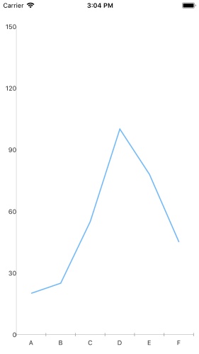

## Environment
<table>
	<tr>
		<td>Product Version</td>
		<td>2018.3.1122.3</td>
	</tr>
	<tr>
		<td>Product</td>
		<td>Chart for Xamarin Cross-Platform</td>
	</tr>
</table>


## Description

The differences between the vertical axis labels position is because the native Android and iOS charts are two different controls and do not have 100 % appearance-matching across all the platforms. In order to make any further customization on the RadChart control, the custom renderer should be used. This article will show you how to position the VericalAxes Labels on iOS on the left to make it look as on Android.

## Solution

First, create the needed business objects, for example:

```C#
public class CategoricalData
{
    public object Category { get; set; }

    public double Value { get; set; }
}
```

Then create a ViewModel:

```C#
public class CategoricalDataViewModel
{
    public ObservableCollection<CategoricalData> Data { get; set; }

    public CategoricalDataViewModel()
    {
        this.Data = GetCategoricalData();
    }

    private static ObservableCollection<CategoricalData> GetCategoricalData()
    {
        var data = new ObservableCollection<CategoricalData>
        {
            new CategoricalData { Category = "A", Value = 101 },
            new CategoricalData { Category = "B", Value = 45 },
            new CategoricalData { Category = "C", Value = 77 },
            new CategoricalData { Category = "D", Value = 15 },
            new CategoricalData { Category = "E", Value = 56 },
        };
        return data;
    }
}
```

Use the following snippet to declare a RadCartesianChart with Line Series in XAML

```XAML
<telerikChart:RadCartesianChart>
    <telerikChart:RadCartesianChart.BindingContext>
        <local:CategoricalDataViewModel />
    </telerikChart:RadCartesianChart.BindingContext>
    <telerikChart:RadCartesianChart.HorizontalAxis>
        <telerikChart:CategoricalAxis LabelFitMode="MultiLine"
                                      PlotMode="OnTicks" />
    </telerikChart:RadCartesianChart.HorizontalAxis>
    <telerikChart:RadCartesianChart.VerticalAxis>
        <telerikChart:NumericalAxis />
    </telerikChart:RadCartesianChart.VerticalAxis>
    <telerikChart:RadCartesianChart.Series>
        <telerikChart:LineSeries ValueBinding="Value"
                                 CategoryBinding="Category"
                                 ItemsSource="{Binding Data}" />
    </telerikChart:RadCartesianChart.Series>
</telerikChart:RadCartesianChart>
```

That's all on the shared project.

Now, let's start with the iOS project:

Create a class for example CustomChartRenderer which inherits from Telerik.XamarinForms.ChartRenderer.iOS.CartesianChartRenderer and override the OnElementChanged method:

```C#
public class CustomChartRenderer : CartesianChartRenderer
{
    protected override void OnElementChanged(ElementChangedEventArgs<RadCartesianChart> e)
    {
        base.OnElementChanged(e);
        TKExtendedChart control = this.Control;
        if (control != null)
        {
            this.Control.YAxis.Style.LineHidden = false;
            this.Control.YAxis.Style.LabelStyle.TextAlignment = TKChartAxisLabelAlignment.Left;
            this.Control.YAxis.Style.LabelStyle.FirstLabelTextAlignment = TKChartAxisLabelAlignment.Left;
        }
    }
}
```

and register the custom renderer for CartesianChart:

```C#
[assembly: ExportRenderer(typeof(Telerik.XamarinForms.Chart.RadCartesianChart), typeof(CustomChartRenderer))]
```

Here is the result on iOS after running the example:


