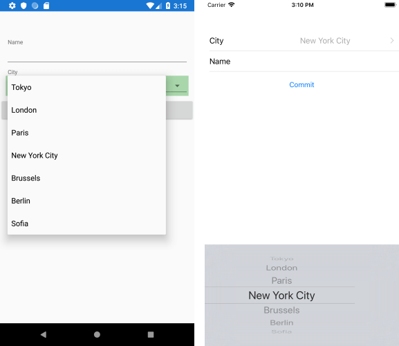

## Environment
<table>
	<tr>
		<td>Product Version</td>
		<td>2018.3.1122</td>
	</tr>
	<tr>
		<td>Product</td>
		<td>DataForm for Xamarin</td>
	</tr>
</table>


## Description

In general, RadDataForm works with simple property types (string, int, long) and when you are using a custom type - the **native Data Form** is not sure what native type corresponds to the one you are using so it disregards the property. With this in mind, we have introduced a mechanism that maps the property declared in Xamarin.Forms to a native one. Below are the needed steps to enable this on Android and iOS.

## Solution

First, create the custom property you will use inside the DataForm PickerEditor:

```C#
public class City
{
	public City(string name)
	{
		this.Name = name;
	}
	public string Name { get; set; }
	public override bool Equals(object obj)
	{
		return this.Name.Equals((obj as City)?.Name);
	}
}
```

Create a sample *SourceItem* class which will be the Source of RadDataForm, it has a property of type *City*:

```C#
public class SourceItem
{
	[DisplayOptions(Header = "Name")]
	public string Name { get; set; }

	[DisplayOptions(Header = "City")]
	public City City { get; set; }
}
```

Add a simple RadDataForm definition to your page:

```XAML
<telerikInput:RadDataForm x:Name="dataForm" />
```

Add some code for setting its Source and registering the PickerEditor in code-behind. In addition, you would need to supply a PropertyDataSourceProvider for the Picker ItemsSource:

```C#
this.dataForm.Source = new SourceItem();
this.dataForm.RegisterEditor(nameof(SourceItem.City), EditorType.PickerEditor);
this.dataForm.PropertyDataSourceProvider = new CityDataSourceProvider();
```	

Here is the provider:

```C#
public class CityDataSourceProvider : PropertyDataSourceProvider
{
	public override IList GetSourceForKey(object key)
	{
		if (key.ToString().Equals("City"))
		{
			return new ObservableCollection<City>
			{
				new City("Tokyo"),
				new City("London"),
				new City("Paris"),
				new City("New York City"),
				new City("Brussels"),
				new City("Berlin"),
				new City("Sofia")
			};
			}
		return null;
	}
}
```

That's all on the shared project.

Now, let's continue the implementation with the Android project. The *City* type should be converted to a Java type through a Telerik.XamarinForms.Common.Android.TypeRegister inside the MainActivity.cs file of the Android project (call it before LoadApplication):

```C#
public class MainActivity : global::Xamarin.Forms.Platform.Android.FormsAppCompatActivity
{
	protected override void OnCreate(Bundle savedInstanceState)
	{
		...
		TypeRegister.Register(typeof(City), typeof(JavaCity), new MyTypeConverter());
		LoadApplication(new App());
	}
	...
}
```

Add the needed MyTypeConverter and JavaCity classes:

```C#
public class JavaCity : ConvertibleObject<City>
{
	public JavaCity(City instance) : base(instance)
	{
	}
	// the display value in editor
	public override string ToString()
	{
		return Instance.Name;
	}
}

public class MyTypeConverter : ITypeConverter
{
	public Java.Lang.Object Convert(object sourceObject)
	{
		return new JavaCity((City)sourceObject);
	}
	public object ConvertBack(Java.Lang.Object nativeObject)
	{
		return (nativeObject as JavaCity).Instance;
	}
}
```	

Lastly, let's go to the iOS project. Again, go to AppDelegate.cs and add the needed code to convert the City type through Telerik.XamarinForms.Common.iOS.TypeRegister method:

```C#
public override bool FinishedLaunching(UIApplication app, NSDictionary options)
{
	global::Xamarin.Forms.Forms.Init();
	LoadApplication(new App());

	TypeRegister.Register(typeof(City), typeof(NSCity), new MyTypeConverter());
	return base.FinishedLaunching(app, options);
}
```
	
And here are the final bits:

```C#
public class NSCity : ConvertibleObject<City>
{
	public NSCity(City instance) : base(instance)
	{
	}
	// the display value in editor
	public override string Description
	{
		get
		{
			return Instance.Name;
		}
	}
}
public class MyTypeConverter : ITypeConverter
{
	public NSObject Convert(object sourceObject)
	{
		return new NSCity((City)sourceObject);
	}

	public object ConvertBack(NSObject nativeObject)
	{
		return (nativeObject as NSCity).Instance;
	}
}
```	

Here is the DataForm while setting City property:

