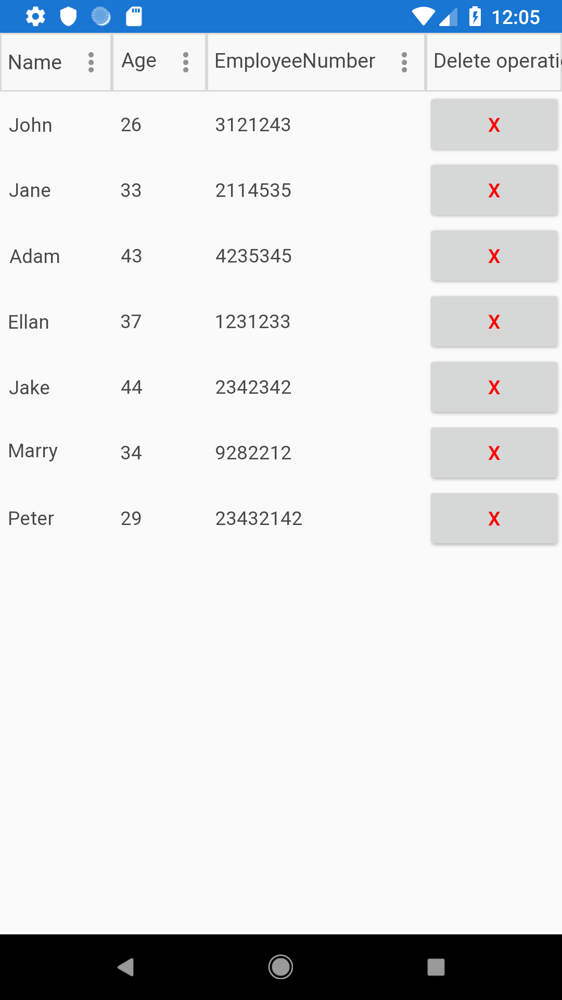

## Environment
<table>
    <tbody>
	    <tr>
	    	<td>Product Version</td>
	    	<td>2019.3.1023.1</td>
	    </tr>
	    <tr>
	    	<td>Product</td>
	    	<td>DataGrid for Xamarin.Forms</td>
	    </tr>
    </tbody>
</table>


## Description

This help article will show you how to add button inside DataGrid Column.

>important TemplateColumn could be used if you want to add content in the DataGrid column different from the predefined column. For example if you have a requirement to add images, image button, etc.

## Solution

This scenario can be achieved through a TemplateColumn. More details about DataGrid TemplateColumn can be found [here](). 

Lets create a sample business model:

```C#
public class Employee 
{
	public string Name { get; set; }
	public int Age { get; set; }
	public int EmployeeNumber { get; set; }
}
```

and a sample ViewModel:

```C#
public class ViewModel
{
    public ObservableCollection<Employee> Items { get; set; }
    public ICommand DeleteItemCommand { get; set; }

    public ViewModel()
    {
        var data = new ObservableCollection<Employee>();

        data.Add(new Employee { Name = "John", Age = 26, EmployeeNumber = 3121243});
        data.Add(new Employee { Name = "Jane", Age = 33, EmployeeNumber = 2114535 });
        data.Add(new Employee { Name = "Adam", Age = 43, EmployeeNumber = 4235345 });
        data.Add(new Employee { Name = "Ellan", Age = 37, EmployeeNumber = 1231233 });
        data.Add(new Employee { Name = "Jake", Age = 44, EmployeeNumber = 2342342 });
        data.Add(new Employee { Name = "Marry", Age = 34, EmployeeNumber = 9282212 });
        data.Add(new Employee { Name = "Peter", Age = 29, EmployeeNumber = 23432142 });

        this.Items = data;

        this.DeleteItemCommand = new Command(this.DeleteItemCommandExecuted);
    }

    public void DeleteItemCommandExecuted(object obj)
    {
        this.Items.Remove(obj as Employee);
    }
}
```

Then we need to define theRadDataGrid and add a button inside the TemplateColumn:

```XAML
<ContentPage.Resources>
    <ResourceDictionary>
        <local:ViewModel x:Key="ViewModel" />
    </ResourceDictionary>
</ContentPage.Resources>
<Grid BindingContext="{StaticResource ViewModel}">
    <telerikDataGrid:RadDataGrid x:Name="DataGrid" 
                                    ItemsSource="{Binding Items}" 
                                    AutoGenerateColumns="False" 
                                    UserEditMode="Cell">
        <telerikDataGrid:RadDataGrid.Columns>
            <telerikDataGrid:DataGridTextColumn PropertyName="Name" />
            <telerikDataGrid:DataGridNumericalColumn PropertyName="Age"/>
            <telerikDataGrid:DataGridNumericalColumn PropertyName="EmployeeNumber"/>
            <telerikDataGrid:DataGridTemplateColumn HeaderText="Delete operation" 
													SizeMode="Fixed">
                <telerikDataGrid:DataGridTemplateColumn.CellContentTemplate>
                    <DataTemplate>
                        <Button Text="x" TextColor="Red" 
                                Command="{Binding DeleteItemCommand, Source={StaticResource ViewModel}}" 
                                CommandParameter="{Binding .}" />
                    </DataTemplate>
                </telerikDataGrid:DataGridTemplateColumn.CellContentTemplate>
            </telerikDataGrid:DataGridTemplateColumn>
        </telerikDataGrid:RadDataGrid.Columns>
    </telerikDataGrid:RadDataGrid>
</Grid>
```

Here is the final result:


