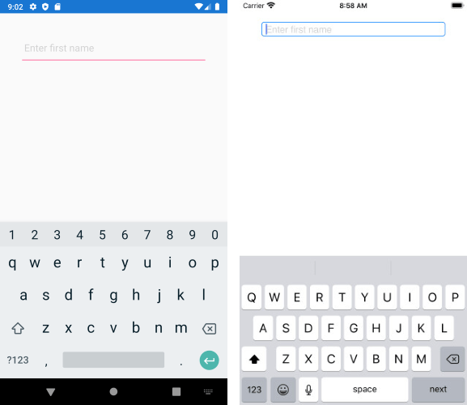

## Environment
<table>
	<tbody>
		<tr>
			<td>Product Version</td>
			<td>R3 2020</td>
		</tr>
		<tr>
			<td>Product</td>
			<td>Entry for Xamarin</td>
		</tr>
	</tbody>
</table>


## Description

RadEntry does not provide ReturnType property as the [Xamarin.Forms Entry ReturnType](https://docs.microsoft.com/en-us/xamarin/xamarin-forms/user-interface/text/entry#customize-the-return-key), still, there is an easy way to implement it by creating custom native renderers on both Android and iOS, taking the native EditText and UITextField controls and setting their corresponding properties.

* For Android override OnElementChanged event and apply <code>ImeOptions</code> of the native EditText control:

```C#
using Android.Content;
using Android.Text;
using Android.Widget;
using EntryExample.Droid;
using Telerik.XamarinForms.Input;
using Xamarin.Forms;
using Xamarin.Forms.Platform.Android;

[assembly: ExportRenderer(typeof(RadEntry), typeof(CustomEntryRenderer))]
namespace EntryExample.Droid
{
    public class CustomEntryRenderer : Telerik.XamarinForms.InputRenderer.Android.EntryRenderer
    {
        public CustomEntryRenderer(Context context) : base(context)
        {

        }
        protected override void OnElementChanged(ElementChangedEventArgs<RadEntry> e)
        {
            base.OnElementChanged(e);

            if (Control != null)
            {
                ((EditText)Control).ImeOptions = global::Android.Views.InputMethods.ImeAction.Next;
            }
        }
    }
}
```

* For iOS override again OnElementChanged and apply <code>ReturnKeyType</code> to the native UITextField control: 

```C#
using EntryExample.iOS;
using Telerik.XamarinForms.Input;
using UIKit;
using Xamarin.Forms;
using Xamarin.Forms.Platform.iOS;

[assembly: ExportRenderer(typeof(RadEntry), typeof(CustomEntryRenderer))]
namespace EntryExample.iOS
{
    public class CustomEntryRenderer: Telerik.XamarinForms.InputRenderer.iOS.EntryRenderer
    {
        protected override void OnElementChanged(ElementChangedEventArgs<RadEntry> e)
        {
            base.OnElementChanged(e);

            ((UITextField)Control).ReturnKeyType = UIReturnKeyType.Next;
        }
    }
}
```

Here is the result on Android and iOS:

