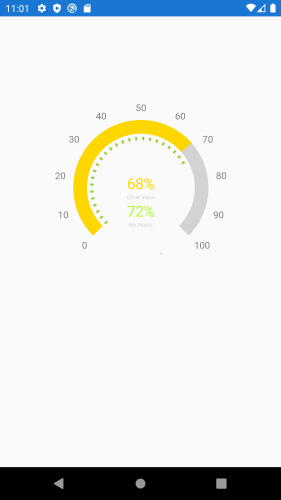

## Environment

<table>
	<tbody>
		<tr>
			<td>Product Version</td>
			<td>2021.1.119.1</td>
		</tr>
		<tr>
			<td>Product</td>
			<td>Chart for Xamarin Cross-Platform</td>
		</tr>
	</tbody>
</table>


## Description

This article will show you how to add minor ticks and title to the RadGauge control. The solution can be created with a little clever use of existing indicators and some custom development.



## Solution

1. Use [GaugeShapeIndicator]()

2. Draw the rectangle shape using [RadPathGeometry](). This is a very simple shape path just like you're familiar with on any platform that uses X,Y coordinates to draw a line. You will need to create one GaugeShapeIndicator for every square.  

3. Create Custom Algorithm to draw the shapes.

Here is the RadGauge definition. The labels inside the stackLayout will be used for displaying a title for the Gauge control

```XAML
<Grid x:Name="MyGaugeGrid" WidthRequest="400" HeightRequest="400" VerticalOptions="Start" HorizontalOptions="Center" Margin="50" >
	<telerikGauges:RadRadialGauge x:Name="gauge"
								  Margin="10"
								  StartAngle="225"
								  SweepAngle="270">
		<telerikGauges:RadRadialGauge.Axis>
			<telerikGauges:GaugeLinearAxis Minimum="0" Maximum="100" 
										   ShowLabels="True" 
										   StrokeThickness="0" 
										   Step="10"
										   />
		</telerikGauges:RadRadialGauge.Axis>
		<telerikGauges:RadRadialGauge.Indicators>
			<telerikGauges:GaugeBarIndicator StartCap="Flat"
											 EndCap="Flat"
											 Fill="LightGray"
											 Offset="3"
											 Value="100" />
			<telerikGauges:GaugeBarIndicator StartCap="Flat"
											 EndCap="Flat"
											 Fill="Gold"
											 Offset="3"
											 Value="{Binding OtherValue}" />
		</telerikGauges:RadRadialGauge.Indicators>
	</telerikGauges:RadRadialGauge>
	
	<!-- for the Gauge Title-->
	<StackLayout HorizontalOptions="Center" VerticalOptions="Center" Margin="0,40,0,0" Spacing="0">
		<Label x:Name="OtherValueLabel"
		   Text="{Binding OtherValue, StringFormat='{0}%'}"
		   TextColor="Gold"
		   HorizontalTextAlignment="Center"
		   FontSize="22" />
		<Label Text="Other Value"
		   TextColor="LightGray"
		   HorizontalTextAlignment="Center"
		   FontSize="8" />
		<Label x:Name="Label"
		   TextColor="GreenYellow"
		   Text="{Binding MyPoints, StringFormat='{0}%'}"
		   HorizontalTextAlignment="Center"
		   FontSize="22" />
		<Label Text="My Points"
		   HorizontalTextAlignment="Center"
		   FontSize="8"
		   TextColor="LightGray" />
	</StackLayout>
</Grid>
```

and the code behind and the custom algorithm in action 

```C#
public partial class MainPage : ContentPage
{
	public MainPage()
	{
		InitializeComponent();
		this.BindingContext = new MainViewModel();
	}
	protected override void OnAppearing()
	{
		base.OnAppearing();

		var avgPercentage = (BindingContext as MainViewModel).MyPoints;

		DrawRectangleIndicators(avgPercentage);
	}

	private void DrawRectangleIndicators(double totalValue)
	{
		for (int i = 0; i < totalValue; i++)
		{
			// Draw an indicator at every 3rd slot
			if (i % 3 == 0)
			{
				gauge.Indicators.Add(CreateGaugeShapeIndicator(i));
			}
		}

		// draw final indicator to represent the total value
		gauge.Indicators.Add(CreateGaugeShapeIndicator(totalValue));
	}

	private GaugeShapeIndicator CreateGaugeShapeIndicator(double indicatorValue)
	{
		var pathGeometry = new RadPathGeometry();
		var pathFigure = new RadPathFigure { StartPoint = new Point(1, 0.2) };
		pathFigure.Segments.Add(new RadLineSegment { Point = new Point(0, 0.2) });
		pathFigure.Segments.Add(new RadLineSegment { Point = new Point(0, 0.8) });
		pathFigure.Segments.Add(new RadLineSegment { Point = new Point(1, 0.8) });
		pathGeometry.Figures.Add(pathFigure);

		return new GaugeShapeIndicator
		{
			Value = indicatorValue,
			Fill = Color.YellowGreen,
			Size = 5,
			Offset = 30,
			Position = GaugeElementPosition.Start,
			Shape = pathGeometry
		};
	}

}

public class MainViewModel
{
	public MainViewModel()
	{
	}
	public double OtherValue { get; set; } = 68;
	public double MyPoints { get; set; } = 72;
}
```

