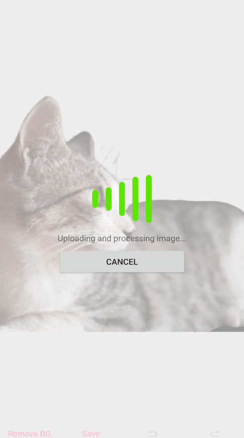

## Environment
<table>
    <tbody>
	    <tr>
	    	<td>Product Version</td>
	    	<td>2019.3.1119</td>
	    </tr>
	    <tr>
	    	<td>Product</td>
	    	<td>ImageEditor for Xamarin</td>
	    </tr>
    </tbody>
</table>


## Description

This article shows you how to make an HTTP request to an online API in a `RadImageEditor` using the `CommandToolbarItem`.

## Solution

The ImageEditor allows you to invoke custom logic via `CommandToolbarItem` in either a bound **Command** or a **Clicked** event. Visit the [ImageEditor Custom Toolbar](https://docs.telerik.com/devtools/xamarin/controls/imageeditor/imageeditor-custom-toolbar) article for details and more options.

### Setup

As an example, this article will use an online API to remove the background from a photo using machine learning via the [Remove Background API](https://www.remove.bg/api). You can use any API in its place. 

However, if you would like to follow along precisely with this tutorial, you will need to get a free API key from the service.

1. Login or Create an Account ([click here](https://www.remove.bg/users/sign_up))
2. Request API Key ([click here](https://www.remove.bg/profile#api-key))

> Progress Software is not affliated with removebg or Kaleido AI. The removebg API example is only to demonstrate how to use any online service with the ImageEditor control.

### Configuring the ImageEditor and Toolbar

The first step is to define a RadImageEditor in the first row of a Grid. Then add a RadImageEditorToolbar with  `AutoGenerateItems="False"` (because we'll be defining our own commands) in the second row. *Note: The initial cat4.jpeg image source is hard coded to keep the example simple.*

```xml
<Grid BackgroundColor="LightGray">
	<Grid.RowDefinitions>
		<RowDefinition />
		<RowDefinition Height="Auto" />
	</Grid.RowDefinitions>

	<ie:RadImageEditor x:Name="Editor" Source="cat4.jpeg" BackgroundColor="Transparent"/>

	<ie:RadImageEditorToolbar ImageEditor="{x:Reference Editor}" AutoGenerateItems="False" Grid.Row="1">
	    ...
	</ie:RadImageEditorToolbar>
</Grid>
```

Next, we'll add a `CommandToolbarItem` to be able to save the image.

```xml
<Grid BackgroundColor="LightGray">
	<Grid.RowDefinitions>
		<RowDefinition />
		<RowDefinition Height="Auto" />
	</Grid.RowDefinitions>

	<ie:RadImageEditor x:Name="Editor" Source="cat4.jpeg" BackgroundColor="Transparent"/>

	<ie:RadImageEditorToolbar ImageEditor="{x:Reference Editor}" AutoGenerateItems="False" Grid.Row="1">
		<ie:CommandToolbarItem Text="Save" Tapped="Save_Clicked" />
	</ie:RadImageEditorToolbar>
</Grid>
```
The last step in the XAML is to add another `CommandToolbarItem` that will call the custom API.

```xml
<Grid BackgroundColor="LightGray">
	<Grid.RowDefinitions>
		<RowDefinition />
		<RowDefinition Height="Auto" />
	</Grid.RowDefinitions>

	<ie:RadImageEditor x:Name="Editor" Source="cat4.jpeg" BackgroundColor="Transparent"/>

	<ie:RadImageEditorToolbar ImageEditor="{x:Reference Editor}" AutoGenerateItems="False" Grid.Row="1">
		<ie:CommandToolbarItem Text="Remove BG" Tapped="RemoveBackground_Clicked" />
		<ie:CommandToolbarItem Text="Save" Tapped="Save_Clicked" />
	</ie:RadImageEditorToolbar>
</Grid>
```


### Calling the API

Now, in the code-behind, let's define the event handlers for the CommandToolbarItem's **Clicked** events. 

```csharp
private async void Save_Clicked(object sender, EventArgs e)
{
	await SaveToPicturesFolderAsync();
}

private async void RemoveBackground_Clicked(object sender, EventArgs e)
{
	await RemoveBackgroundAsync();
}
```

The **SaveToPicturesFolder** task is strightforward thanks to .NET Standard 2.0. It uses `System.IO.File` to save a file to the user's pictures folder for that device.


```csharp
private async Task SaveToPicturesFolderAsync()
{
	var folderPath = Environment.GetFolderPath(Environment.SpecialFolder.MyPictures);

	using (var fileStream = File.OpenWrite(Path.Combine(folderPath, "ImageEditor_Final.jpeg")))
	{
		await this.Editor.SaveAsync(fileStream, ImageFormat.Jpeg, 0.9);
	}
}
```

Finally, the RemoveBackgroundAsync task is where the API call is made. Take notice of the code comments in the following snippet to follow the workflow.


```csharp
private async Task RemoveBackgroundAsync()
{
	// 1. Create the file path for a temporary image file
	var folderPath = Environment.GetFolderPath(Environment.SpecialFolder.LocalApplicationData);
	var tempFilePath = Path.Combine(folderPath, "temp_image.jpeg");

	// 2. Use the ImageEditor's SaveAsync to save the current image to the temp file
	using (var tempFileStream = File.OpenWrite(tempFilePath))
	{
		await this.Editor.SaveAsync(tempFileStream, ImageFormat.Jpeg, 0.9);
	}

	// 3. Create a MultipartFormDataContent and add the headers required by the API you're using
	using (var formData = new MultipartFormDataContent())
	{
		// 4. In this case, we pass the API key and the image file
		formData.Headers.Add("X-Api-Key", "YOUR_REMOVEBG_API_KEY_GOES_HERE");
		formData.Add(new ByteArrayContent(File.ReadAllBytes(tempFilePath)), "image_file", "file.jpg");
		formData.Add(new StringContent("auto"), "size");

		// 5. Make the request to the API
		using(var client = new HttpClient())
		using (var response = await client.PostAsync("https://api.remove.bg/v1.0/removebg", formData))
		{
			if (response.IsSuccessStatusCode)
			{
				var noBgFilePath = Path.Combine(folderPath, "no-bg_image.jpg");

				// 6. Save the API response as a new image file
				using (var fileStream = File.OpenWrite(noBgFilePath))
				{
					await response.Content.CopyToAsync(fileStream);
				}

				// 6. Set the ImageEditor source to the new file path
				Editor.Source = new FileImageSource { File = noBgFilePath };
			}
		}
	}
}
```
### Advanced - Extra Considerations

With image processing, tasks typically take a longer time to occur than most app interactions. Consider adding a RadBusyIndicator *on top* of the ImageEditor that not only shows them the app is busy, but also blocks user input while processing the image.

Here's an example that not only shows a BusyIndicator, but also allows the user to cancel the POST.

XAML

```xml
<ContentPage xmlns:ie="clr-namespace:Telerik.XamarinForms.ImageEditor;assembly=Telerik.XamarinForms.ImageEditor"
             xmlns:primitives="clr-namespace:Telerik.XamarinForms.Primitives;assembly=Telerik.XamarinForms.Primitives"
             ...>

    <Grid BackgroundColor="LightGray">
        <Grid.RowDefinitions>
            <RowDefinition />
            <RowDefinition Height="Auto" />
        </Grid.RowDefinitions>
        
       <!--  ImageEditor and Toolbar set up
        <ie:RadImageEditor .../>
        <ie:RadImageEditorToolbar Grid.Row="1" .../>
        -->

        <!-- Add a hidden RadBusyIndicator on top of both rows (RowSpan=2) with a translucent background-->
        <primitives:RadBusyIndicator x:Name="BusyIndicator"
                                     IsVisible="False"
                                     AnimationContentHeightRequest="100"
                                     AnimationContentWidthRequest="100"
                                     AnimationType="Animation6"
                                     BackgroundColor="#99FFFFFF"
                                     Grid.Row="0"
                                     Grid.RowSpan="2">
            <primitives:RadBusyIndicator.BusyContent>
                <StackLayout>
                    <!-- A label that you can update as operations change (i.e. show progress) -->
                    <Label x:Name="BusyLabel" />
                    <!-- Add a cancel button -->
                    <Button Text="cancel" Clicked="Button_OnClicked"/>
                </StackLayout>
            </primitives:RadBusyIndicator.BusyContent>
            <primitives:RadBusyIndicator.BusyContentTemplate>
                <ControlTemplate>
                    <Grid>
                        <Grid.RowDefinitions>
                            <RowDefinition Height="Auto" />
                            <RowDefinition Height="Auto" />
                            <RowDefinition Height="*" />
                        </Grid.RowDefinitions>
                        <ContentPresenter Content="{TemplateBinding Path=AnimationContent}" />
                        <ContentPresenter Content="{TemplateBinding Path=BusyContent}"
                                          HorizontalOptions="Center" 
                                          Grid.Row="1" />
                    </Grid>
                </ControlTemplate>
            </primitives:RadBusyIndicator.BusyContentTemplate>
        </primitives:RadBusyIndicator>
    </Grid>
</ContentPage>
```

Toggle Busyindicator before and after the call. Update "busy message" via the `BusyLabel` and offer a cancel button.

```csharp
// CancellationTokenSource field on the class level
private CancellationTokenSource cts;

private async void RemoveBackground_Clicked(object sender, EventArgs e)
{
    // Show the busy indicator
    BusyIndicator.IsVisible = BusyIndicator.IsBusy = true;
    BusyLabel.Text = "Starting request...";

    await RemoveBackgroundAsync();

    // Hide the busy indicator
    BusyLabel.Text = "Done!";
    BusyIndicator.IsVisible = BusyIndicator.IsBusy = false;
}

private async Task RemoveBackgroundAsync()
{
    ...
    
    BusyLabel.Text = "Uploading and processing image...";
    
    // New up the CancellationTokenSource and pass the CancellationToken to to the HttpClient's PostAsync call
    cts = new CancellationTokenSource();
	
    using (var response = await client.PostAsync("https://api.remove.bg/v1.0/removebg", formData, cts.Token))

    ...
}


private void Button_OnClicked(object sender, EventArgs e)
{
    BusyLabel.Text = "Cancelling...";
    
    // If the user clicked the Cancel button in the busy indicator, cancel the HTTP request via token
    cts.Cancel();
}
```

Here is the result at while the remote operation is busy:



## Resources

For more information, visit the following locations:

* [ImageEditor Overview](https://docs.telerik.com/devtools/xamarin/controls/imageeditor/imageeditor-overview)
* [ImageEditor Toobar](https://docs.telerik.com/devtools/xamarin/controls/imageeditor/imageeditor-toolbar)
* [ImageEditor Custom Toobar](https://docs.telerik.com/devtools/xamarin/controls/imageeditor/imageeditor-custom-toolbar)
* [ImageEditor Commands](https://docs.telerik.com/devtools/xamarin/controls/imageeditor/imageeditor-commands)

