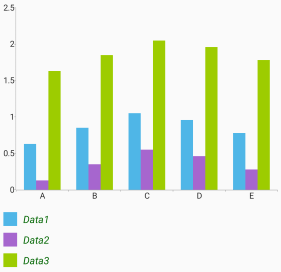
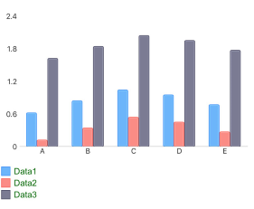

## Environment
<table>
	<tbody>
		<tr>
			<td>Product Version</td>
			<td>R3 2020</td>
		</tr>
		<tr>
			<td>Product</td>
			<td>RadLegend for Xamarin</td>
		</tr>
	</tbody>
</table>


## Description

Currently RadLegend for Xamarin does not provide a property for setting the FontFamily of the legend items' titles. This, however, can be achieved through custom renderers on both Android and iOS. The code below shows a sample implementation for applying different FontFamily to RadLegend.

## Solution

Let's have the following sample RadLegend instance:

```XAML
<telerikChart:RadLegend LegendProvider="{x:Reference Name=chart}" 
						LegendItemFontColor="DarkGreen"
						HeightRequest="200"/>
```

You would need to go to the Android and iOS projects and add the following renderer classes in the corresponding project:

>Just for the example the renderers are defined in the **LegendItemRenderer** namespace, you would need to adjust it according to your application' used namespaces.

* For Android you would need to override CreateNativeControl method of the LegendRenderer and in it return a custom <code>LegendView</code> object with a modified <code>LegendItemListAdapter</code> implementation. Inside the adapter you can access each <code>RadLegendItemView</code> and set the font to its TitleView:

```C#
using Android.Content;
using Android.Graphics;
using Android.Runtime;
using Com.Telerik.Android.Common.Math;
using Com.Telerik.Widget.Primitives.Legend;
using LegendItemRenderer.Droid;
using System;
using System.Collections.Generic;
using System.Collections.ObjectModel;
using System.Linq;
using Telerik.XamarinForms.ChartRenderer.Android;

[assembly: Xamarin.Forms.ExportRenderer(typeof(Telerik.XamarinForms.Chart.RadLegend), typeof(CustomLegendRenderer))]
namespace LegendItemRenderer.Droid
{
    public class CustomLegendRenderer : LegendRenderer
    {
        public CustomLegendRenderer(Context context) : base(context)
        {

        }

        protected override RadLegendView CreateNativeControl()
        {
            return new MyLegendView(this.Context);
        }
    }

    public class MyLegendView : RadLegendView
    {
        public MyLegendView(Context p0) : base(p0) { }

        public MyLegendView(Context p0, global::Android.Util.IAttributeSet p1) : base(p0, p1) { }

        public MyLegendView(Context p0, global::Android.Util.IAttributeSet p1, int p2, int p3) : base(p0, p1, p2, p3) { }

        protected MyLegendView(IntPtr javaReference, JniHandleOwnership transfer) : base(javaReference, transfer) { }
  
        protected override LegendItemListAdapter CreateListViewAdapter()
        {
            var legendItems = new ObservableCollection<LegendItem>();
            var provider = this.LegendProvider;
            if (provider != null)
            {
                legendItems = new ObservableCollection<LegendItem>(provider.LegendInfos.ToEnumerable<LegendItem>()) { };                
            }

            return new MyLegendAdapter(this.Context, legendItems, this.LegendItemIconSize, this.LegendItemFontSize, this.LegendItemFontColor, this.AllowSelection);
        }
    }

    public class MyLegendAdapter : LegendItemListAdapter
    {
        public MyLegendAdapter(Context p0, IList<LegendItem> p1, RadSize p2, float p3, int p4, bool p5) : base(p0, p1, p2, p3, p4, p5) { }

        protected MyLegendAdapter(IntPtr javaReference, JniHandleOwnership transfer) : base(javaReference, transfer) { }

        public override void OnBindListViewHolder(ViewHolder p0, int p1)
        {
            base.OnBindListViewHolder(p0, p1);

            var legendItem = p0.ItemView as RadLegendItemView;
            if (legendItem != null)
            {
                var titleView = legendItem.TitleView;
                titleView.SetTypeface(Typeface.SansSerif, TypefaceStyle.Italic);
            }
        }
    }
}
```

Here is the result on Android with a sample RadCartesianChart with BarSeries:



* For iOS you would need to override OnElementChanged and OnElementPropertyChanged methods of the LegendRenderer and using the Container property of the RadLegendView you can access each legend item and set the Font of its Label:

```C#
using LegendItemRenderer.iOS;
using System.ComponentModel;
using Telerik.XamarinForms.Chart;
using Telerik.XamarinForms.ChartRenderer.iOS;
using UIKit;
using Xamarin.Forms.Platform.iOS;

[assembly: Xamarin.Forms.ExportRenderer(typeof(Telerik.XamarinForms.Chart.RadLegend), typeof(CustomLegendRenderer))]
namespace LegendItemRenderer.iOS
{
    public class CustomLegendRenderer : LegendRenderer
    {
        protected override void OnElementChanged(ElementChangedEventArgs<RadLegend> e)
        {
            base.OnElementChanged(e);
            this.UpdateFont();
        }

        protected override void OnElementPropertyChanged(object sender, PropertyChangedEventArgs e)
        {
            base.OnElementPropertyChanged(sender, e);
            this.UpdateFont();
        }

        private void UpdateFont()
        {
            Xamarin.Forms.Device.BeginInvokeOnMainThread(() =>
            {
                if (this.Control.Container != null)
                {
                    for (int i = 0; i < (int)this.Control.Container.ItemCount; i++)
                    {
                        var currentItem = this.Control.Container.ItemAtIndex((uint)i);
                        if (currentItem != null)
                        {
                            currentItem.Label.Font = UIFont.FromName("ArialMT", 14);
                        }
                    }
                }
            });
        }
    }
}
```

Here is the result on Android with a sample RadCartesianChart with BarSeries:


