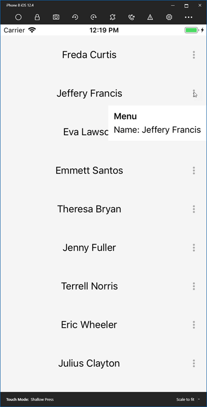

## Environment
<table>
    <tbody>
	    <tr>
	    	<td>Product Version</td>
	    	<td>2019.2.802.1</td>
	    </tr>
	    <tr>
	    	<td>Product</td>
	    	<td>ListView for Xamarin Cross-Platform</td>
	    </tr>
    </tbody>
</table>


## Description

This article shows how to add a context menu to the ListView item.

## Solution

This scenario could be achieved for example, with [RadButton](), [RadPopup]() controls. We can use the [Telerik Font Icons]() to set icon to the RadButton **Text** property instead of text.

## Example

Let's screate a business model for the items:

```C#
public class DataItem : BindableBase
{
    private string name;
    private bool isPopupOpen;

    public DataItem(string personName)
    {
        Name = personName;
    }

    public string Name
    {
        get => name;
        set => SetProperty(ref name, value);
    }

    public bool IsPopupOpen
    {
        get => isPopupOpen;
        set => SetProperty(ref isPopupOpen, value);
    }
}
```

Then, in the view model, let's create some sample names to populate the data source and a command that will toggle the IsPopupOpen property of that item:

```C#
public class ViewModel : ViewModelBase
{
    public ViewModel()
    {
        var names = SampleDataService.Current.GeneratePeopleNames();

        foreach (var name in names)
        {
            People.Add(new DataItem(name));
        }

        OpenContextMenuCommand = new Command<DataItem>(item => item.IsPopupOpen = !item.IsPopupOpen);
    }

    public ObservableCollection<DataItem> People { get; set; } = new ObservableCollection<DataItem>();

    public Command<DataItem> OpenContextMenuCommand { get; }
}
```

Finally, the XAML, uses a RadPopup in the ItemTemplate with a slight offset. Here are the important takeaways:

- The control's **IsOpen** property is bound to the model's **IsPopupOpen** property.
- The Button Command uses **x:Reference** to get to the view model command property.

```XAML
<ContentPage xmlns="http://xamarin.com/schemas/2014/forms"
             xmlns:x="http://schemas.microsoft.com/winfx/2009/xaml"
             xmlns:d="http://xamarin.com/schemas/2014/forms/design"
             xmlns:mc="http://schemas.openxmlformats.org/markup-compatibility/2006"
             xmlns:telerikDataControls="clr-namespace:Telerik.XamarinForms.DataControls;assembly=Telerik.XamarinForms.DataControls"
             xmlns:local="clr-namespace:LVMenu"
             xmlns:telerikListView="clr-namespace:Telerik.XamarinForms.DataControls.ListView;assembly=Telerik.XamarinForms.DataControls"
             xmlns:telerikPrimitives="clr-namespace:Telerik.XamarinForms.Primitives;assembly=Telerik.XamarinForms.Primitives"
             mc:Ignorable="d"
             x:Class="LVMenu.MainPage">

    <ContentPage.BindingContext>
        <local:ViewModel x:Name="PageViewModel" />
    </ContentPage.BindingContext>

    <ContentPage.Resources>
        <!-- See https://docs.telerik.com/devtools/xamarin/styling-and-appearance/telerik-font-icons for more details.-->
        <OnPlatform x:Key="IconsFont" 
                    x:TypeArguments="x:String">
            <On Platform="iOS">telerikfontexamples</On>
            <On Platform="Android">Fonts/telerikfontexamples.ttf#telerikfontexamples</On>
            <On Platform="UWP">/Assets/Fonts/telerikfontexamples.ttf#telerikfontexamples</On>
        </OnPlatform>

        <x:String x:Key="VerticalEllipsisIcon">&#xE807;</x:String>

        <Color x:Key="BackgroundColor">WhiteSmoke</Color>
    </ContentPage.Resources>

    <Grid>
        <telerikDataControls:RadListView x:Name="listView"
                                         ItemsSource="{Binding People}"
                                         SelectionMode="None">
            <telerikDataControls:RadListView.ItemTemplate>
                <DataTemplate>
                    <telerikListView:ListViewTemplateCell>
                        <Grid x:Name="ItemGrid"
                              BackgroundColor="{StaticResource BackgroundColor}"
                              HeightRequest="70">
                            <Grid.ColumnDefinitions>
                                <ColumnDefinition Width="*" />
                                <ColumnDefinition Width="45" />
                            </Grid.ColumnDefinitions>

                            <Label x:Name="ListItemDisplayLabel"
                                   Text="{Binding Name}"
                                   HorizontalOptions="Center"
                                   VerticalOptions="Center"
                                   FontSize="18" />

                            <BoxView x:Name="ItemSpacerBoxView"
                                     HorizontalOptions="Fill"
                                     VerticalOptions="End"
                                     HeightRequest="1" />

                            <!-- If you want just the ellipsis to open the context menu, use a Button instead. 
                                 Since the command is in the page's ViewModel, so we use x:Reference to escape the BindingContext of the DataTemplate -->
                            <Button Text="{StaticResource VerticalEllipsisIcon}"
                                    FontFamily="{StaticResource IconsFont}"
                                    Command="{Binding BindingContext.OpenContextMenuCommand, Source={x:Reference listView}}"
                                    CommandParameter="{Binding}"
                                    TextColor="DarkGray"
                                    BackgroundColor="Transparent"
                                    VerticalOptions="Center"
                                    HorizontalOptions="Center"
                                    Grid.Column="1">
                                <telerikPrimitives:RadPopup.Popup>
                                    <!-- The BindingContext of the popup is the item, so we can bind to IsPopupOpen and Name. -->
                                    <telerikPrimitives:RadPopup IsOpen="{Binding IsPopupOpen}"
                                                                HorizontalOffset="-25">
                                        <StackLayout BackgroundColor="White"
                                                     Padding="10"
                                                     Spacing="5">
                                            <Label Text="Menu" FontAttributes="Bold"/>
                                            <Label Text="{Binding Name, StringFormat='Name: {0}'}" />
                                        </StackLayout>
                                    </telerikPrimitives:RadPopup>
                                </telerikPrimitives:RadPopup.Popup>
                            </Button>
                        </Grid>
                    </telerikListView:ListViewTemplateCell>
                </DataTemplate>
            </telerikDataControls:RadListView.ItemTemplate>
        </telerikDataControls:RadListView>
    </Grid>
</ContentPage>
```

Here is the final result:


