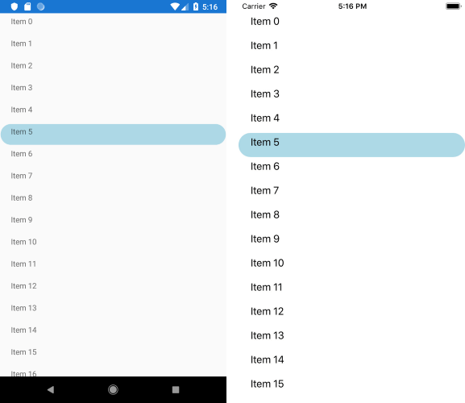

## Environment
<table>
	<tr>
		<td>Product Version</td>
		<td>2018.3 1122.3</td>
	</tr>
	<tr>
		<td>Product</td>
		<td>ListView for Xamarin Cross-Platform</td>
	</tr>
</table>


## Description

This article will show you how to create a rounded border when RadListView Item is selected.

## Solution

First, create a sample *DataItem* class which will be the Source of the RadListView and inherits from INotifyPropertyChanged interface:

```C#
public class DataItem : INotifyPropertyChanged
{
    private string name;
    private bool isSelected;

    public string Name
    {
        get
        {
            return this.name;
        }
        set
        {
            if (this.name != value)
            {
                this.name = value;
                this.OnPropertyChanged();
            }
        }
    }

    public bool IsSelected
    {
        get
        {
            return this.isSelected;
        }
        set
        {
            if (this.isSelected != value)
            {
                this.isSelected = value;
                this.OnPropertyChanged();
            }
        }
    }

    public event PropertyChangedEventHandler PropertyChanged;

    private void OnPropertyChanged([CallerMemberName] string propertyName = null)
    {
        this.PropertyChanged?.Invoke(this, new PropertyChangedEventArgs(propertyName));
    }
}
```

And here is the VieWModel:

```C#
public class ViewModel
{
    public ViewModel()
    {
        this.ItemsSource = new ObservableCollection<DataItem>();

        for (int index = 0; index < 100; index++)
        {
            var item = new DataItem
            {
                Name = $"Item {index}"
            };

            this.ItemsSource.Add(item);
        }
    }

    public ObservableCollection<DataItem> ItemsSource { get; }
}
```

Add a definition of RadListView to your page:

```C#
<telerikDataControls:RadListView x:Name="listView" 
                                 ItemsSource="{Binding ItemsSource}" 
                                 SelectionChanged="OnSelectionChanged" 
                                 SelectionMode="Single">
    <telerikDataControls:RadListView.ItemTemplate>
        <DataTemplate>
            <telerikListView:ListViewTemplateCell>
                <Grid>
                    <telerikPrimitives:RadBorder BackgroundColor="LightBlue" 
												 CornerRadius="20" 
												 IsVisible="{Binding IsSelected}" />
                    <Label Text="{Binding Name}" Margin="20,5" />
                </Grid>
            </telerikListView:ListViewTemplateCell>
        </DataTemplate>
    </telerikDataControls:RadListView.ItemTemplate>
    <telerikDataControls:RadListView.LayoutDefinition>
        <telerikListView:ListViewLinearLayout ItemLength="40" />
    </telerikDataControls:RadListView.LayoutDefinition>
    <telerikDataControls:RadListView.ItemStyle>
        <telerikListView:ListViewItemStyle BackgroundColor="Transparent"
                                        BorderLocation="None" />
    </telerikDataControls:RadListView.ItemStyle>
    <telerikDataControls:RadListView.SelectedItemStyle>
        <telerikListView:ListViewItemStyle BackgroundColor="Transparent"
                                        BorderLocation="None" />
    </telerikDataControls:RadListView.SelectedItemStyle>
</telerikDataControls:RadListView>
```

Trigger the SelectionChanged event and inside it implement your custom logic for rounded corner border when item is selected:

```C#
private void OnSelectionChanged(object sender, NotifyCollectionChangedEventArgs eventArgs)
{
    if (eventArgs.OldItems != null)
    {
        foreach (DataItem item in eventArgs.OldItems)
        {
            item.IsSelected = false;
        }
    }

    if (eventArgs.NewItems != null)
    {
        foreach (DataItem item in eventArgs.NewItems)
        {
            item.IsSelected = true;
        }
    }
}
```

Here is the result after running the example:


