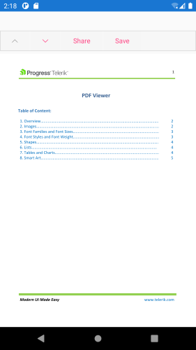
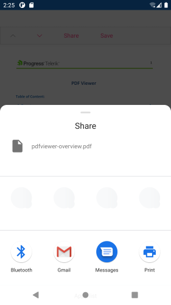
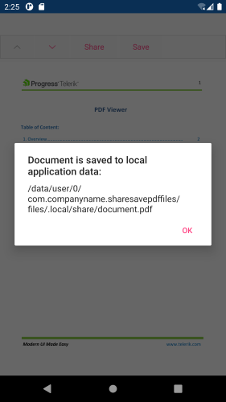

## Environment

<table>
	<tbody>
		<tr>
			<td>Product Version</td>
			<td>2022.1 222.1</td>
		</tr>
		<tr>
			<td>Product</td>
			<td>PdfViewer for Xamarin</td>
		</tr>
	</tbody>
</table>


## Description

This artilce will show you how to save and share pdf documents loaded in the Telerik PdfViewer for Xamarin. 

## Solution

For Sharing files we will use the [Xamarin.Essentials API](https://docs.microsoft.com/en-us/xamarin/essentials/share?tabs=ios)

1. The Share and Save options will be added to the Telerik PdfViewer Toolbar. We will add two new `PdfViewerToolbarItemBase`. Here is the XAMl definition:

 ```XAML
<Grid>
	<Grid.RowDefinitions>
		<RowDefinition Height="Auto"/>
		<RowDefinition />
	</Grid.RowDefinitions>
	<telerikPdfViewer:RadPdfViewerToolbar PdfViewer="{Binding Source={x:Reference pdfViewer}}"
									  IsScrollable="True">
		<telerikPdfViewer:NavigateToPreviousPageToolbarItem/>
		<telerikPdfViewer:NavigateToNextPageToolbarItem/>
		<telerikPdfViewer:PdfViewerToolbarItemBase Text="Share" 
												   Command="{Binding ShareDocumentCommand}" />
		<telerikPdfViewer:PdfViewerToolbarItemBase Text="Save" 
												   Command="{Binding SaveDocumentCommand}" />
	</telerikPdfViewer:RadPdfViewerToolbar>
	<telerikPdfViewer:RadPdfViewer x:Name="pdfViewer" Grid.Row="1"
								   Document="{Binding Document, Mode=OneWayToSource}" />
</Grid>
 ```

2. And the namespace used: 

 ```XAML
xmlns:telerikPdfViewer="clr-namespace:Telerik.XamarinForms.PdfViewer;assembly=Telerik.XamarinForms.PdfViewer"
 ```

3. Then we will load a document in the PdfViewer as embedded resource:

 ```C#
Func<CancellationToken, Task<Stream>> streamFunc = ct => Task.Run(() =>
{
    Assembly assembly = typeof(MainPage).Assembly;
    string fileName = assembly.GetManifestResourceNames().FirstOrDefault(n => n.Contains("pdfviewer-overview.pdf"));
    Stream stream = assembly.GetManifestResourceStream(fileName);
    return stream;
});
this.pdfViewer.Source = streamFunc;
 ```
 
 
 
## Save and Share pdf documents. 

We will need a ViewModel for the bindings we have. PdfViewer.`Document` property which we will use for saving the pdf document, and for the two commands we have.

ViewModel with `ShareDocumentCommand` and `SaveDocumentCommand` implementation:

```C#
public class ViewModel
{
    public ViewModel()
    {
        this.ShareDocumentCommand = new Command(this.ShareDocument);
        this.SaveDocumentCommand = new Command(this.SaveDocument);
    }

    private async void ShareDocument(object obj)
    {
        await ShareAsync();
    }

    // save pdf document
    private void SaveDocument(object obj)
    {

        var fileName = "document.pdf";
        var localFolder = Environment.GetFolderPath(Environment.SpecialFolder.LocalApplicationData);
        var filePath = Path.Combine(localFolder, fileName);

        using (Stream output = File.OpenWrite(filePath))
        {
            new Telerik.Windows.Documents.Fixed.FormatProviders.Pdf.PdfFormatProvider().Export(this.Document, output);

            Application.Current.MainPage.DisplayAlert("Document is saved to local application data: ", filePath, "OK");
        }
    }

    // share pdf document
    private async Task ShareAsync()
    {
        Assembly assembly = typeof(MainPage).Assembly;
        string fileName = assembly.GetManifestResourceNames().FirstOrDefault(n => n.Contains("pdfviewer-overview.pdf"));
        Stream stream = assembly.GetManifestResourceStream(fileName);
        var cacheFile = Path.Combine(FileSystem.CacheDirectory, "pdfviewer-overview.pdf");
        using (var file = new FileStream(cacheFile, FileMode.Create, FileAccess.Write))
        {
            stream.CopyTo(file);
        }
        var request = new ShareFileRequest {
            Title = "Share pdf document",
            File = new ShareFile(cacheFile)
        };
        await Share.RequestAsync(request);
    }

    public RadFixedDocument Document { get; set; }

    public ICommand SaveDocumentCommand { get; set; }

    public ICommand ShareDocumentCommand { get; set; }
}
```

Share Doument Result: 



Save Document Result:


 
