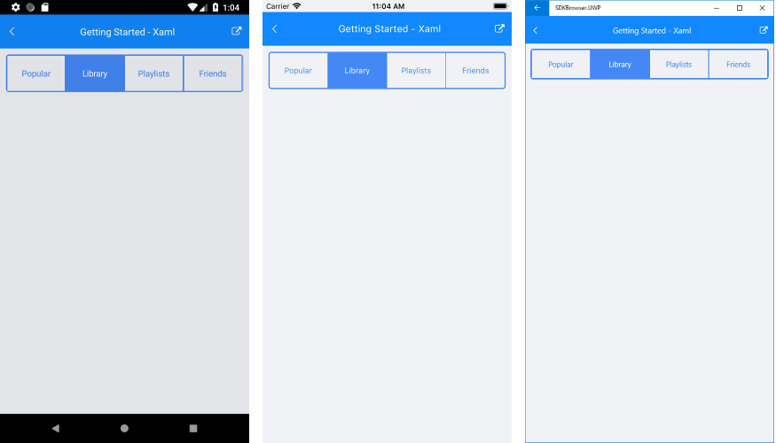

## Environment
<table>
	<tr>
		<td>Product Version</td>
		<td>2018.3 1109.1</td>
	</tr>
	<tr>
		<td>Product</td>
		<td>SegmentedControl for Xamarin</td>
	</tr>
</table>


## Description
Is it possible to set rounded corners on the outer buttons on Android and UWP like seen on iOS?

## Solution
RadSegmentedControl does not provide such an option itself, however, you could achieve it using our [RadBorder control](https://docs.telerik.com/devtools/xamarin/controls/border/border-overview). All you need to do is to wrap SegmentedControl inside Border and set a few color properties. 

Here is a quick example:

```XAML
<telerikPrimitives:RadBorder BorderColor="#4488F6" CornerRadius="5" VerticalOptions="Start">
    <telerikInput:RadSegmentedControl x:Name="segmentControl"
                                    HeightRequest="60"
                                    VerticalOptions="Start"
                                    SelectedSegmentBackgroundColor="#4488F6">
        <telerikInput:RadSegmentedControl.ItemsSource>
            <x:Array Type="{x:Type x:String}">
                <x:String>Popular</x:String>
                <x:String>Library</x:String>
                <x:String>Playlists</x:String>
                <x:String>Friends</x:String>
            </x:Array>
        </telerikInput:RadSegmentedControl.ItemsSource>
    </telerikInput:RadSegmentedControl>
</telerikPrimitives:RadBorder>
```

Here is the result on different platforms:

