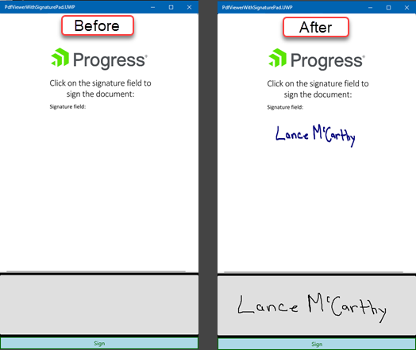

## Environment
<table>
	<tbody>
		<tr>
			<td>Product Version</td>
			<td>R1 2022</td>
		</tr>
		<tr>
			<td>Product</td>
			<td>SignaturePad for Xamarin, PdfViewer for Xamarin, PdfProcessing</td>
		</tr>
	</tbody>
</table>

## Description

This article will show you how to use a UI for Xamarin [SignaturePad](https://docs.telerik.com/devtools/xamarin/controls/signaturepad/overview) control and [PdfProcessing](https://docs.telerik.com/devtools/xamarin/controls/pdfprocessing/overview) to add a written signature to a PDF document.

Here is a screenshot of the document in the [PdfViewer](https://docs.telerik.com/devtools/xamarin/controls/pdfviewer/pdfviewer-overview), before and after modification:



## Solution

This approach uses four phases to achieve the result.

1. Import the original PDF file into a `RadFixedDocument` (optional: load the FixedDocument in a `RadPdfViewer`).
2. Use a `RadSignaturePad` to capture the user's written signature as a JPEG image.
3. Use `PdfProcessing` to locate the `SignatureWidget` in the FixedDocument, then use the `FixedContentEditor` to insert the user's signature at the the same location and remove the SignatureWidget when done.
4. Export the modified `RadFixedDocument` as a new PDF file (optional: load the modified file in a `RadPdfViewer`).

> The [RadPdfViewer](https://docs.telerik.com/devtools/xamarin/controls/pdfviewer/pdfviewer-overview) is not required. The optional steps are only for the user to view the document before and after modification.

### XAML

The UI in this example contains a Grid with three rows containing: RadPdfViewer, RadSignaturePad and a RadButton

```xml
<ContentPage xmlns="http://xamarin.com/schemas/2014/forms"
             xmlns:x="http://schemas.microsoft.com/winfx/2009/xaml"
             xmlns:pdfViewer="clr-namespace:Telerik.XamarinForms.PdfViewer;assembly=Telerik.XamarinForms.PdfViewer"
             xmlns:input="clr-namespace:Telerik.XamarinForms.Input;assembly=Telerik.XamarinForms.Input"
             x:Class="PdfViewerWithSignaturePad.MainPage">

    <Grid RowDefinitions="3*, Auto, Auto">
        <pdfViewer:RadPdfViewer x:Name="PdfViewer1"
                                Grid.Row="0"/>

        <input:RadSignaturePad x:Name="SignaturePad1"
                               HeightRequest="150"
                               Grid.Row="1"/>

        <input:RadButton x:Name="SignAndSaveButton"
                         Text="Sign"
                         Clicked="SignAndSaveButton_OnClicked"
                         HorizontalOptions="Fill"
                         BorderColor="DarkGreen"
                         BorderThickness="2"
                         TextColor="DarkGreen"
                         BackgroundColor="LightBlue"
                         Grid.Row="2"/>
    </Grid>
</ContentPage>
```

### Code-behind

In the code-behind, the main steps are the following:

- In OnAppearing, we perform step 1 and import the PDF file into a FixedDocument.
- In the button Clicked event handler, we perform 'll find Steps 2, 3 and 4
- The helper methods do the heavy lifting for saving, loading and parsing.

> Read all the code comments to follow the order of operations and to understand what each line is doing.

```csharp
using System;
using System.IO;
using System.Linq;
using System.Reflection;
using System.Threading.Tasks;
using Telerik.Windows.Documents.Fixed.FormatProviders.Pdf;
using Telerik.Windows.Documents.Fixed.Model;
using Telerik.Windows.Documents.Fixed.Model.Annotations;
using Telerik.Windows.Documents.Fixed.Model.Editing;
using Telerik.XamarinForms.Input;
using Telerik.XamarinForms.PdfViewer;
using Xamarin.Forms;

namespace PdfViewerWithSignaturePad
{
    public partial class MainPage : ContentPage
    {
        private readonly string localFolder;
        private RadFixedDocument originalDocument;

        public MainPage()
        {
            InitializeComponent();
            localFolder = Environment.GetFolderPath(Environment.SpecialFolder.LocalApplicationData);
        }

        protected override void OnAppearing()
        {
            base.OnAppearing();
            
            // Step 1. Import the PDF file into a FixedDocument
            originalDocument = ImportPdfFileToFixedDocument("Original.pdf");


            // Step 1b. (Optional) - Show the PDF in the PdfViewer
            PdfViewer1.Source = new FixedDocumentSource(originalDocument);
        }

        private async void SignAndSaveButton_OnClicked(object sender, EventArgs e)
        {
            // Preparation - Create the file paths we'll be using
            var signatureImageFilePath = Path.Combine(localFolder, "Signature.jpg");
            var updatedPdfFilePath = Path.Combine(localFolder, "OriginalDocument_SIGNED.pdf");

            // Step 2. Save the SignaturePad's image to a file
            await SaveSignatureImageAsync(SignaturePad1, signatureImageFilePath);

            // Step 3. Replace the SignatureWidget in the PDF document with the image
            var signedDocument = AddSignatureToDocument(originalDocument, signatureImageFilePath);
            
            if (signedDocument != null)
            {
                // Step 4. Export the completed FixedDocument and save a new PDF file
                byte[] pdfData = new PdfFormatProvider().Export(signedDocument);
                File.WriteAllBytes(updatedPdfFilePath, pdfData);

                
                //  Step 4b. (optional) - Show the new PDF in the PdfViewer
                PdfViewer1.Source = null;
                PdfViewer1.Source = new FileDocumentSource(updatedPdfFilePath);
            }
        }

        // *************** HELPER METHODS *************** //

        private static RadFixedDocument ImportPdfFileToFixedDocument(string pathOrResourceName, bool isEmbeddedResource = true)
        {
            if (isEmbeddedResource)
            {
                Assembly assembly = typeof(MainPage).Assembly;
                string fileName = assembly.GetManifestResourceNames().FirstOrDefault(n => n.Contains(pathOrResourceName));

                using (var stream = assembly.GetManifestResourceStream(fileName))
                {
                    var provider = new Telerik.Windows.Documents.Fixed.FormatProviders.Pdf.PdfFormatProvider();
                    return provider.Import(stream);
                }
            }
            else
            {
                using (var stream = File.OpenRead(pathOrResourceName))
                {
                    var provider = new Telerik.Windows.Documents.Fixed.FormatProviders.Pdf.PdfFormatProvider();
                    return provider.Import(stream);
                }
            }
        }

        private static async Task SaveSignatureImageAsync(RadSignaturePad pad, string filePath)
        {
            // Create a MemoryStream to load the image into
            using (var imgStream = new MemoryStream())
            {
                // Grab the user's signature image from the SignaturePad
                var saveSettings = new SaveImageSettings
                {
                    ImageFormat = ImageFormat.Jpeg,
                    ScaleFactor = 0.7,
                    ImageQuality = 1,
                    BackgroundColor = Color.White,
                    StrokeColor = Color.DarkBlue,
                    StrokeThickness = 5
                };

                // Save the written signature as an image
                await pad.SaveImageAsync(imgStream, saveSettings);

                if (imgStream.CanSeek)
                {
                    imgStream.Seek(0, SeekOrigin.Begin);
                }
                else
                {
                    imgStream.Position = 0;
                }

                var imgBytes = imgStream.ToArray();

                File.WriteAllBytes(filePath, imgBytes);
            }
        }

        private static RadFixedDocument AddSignatureToDocument(RadFixedDocument originalDocument, string imageFilePath)
        {
            // We'll use a clone of the original document to perform editing operations with (just in case something goes wrong)
            RadFixedDocument workingDocument = originalDocument.Clone();

            // Let's check if there are any FormFields in the document.
            var formFieldsCount = workingDocument.AcroForm.FormFields.Count;

            // If there are no FormFields, then there's no SignatureField and we're done.
            if (formFieldsCount == 0)
                return null;

            // Iterate the FormFields in the document
            foreach (var formField in workingDocument.AcroForm.FormFields)
            {
                // Iterate over the widgets
                foreach (var widget in formField.Widgets)
                {
                    // IMPORTANT -Detect a SignatureWidget to continue.
                    if (widget.WidgetContentType == WidgetContentType.SignatureContent)
                    {
                        // WARNING - this demo has the signature on the first page
                        // If yours is on a different page, change this or dynamically search all pages for the widget.
                        var currentPage = workingDocument.Pages.First();

                        // An easy way to edit the document is to use a FixedContentEditor. See https://docs.telerik.com/devtools/document-processing/libraries/radpdfprocessing/editing/fixedcontenteditor
                        var editor = new FixedContentEditor(currentPage);

                        // Move the Editor to the same location on the page that the SignatureWidget was. See https://docs.telerik.com/devtools/document-processing/libraries/radpdfprocessing/concepts/position
                        editor.Position.Translate(widget.Rect.X, widget.Rect.Y);

                        // Get the dimensions of the widget to use for the size of the image
                        var imageHeight = Convert.ToInt32(widget.Rect.Height);
                        var imageWidth = Convert.ToInt32(widget.Rect.Width);

                        // Load the image file into a byte[]
                        var fileImageBytes = File.ReadAllBytes(imageFilePath);

                        // Draw the image on the document. See https://docs.telerik.com/devtools/document-processing/libraries/radpdfprocessing/editing/fixedcontenteditor#inserting-image
                        var imageSource = new Telerik.Windows.Documents.Fixed.Model.Resources.ImageSource(new MemoryStream(fileImageBytes));

                        editor.DrawImage(imageSource, imageWidth, imageHeight);

                        // Finally, remove the SignatureWidget
                        currentPage.Annotations.Remove(widget);

                        return workingDocument;
                    }
                }
            }

            return null;
        }
    }
}

```

## See Also

Here are links to the documentation for the components we use above.

* Telerik UI for Xamarin - [PdfViewer](https://docs.telerik.com/devtools/xamarin/controls/pdfviewer/pdfviewer-overview)
  * [Key Features - Loading a Document](https://docs.telerik.com/devtools/xamarin/controls/pdfviewer/pdfviewer-key-features)
* Telerik UI for Xamarin - [SignaturePad](https://docs.telerik.com/devtools/xamarin/controls/signaturepad/overview)
  * [Saving Options](https://docs.telerik.com/devtools/xamarin/controls/signaturepad/saving-options)
* Telerik Document Processing - [PdfProcessing](https://docs.telerik.com/devtools/document-processing/libraries/radpdfprocessing/overview)
  * [Understanding the Document Model](https://docs.telerik.com/devtools/document-processing/libraries/radpdfprocessing/model/general-information)
    * [Interactive Forms](https://docs.telerik.com/devtools/document-processing/libraries/radpdfprocessing/model/interactive-forms/overview)
    * [Widgets](https://docs.telerik.com/devtools/document-processing/libraries/radpdfprocessing/model/interactive-forms/widgets)
    * [SignatureFeild](https://docs.telerik.com/devtools/document-processing/libraries/radpdfprocessing/model/interactive-forms/form-fields/signaturefield)
  * [FixedContentEditor](https://docs.telerik.com/devtools/document-processing/libraries/radpdfprocessing/editing/fixedcontenteditor)
  * [PdfFormatProvider - Import and Export](https://docs.telerik.com/devtools/document-processing/libraries/radpdfprocessing/formats-and-conversion/pdf/pdfformatprovider/pdfformatprovider)


