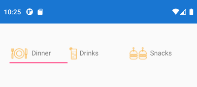

## Environment
<table>
	<tbody>
		<tr>
			<td>Product Version</td>
			<td>R1 2021</td>
		</tr>
		<tr>
			<td>Product</td>
			<td>TabView for Xamarin</td>
		</tr>
	</tbody>
</table>


## Description

This help article will show you how to customize the TabView header items and add images to them.

## Solution

In general, you can customize the appearance of each `TabViewHeaderItem` by modifying its ControlTemplate. You can take the default ControlTemplate as a base and add any controls inside it per the requirements you have. Check [Customize the TabViewHeaderItem Control Template](#customize-the-tabviewheaderitem-control-template) documentation topic for more details on the matter.

To show an image, you can add an [Xamarin.Forms.Image](https://docs.microsoft.com/en-us/xamarin/xamarin-forms/user-interface/images?tabs=macos) View inside the template. 

Here is a sample ControlTemplate with an Image view that should be added to the Page Resources:

```XAML
<ControlTemplate x:Key="DinnerHeaderControlTemplate">
	<Grid BackgroundColor="Transparent">
		<BoxView IsVisible="{TemplateBinding IsSelected}"
				BackgroundColor="{TemplateBinding SelectedColor}"
				VerticalOptions="End"
				HeightRequest="2" />
		<StackLayout Orientation="Horizontal" 
					 Margin="0, 0, 0, 8">
			<Image Source="tab_dinner.png" />
			<Label Text="{TemplateBinding Text}" 
					Margin="0, 0, 0, 2" 
					VerticalOptions="Center" 
					HorizontalOptions="Center" />
		</StackLayout>
	</Grid>
</ControlTemplate>
```

Then apply thus created **DinnerHeaderControlTemplate** to the `TabViewHeaderItem` ControlTemplate property:

```XAML
<telerikPrimitives:RadTabView x:Name="tabView">
	<telerikPrimitives:RadTabView.Items>
		<telerikPrimitives:TabViewItem>
			<telerikPrimitives:TabViewItem.Header>
				<telerikPrimitives:TabViewHeaderItem Text="Dinner" 
													 ControlTemplate="{StaticResource DinnerHeaderControlTemplate}" />
			</telerikPrimitives:TabViewItem.Header>
		</telerikPrimitives:TabViewItem>
	 </telerikPrimitives:RadTabView.Items>
</telerikPrimitives:RadTabView>
```

Check the result on Android below:


