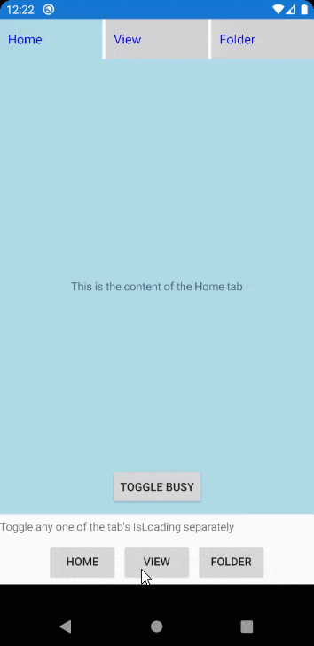

## Environment
<table>
	<tbody>
		<tr>
			<td>Product Version</td>
			<td>2020.3.916</td>
		</tr>
		<tr>
			<td>Product</td>
			<td>TabView for Xamarin</td>
		</tr>
	</tbody>
</table>


## Description

A common requested user experience is to show that the contents of a tab are being loaded, even if the user is not on that current tab. This tutorial will walk you through adding a **RadBusyIndicator** to a custom `TabViewItem.Header` and remotely toggling `IsBusy` via data binding.

Here's an animation of the final result



## Solution

### Step 1

First, you need to learn how to use a custom header for a TabViewItem. We have a tuorial already prepared for this, go to [Custom TabViewHeader tutorial](https://docs.telerik.com/devtools/xamarin/controls/tabview/tabview-header-item#custom-tabviewheader) and complete the tutorial.

Once that is complete, move to Step 2.

### Step 2

In your data model class, do two things:

* Add a **bool** property `IsLoading`
* Add a **Command** property named `ToggleLoadingCommand`

Here is an example being used in this tutorial's demo

*ItemModel.cs*

```csharp
public class ItemModel : NotifyPropertyChangedBase
{
    private bool isLoading;

    public ItemModel(string title, object content)
    {
        TabTitle = title;
        TabContent = content;

        ToggleLoadingCommand = new Command(ToggleLoading);
    }

    public string TabTitle { get; set; }

    public object TabContent { get; set; }

    public bool IsLoading
    {
        get => isLoading;
        set => UpdateValue(ref isLoading, value);
    }

    public Command ToggleLoadingCommand { get; set; }

    private void ToggleLoading()
    {
        IsLoading = !IsLoading;
    }
}

```
> Notice that the Command's `ToggleLoading()` Action toggles the value of `IsLoading`. equally important is that IsLoading must invoke PropertyChanged. 

### Step 3

With the basic setup prepared and the data model ready, it is time to further customize the **ControlTemplate** by adding a `RadBusyIndicator` and bind the RadBusyIndicator's `IsBusy` property to your data model's `IsLoading` property. 

An easy way to do this is to use a [Xamarin.Forms RelativeSource](https://docs.microsoft.com/en-us/xamarin/xamarin-forms/app-fundamentals/data-binding/relative-bindings) binding, here's what that looks like (see the final code at the end of this article):

```xml
<ControlTemplate x:Key="HeaderControlTemplate">
    <Grid BackgroundColor="LightGray"
          HeightRequest="50">
        <Grid.Triggers>
            <DataTrigger TargetType="Grid"
                         Binding="{TemplateBinding IsSelected}"
                         Value="True">
                <Setter Property="BackgroundColor"
                        Value="LightBlue" />
            </DataTrigger>
            <DataTrigger TargetType="Grid"
                         Binding="{TemplateBinding IsSelected}"
                         Value="False">
                <Setter Property="BackgroundColor"
                        Value="LightGray" />
            </DataTrigger>
        </Grid.Triggers>
        <StackLayout Orientation="Horizontal"
                     Margin="10">
            <Label Text="{TemplateBinding Text}"
                   FontSize="16"
                   TextColor="Blue"
                   HorizontalOptions="Center"
                   VerticalOptions="Center" />
            <telerikPrimitives:RadBusyIndicator IsBusy="{Binding IsLoading, Source={RelativeSource AncestorType={x:Type local:ItemModel}}}"
                                                WidthRequest="50"
                                                HeightRequest="50"
                                                AnimationContentWidthRequest="30"
                                                AnimationContentHeightRequest="30"
                                                AnimationContentColor="Blue" />
        </StackLayout>
    </Grid>
</ControlTemplate>

```
> To prevent stretching, you will want to restrict the dimensions of the busy animation. Notice we use 30px value for Animation dimensions and a 50px value for the overall dimensions, you can change that based on which animation style you are using.


### Step 4

The final step is to change the value of your data model's `IsLoading` property, this will toggle the animation for whichever tab it is located in. 

The rest of this article will share the final demo code, which shows you two different approaches you can take to change the `IsLoading` value:

* Option 1. Inside the TabViewItem via a Button and the `ToggleLoadingCommand`
* Option 2. Outside of the TabView via a Button clicked event to set `IsLoading`

Here are the rest of the demo's files so you can complete the tutorial.

*MainViewModel.cs*

```csharp
public class MainViewModel
{
    public MainViewModel()
    {
        TabOneContext = new ItemModel("Home", "This is the content of the Home tab");
        TabTwoContext = new ItemModel("View", "This is the content of the View tab");
        TabThreeContext = new ItemModel("Folder", "This is the content of the Folder tab.");
    }

    public ItemModel TabOneContext { get; set; }

    public ItemModel TabTwoContext { get; set; }

    public ItemModel TabThreeContext { get; set; }
}

```

*MainPage.xaml*

```xml
<?xml version="1.0" encoding="utf-8" ?>
<ContentPage xmlns="http://xamarin.com/schemas/2014/forms"
             xmlns:x="http://schemas.microsoft.com/winfx/2009/xaml"
             xmlns:d="http://xamarin.com/schemas/2014/forms/design"
             xmlns:mc="http://schemas.openxmlformats.org/markup-compatibility/2006"
             mc:Ignorable="d"
             xmlns:telerikPrimitives="clr-namespace:Telerik.XamarinForms.Primitives;assembly=Telerik.XamarinForms.Primitives"
             xmlns:local="clr-namespace:YourApp.Portable;assembly=YourApp.Portable"
             x:Class="YourApp.Portable.MainPage">

    <ContentPage.Resources>
        <Style x:Key="BodyTextStyle"
               TargetType="Label">
            <Setter Property="Margin"
                    Value="10" />
            <Setter Property="HorizontalOptions"
                    Value="Center" />
            <Setter Property="VerticalOptions"
                    Value="Center" />
        </Style>
        <Style x:Key="ToggleBusyButtonStyle"
               TargetType="Button">
            <Setter Property="Text"
                    Value="Toggle Busy" />
            <Setter Property="Margin"
                    Value="10" />
            <Setter Property="HorizontalOptions"
                    Value="Center" />
            <Setter Property="VerticalOptions"
                    Value="End" />
        </Style>

        <ControlTemplate x:Key="HeaderControlTemplate">
            <Grid BackgroundColor="LightGray"
                  HeightRequest="50">
                <Grid.Triggers>
                    <DataTrigger TargetType="Grid"
                                 Binding="{TemplateBinding IsSelected}"
                                 Value="True">
                        <Setter Property="BackgroundColor"
                                Value="LightBlue" />
                    </DataTrigger>
                    <DataTrigger TargetType="Grid"
                                 Binding="{TemplateBinding IsSelected}"
                                 Value="False">
                        <Setter Property="BackgroundColor"
                                Value="LightGray" />
                    </DataTrigger>
                </Grid.Triggers>
                <StackLayout Orientation="Horizontal"
                             Margin="10">
                    <Label Text="{TemplateBinding Text}"
                           FontSize="16"
                           TextColor="Blue"
                           HorizontalOptions="Center"
                           VerticalOptions="Center" />
                    <telerikPrimitives:RadBusyIndicator IsBusy="{Binding IsLoading, Source={RelativeSource AncestorType={x:Type local:ItemModel}}}"
                                                        WidthRequest="50"
                                                        HeightRequest="50"
                                                        AnimationContentWidthRequest="30"
                                                        AnimationContentHeightRequest="30"
                                                        AnimationContentColor="Blue" />
                </StackLayout>
            </Grid>
        </ControlTemplate>
    </ContentPage.Resources>

    <Grid>
        <Grid.RowDefinitions>
            <RowDefinition />
            <RowDefinition Height="Auto" />
        </Grid.RowDefinitions>

        <telerikPrimitives:RadTabView x:Name="tabView">
            <telerikPrimitives:RadTabView.Items>

                <telerikPrimitives:TabViewItem BindingContext="{Binding TabOneContext}">
                    <telerikPrimitives:TabViewItem.Header>
                        <telerikPrimitives:TabViewHeaderItem Text="Home"
                                                             ControlTemplate="{StaticResource HeaderControlTemplate}" />
                    </telerikPrimitives:TabViewItem.Header>
                    <telerikPrimitives:TabViewItem.Content>
                        <Grid BackgroundColor="LightBlue">
                            <Label Text="{Binding TabContent}"
                                   Style="{StaticResource BodyTextStyle}" />
                            <Button Command="{Binding ToggleLoadingCommand}"
                                    Style="{StaticResource ToggleBusyButtonStyle}" />
                        </Grid>
                    </telerikPrimitives:TabViewItem.Content>
                </telerikPrimitives:TabViewItem>

                <telerikPrimitives:TabViewItem BindingContext="{Binding TabTwoContext}">
                    <telerikPrimitives:TabViewItem.Header>
                        <telerikPrimitives:TabViewHeaderItem Text="{Binding TabTitle}"
                                                             ControlTemplate="{StaticResource HeaderControlTemplate}" />
                    </telerikPrimitives:TabViewItem.Header>
                    <telerikPrimitives:TabViewItem.Content>
                        <Grid BackgroundColor="LightBlue">
                            <Label Text="{Binding TabContent}"
                                   Style="{StaticResource BodyTextStyle}" />
                            <Button Command="{Binding ToggleLoadingCommand}"
                                    Style="{StaticResource ToggleBusyButtonStyle}" />
                        </Grid>
                    </telerikPrimitives:TabViewItem.Content>
                </telerikPrimitives:TabViewItem>

                <telerikPrimitives:TabViewItem BindingContext="{Binding TabThreeContext}">
                    <telerikPrimitives:TabViewItem.Header>
                        <telerikPrimitives:TabViewHeaderItem Text="{Binding TabTitle}"
                                                             ControlTemplate="{StaticResource HeaderControlTemplate}" />
                    </telerikPrimitives:TabViewItem.Header>
                    <telerikPrimitives:TabViewItem.Content>
                        <Grid BackgroundColor="LightBlue">
                            <Label Text="{Binding TabContent}"
                                   Style="{StaticResource BodyTextStyle}" />
                            <Button Command="{Binding ToggleLoadingCommand}"
                                    Style="{StaticResource ToggleBusyButtonStyle}" />
                        </Grid>
                    </telerikPrimitives:TabViewItem.Content>
                </telerikPrimitives:TabViewItem>
            </telerikPrimitives:RadTabView.Items>
        </telerikPrimitives:RadTabView>

        <StackLayout Spacing="5" Grid.Row="1">
            <Label Text="Toggle any one of the tab's IsLoading separately" />
            <StackLayout HorizontalOptions="Center"
                         Orientation="Horizontal"
                         Padding="5"
                         Spacing="5">
                <Button Text="HOME"
                        Clicked="Button_OnClicked" />
                <Button Text="VIEW"
                        Clicked="Button_OnClicked" />
                <Button Text="FOLDER"
                        Clicked="Button_OnClicked" />
            </StackLayout>
        </StackLayout>
    </Grid>
</ContentPage>
```

*MainPage.xaml.cs*

```csharp
public partial class MainPage : ContentPage
{
    public MainPage()
    {
        InitializeComponent();
        BindingContext = new MainViewModel();
    }

    private void Button_OnClicked(object sender, EventArgs e)
    {
        if (sender is Button btn && BindingContext is MainViewModel vm)
        {
            switch (btn.Text)
            {
                case "HOME":
                    vm.TabOneContext.IsLoading = !vm.TabOneContext.IsLoading;
                    break;
                case "VIEW":
                    vm.TabTwoContext.IsLoading = !vm.TabTwoContext.IsLoading;
                    break;
                case "FOLDER":
                    vm.TabThreeContext.IsLoading = !vm.TabThreeContext.IsLoading;
                    break;
            }
        }
    }
}

```

## Resources

For more information, visit the following **RadTabView** documentation articles.

* [Overview](https://docs.telerik.com/devtools/xamarin/controls/tabview/tabview-overview)
* [Key features](https://docs.telerik.com/devtools/xamarin/controls/tabview/tabview-key-features)
* [Getting started](https://docs.telerik.com/devtools/xamarin/controls/tabview/tabview-getting-started)
* [TabViewItem control](https://docs.telerik.com/devtools/xamarin/controls/tabview/tabview-item)
* [TabViewHeaderItem control](https://docs.telerik.com/devtools/xamarin/controls/tabview/tabview-header-item)
